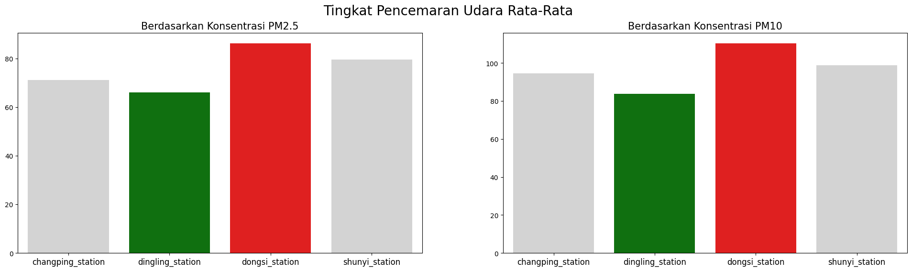
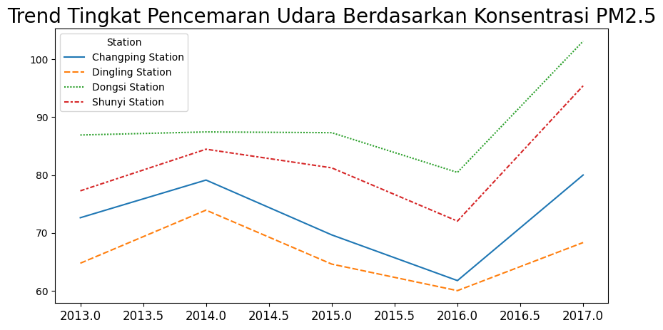
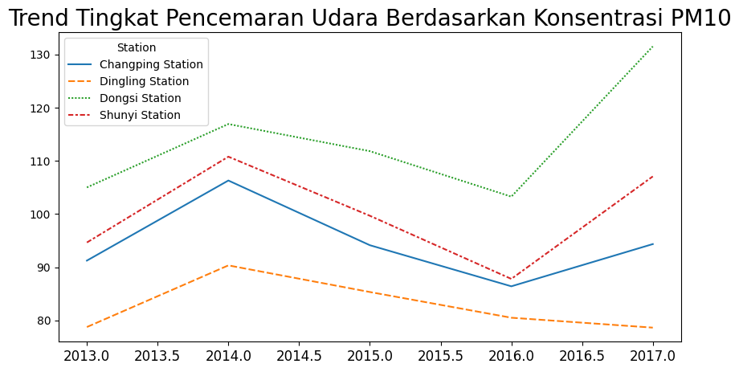
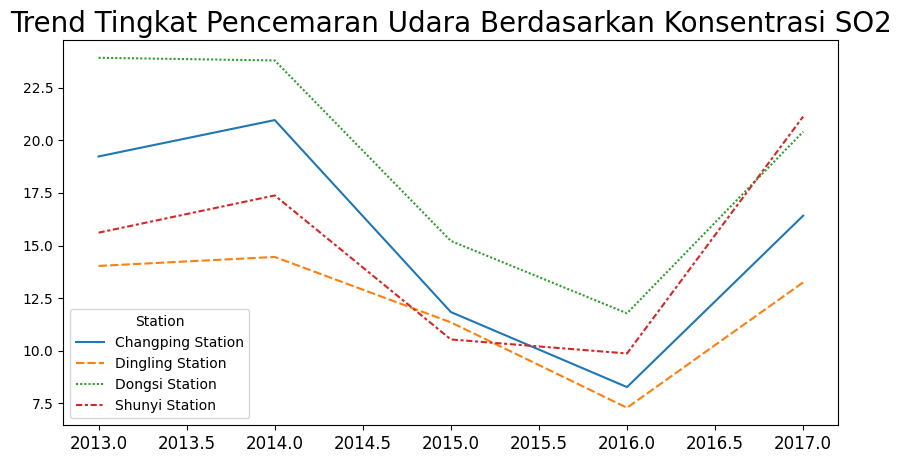
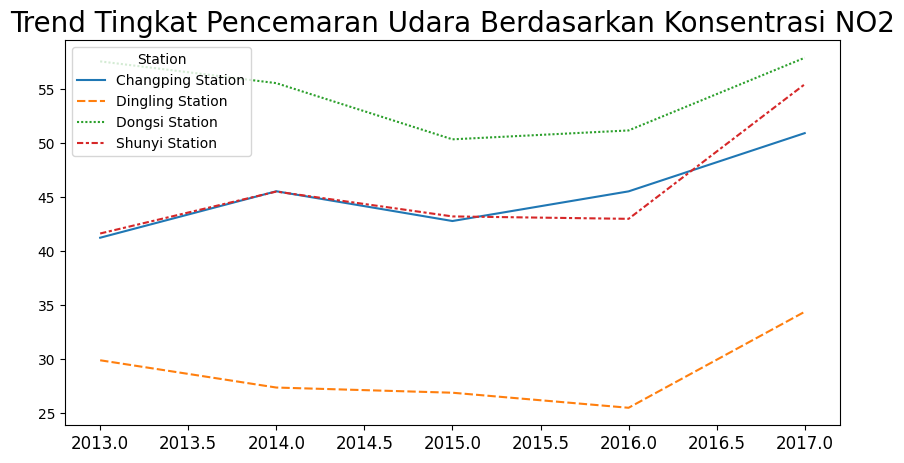
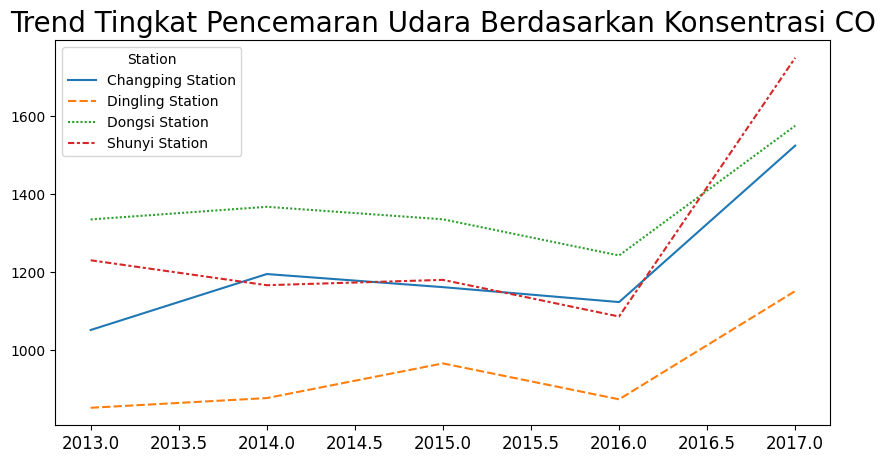

# Proyek Analisis Data: Air Quality Dataset
* Nama: Grecilia Padmadewi Gosali
* Email: grecilia.gosali@gmail.com
* Id Dicoding: Grecilia Gosali

## Menentukan Pertanyaan Bisnis
* Stasiun mana yang memiliki tingkat pencemaran udara tertinggi dan terendah berdasarkan konsentrasi PM2,5 dan PM10?
* Apakah tingkat pencemaran udara memiliki kenaikan atau penurunan dari tahun 2013 hingga 2017?

## Menyiapkan semua library yang dibutuhkan


```python
import numpy as np
import pandas as pd
import matplotlib.pyplot as plt
import seaborn as sns
```

## Data Wrangling

### Gathering Data

##### Changping Station


```python
changping_aq_df = pd.read_csv("https://raw.githubusercontent.com/marceloreis/HTI/master/PRSA_Data_20130301-20170228/PRSA_Data_Changping_20130301-20170228.csv")
changping_aq_df.head(10)
```


<div>
<style scoped>
    .dataframe tbody tr th:only-of-type {
        vertical-align: middle;
    }

    .dataframe tbody tr th {
        vertical-align: top;
    }

    .dataframe thead th {
        text-align: right;
    }
</style>
<table border="1" class="dataframe">
  <thead>
    <tr style="text-align: right;">
      <th></th>
      <th>No</th>
      <th>year</th>
      <th>month</th>
      <th>day</th>
      <th>hour</th>
      <th>PM2.5</th>
      <th>PM10</th>
      <th>SO2</th>
      <th>NO2</th>
      <th>CO</th>
      <th>O3</th>
      <th>TEMP</th>
      <th>PRES</th>
      <th>DEWP</th>
      <th>RAIN</th>
      <th>wd</th>
      <th>WSPM</th>
      <th>station</th>
    </tr>
  </thead>
  <tbody>
    <tr>
      <th>0</th>
      <td>1</td>
      <td>2013</td>
      <td>3</td>
      <td>1</td>
      <td>0</td>
      <td>3.0</td>
      <td>6.0</td>
      <td>13.0</td>
      <td>7.0</td>
      <td>300.0</td>
      <td>85.0</td>
      <td>-2.3</td>
      <td>1020.8</td>
      <td>-19.7</td>
      <td>0.0</td>
      <td>E</td>
      <td>0.5</td>
      <td>Changping</td>
    </tr>
    <tr>
      <th>1</th>
      <td>2</td>
      <td>2013</td>
      <td>3</td>
      <td>1</td>
      <td>1</td>
      <td>3.0</td>
      <td>3.0</td>
      <td>6.0</td>
      <td>6.0</td>
      <td>300.0</td>
      <td>85.0</td>
      <td>-2.5</td>
      <td>1021.3</td>
      <td>-19.0</td>
      <td>0.0</td>
      <td>ENE</td>
      <td>0.7</td>
      <td>Changping</td>
    </tr>
    <tr>
      <th>2</th>
      <td>3</td>
      <td>2013</td>
      <td>3</td>
      <td>1</td>
      <td>2</td>
      <td>3.0</td>
      <td>3.0</td>
      <td>22.0</td>
      <td>13.0</td>
      <td>400.0</td>
      <td>74.0</td>
      <td>-3.0</td>
      <td>1021.3</td>
      <td>-19.9</td>
      <td>0.0</td>
      <td>ENE</td>
      <td>0.2</td>
      <td>Changping</td>
    </tr>
    <tr>
      <th>3</th>
      <td>4</td>
      <td>2013</td>
      <td>3</td>
      <td>1</td>
      <td>3</td>
      <td>3.0</td>
      <td>6.0</td>
      <td>12.0</td>
      <td>8.0</td>
      <td>300.0</td>
      <td>81.0</td>
      <td>-3.6</td>
      <td>1021.8</td>
      <td>-19.1</td>
      <td>0.0</td>
      <td>NNE</td>
      <td>1.0</td>
      <td>Changping</td>
    </tr>
    <tr>
      <th>4</th>
      <td>5</td>
      <td>2013</td>
      <td>3</td>
      <td>1</td>
      <td>4</td>
      <td>3.0</td>
      <td>3.0</td>
      <td>14.0</td>
      <td>8.0</td>
      <td>300.0</td>
      <td>81.0</td>
      <td>-3.5</td>
      <td>1022.3</td>
      <td>-19.4</td>
      <td>0.0</td>
      <td>N</td>
      <td>2.1</td>
      <td>Changping</td>
    </tr>
    <tr>
      <th>5</th>
      <td>6</td>
      <td>2013</td>
      <td>3</td>
      <td>1</td>
      <td>5</td>
      <td>3.0</td>
      <td>3.0</td>
      <td>10.0</td>
      <td>17.0</td>
      <td>400.0</td>
      <td>71.0</td>
      <td>-4.5</td>
      <td>1022.6</td>
      <td>-19.5</td>
      <td>0.0</td>
      <td>NNW</td>
      <td>1.7</td>
      <td>Changping</td>
    </tr>
    <tr>
      <th>6</th>
      <td>7</td>
      <td>2013</td>
      <td>3</td>
      <td>1</td>
      <td>6</td>
      <td>4.0</td>
      <td>6.0</td>
      <td>12.0</td>
      <td>22.0</td>
      <td>500.0</td>
      <td>65.0</td>
      <td>-4.5</td>
      <td>1023.4</td>
      <td>-19.5</td>
      <td>0.0</td>
      <td>NNW</td>
      <td>1.8</td>
      <td>Changping</td>
    </tr>
    <tr>
      <th>7</th>
      <td>8</td>
      <td>2013</td>
      <td>3</td>
      <td>1</td>
      <td>7</td>
      <td>3.0</td>
      <td>6.0</td>
      <td>25.0</td>
      <td>39.0</td>
      <td>600.0</td>
      <td>48.0</td>
      <td>-2.1</td>
      <td>1024.6</td>
      <td>-20.0</td>
      <td>0.0</td>
      <td>NW</td>
      <td>2.5</td>
      <td>Changping</td>
    </tr>
    <tr>
      <th>8</th>
      <td>9</td>
      <td>2013</td>
      <td>3</td>
      <td>1</td>
      <td>8</td>
      <td>9.0</td>
      <td>25.0</td>
      <td>13.0</td>
      <td>42.0</td>
      <td>700.0</td>
      <td>46.0</td>
      <td>-0.2</td>
      <td>1025.2</td>
      <td>-20.5</td>
      <td>0.0</td>
      <td>NNW</td>
      <td>2.8</td>
      <td>Changping</td>
    </tr>
    <tr>
      <th>9</th>
      <td>10</td>
      <td>2013</td>
      <td>3</td>
      <td>1</td>
      <td>9</td>
      <td>11.0</td>
      <td>29.0</td>
      <td>5.0</td>
      <td>18.0</td>
      <td>500.0</td>
      <td>73.0</td>
      <td>0.6</td>
      <td>1025.3</td>
      <td>-20.4</td>
      <td>0.0</td>
      <td>NNW</td>
      <td>3.8</td>
      <td>Changping</td>
    </tr>
  </tbody>
</table>
</div>


##### Dingling Station


```python
dingling_aq_df = pd.read_csv('https://raw.githubusercontent.com/marceloreis/HTI/master/PRSA_Data_20130301-20170228/PRSA_Data_Dingling_20130301-20170228.csv')
dingling_aq_df.head(10)
```


<div>
<style scoped>
    .dataframe tbody tr th:only-of-type {
        vertical-align: middle;
    }

    .dataframe tbody tr th {
        vertical-align: top;
    }

    .dataframe thead th {
        text-align: right;
    }
</style>
<table border="1" class="dataframe">
  <thead>
    <tr style="text-align: right;">
      <th></th>
      <th>No</th>
      <th>year</th>
      <th>month</th>
      <th>day</th>
      <th>hour</th>
      <th>PM2.5</th>
      <th>PM10</th>
      <th>SO2</th>
      <th>NO2</th>
      <th>CO</th>
      <th>O3</th>
      <th>TEMP</th>
      <th>PRES</th>
      <th>DEWP</th>
      <th>RAIN</th>
      <th>wd</th>
      <th>WSPM</th>
      <th>station</th>
    </tr>
  </thead>
  <tbody>
    <tr>
      <th>0</th>
      <td>1</td>
      <td>2013</td>
      <td>3</td>
      <td>1</td>
      <td>0</td>
      <td>4.0</td>
      <td>4.0</td>
      <td>3.0</td>
      <td>NaN</td>
      <td>200.0</td>
      <td>82.0</td>
      <td>-2.3</td>
      <td>1020.8</td>
      <td>-19.7</td>
      <td>0.0</td>
      <td>E</td>
      <td>0.5</td>
      <td>Dingling</td>
    </tr>
    <tr>
      <th>1</th>
      <td>2</td>
      <td>2013</td>
      <td>3</td>
      <td>1</td>
      <td>1</td>
      <td>7.0</td>
      <td>7.0</td>
      <td>3.0</td>
      <td>NaN</td>
      <td>200.0</td>
      <td>80.0</td>
      <td>-2.5</td>
      <td>1021.3</td>
      <td>-19.0</td>
      <td>0.0</td>
      <td>ENE</td>
      <td>0.7</td>
      <td>Dingling</td>
    </tr>
    <tr>
      <th>2</th>
      <td>3</td>
      <td>2013</td>
      <td>3</td>
      <td>1</td>
      <td>2</td>
      <td>5.0</td>
      <td>5.0</td>
      <td>3.0</td>
      <td>2.0</td>
      <td>200.0</td>
      <td>79.0</td>
      <td>-3.0</td>
      <td>1021.3</td>
      <td>-19.9</td>
      <td>0.0</td>
      <td>ENE</td>
      <td>0.2</td>
      <td>Dingling</td>
    </tr>
    <tr>
      <th>3</th>
      <td>4</td>
      <td>2013</td>
      <td>3</td>
      <td>1</td>
      <td>3</td>
      <td>6.0</td>
      <td>6.0</td>
      <td>3.0</td>
      <td>NaN</td>
      <td>200.0</td>
      <td>79.0</td>
      <td>-3.6</td>
      <td>1021.8</td>
      <td>-19.1</td>
      <td>0.0</td>
      <td>NNE</td>
      <td>1.0</td>
      <td>Dingling</td>
    </tr>
    <tr>
      <th>4</th>
      <td>5</td>
      <td>2013</td>
      <td>3</td>
      <td>1</td>
      <td>4</td>
      <td>5.0</td>
      <td>5.0</td>
      <td>3.0</td>
      <td>NaN</td>
      <td>200.0</td>
      <td>81.0</td>
      <td>-3.5</td>
      <td>1022.3</td>
      <td>-19.4</td>
      <td>0.0</td>
      <td>N</td>
      <td>2.1</td>
      <td>Dingling</td>
    </tr>
    <tr>
      <th>5</th>
      <td>6</td>
      <td>2013</td>
      <td>3</td>
      <td>1</td>
      <td>5</td>
      <td>6.0</td>
      <td>6.0</td>
      <td>3.0</td>
      <td>4.0</td>
      <td>200.0</td>
      <td>79.0</td>
      <td>-4.5</td>
      <td>1022.6</td>
      <td>-19.5</td>
      <td>0.0</td>
      <td>NNW</td>
      <td>1.7</td>
      <td>Dingling</td>
    </tr>
    <tr>
      <th>6</th>
      <td>7</td>
      <td>2013</td>
      <td>3</td>
      <td>1</td>
      <td>6</td>
      <td>5.0</td>
      <td>10.0</td>
      <td>3.0</td>
      <td>4.0</td>
      <td>200.0</td>
      <td>77.0</td>
      <td>-4.5</td>
      <td>1023.4</td>
      <td>-19.5</td>
      <td>0.0</td>
      <td>NNW</td>
      <td>1.8</td>
      <td>Dingling</td>
    </tr>
    <tr>
      <th>7</th>
      <td>8</td>
      <td>2013</td>
      <td>3</td>
      <td>1</td>
      <td>7</td>
      <td>5.0</td>
      <td>6.0</td>
      <td>3.0</td>
      <td>2.0</td>
      <td>200.0</td>
      <td>80.0</td>
      <td>-2.1</td>
      <td>1024.6</td>
      <td>-20.0</td>
      <td>0.0</td>
      <td>NW</td>
      <td>2.5</td>
      <td>Dingling</td>
    </tr>
    <tr>
      <th>8</th>
      <td>9</td>
      <td>2013</td>
      <td>3</td>
      <td>1</td>
      <td>8</td>
      <td>8.0</td>
      <td>7.0</td>
      <td>3.0</td>
      <td>3.0</td>
      <td>200.0</td>
      <td>79.0</td>
      <td>-0.2</td>
      <td>1025.2</td>
      <td>-20.5</td>
      <td>0.0</td>
      <td>NNW</td>
      <td>2.8</td>
      <td>Dingling</td>
    </tr>
    <tr>
      <th>9</th>
      <td>10</td>
      <td>2013</td>
      <td>3</td>
      <td>1</td>
      <td>9</td>
      <td>8.0</td>
      <td>8.0</td>
      <td>3.0</td>
      <td>2.0</td>
      <td>200.0</td>
      <td>81.0</td>
      <td>0.6</td>
      <td>1025.3</td>
      <td>-20.4</td>
      <td>0.0</td>
      <td>NNW</td>
      <td>3.8</td>
      <td>Dingling</td>
    </tr>
  </tbody>
</table>
</div>


##### Dongsi Station


```python
dongsi_aq_df = pd.read_csv('https://raw.githubusercontent.com/marceloreis/HTI/master/PRSA_Data_20130301-20170228/PRSA_Data_Dongsi_20130301-20170228.csv')
dongsi_aq_df.head(10)
```


<div>
<style scoped>
    .dataframe tbody tr th:only-of-type {
        vertical-align: middle;
    }

    .dataframe tbody tr th {
        vertical-align: top;
    }

    .dataframe thead th {
        text-align: right;
    }
</style>
<table border="1" class="dataframe">
  <thead>
    <tr style="text-align: right;">
      <th></th>
      <th>No</th>
      <th>year</th>
      <th>month</th>
      <th>day</th>
      <th>hour</th>
      <th>PM2.5</th>
      <th>PM10</th>
      <th>SO2</th>
      <th>NO2</th>
      <th>CO</th>
      <th>O3</th>
      <th>TEMP</th>
      <th>PRES</th>
      <th>DEWP</th>
      <th>RAIN</th>
      <th>wd</th>
      <th>WSPM</th>
      <th>station</th>
    </tr>
  </thead>
  <tbody>
    <tr>
      <th>0</th>
      <td>1</td>
      <td>2013</td>
      <td>3</td>
      <td>1</td>
      <td>0</td>
      <td>9.0</td>
      <td>9.0</td>
      <td>3.0</td>
      <td>17.0</td>
      <td>300.0</td>
      <td>89.0</td>
      <td>-0.5</td>
      <td>1024.5</td>
      <td>-21.4</td>
      <td>0.0</td>
      <td>NNW</td>
      <td>5.7</td>
      <td>Dongsi</td>
    </tr>
    <tr>
      <th>1</th>
      <td>2</td>
      <td>2013</td>
      <td>3</td>
      <td>1</td>
      <td>1</td>
      <td>4.0</td>
      <td>4.0</td>
      <td>3.0</td>
      <td>16.0</td>
      <td>300.0</td>
      <td>88.0</td>
      <td>-0.7</td>
      <td>1025.1</td>
      <td>-22.1</td>
      <td>0.0</td>
      <td>NW</td>
      <td>3.9</td>
      <td>Dongsi</td>
    </tr>
    <tr>
      <th>2</th>
      <td>3</td>
      <td>2013</td>
      <td>3</td>
      <td>1</td>
      <td>2</td>
      <td>7.0</td>
      <td>7.0</td>
      <td>NaN</td>
      <td>17.0</td>
      <td>300.0</td>
      <td>60.0</td>
      <td>-1.2</td>
      <td>1025.3</td>
      <td>-24.6</td>
      <td>0.0</td>
      <td>NNW</td>
      <td>5.3</td>
      <td>Dongsi</td>
    </tr>
    <tr>
      <th>3</th>
      <td>4</td>
      <td>2013</td>
      <td>3</td>
      <td>1</td>
      <td>3</td>
      <td>3.0</td>
      <td>3.0</td>
      <td>5.0</td>
      <td>18.0</td>
      <td>NaN</td>
      <td>NaN</td>
      <td>-1.4</td>
      <td>1026.2</td>
      <td>-25.5</td>
      <td>0.0</td>
      <td>N</td>
      <td>4.9</td>
      <td>Dongsi</td>
    </tr>
    <tr>
      <th>4</th>
      <td>5</td>
      <td>2013</td>
      <td>3</td>
      <td>1</td>
      <td>4</td>
      <td>3.0</td>
      <td>3.0</td>
      <td>7.0</td>
      <td>NaN</td>
      <td>200.0</td>
      <td>84.0</td>
      <td>-1.9</td>
      <td>1027.1</td>
      <td>-24.5</td>
      <td>0.0</td>
      <td>NNW</td>
      <td>3.2</td>
      <td>Dongsi</td>
    </tr>
    <tr>
      <th>5</th>
      <td>6</td>
      <td>2013</td>
      <td>3</td>
      <td>1</td>
      <td>5</td>
      <td>4.0</td>
      <td>4.0</td>
      <td>9.0</td>
      <td>25.0</td>
      <td>300.0</td>
      <td>78.0</td>
      <td>-2.4</td>
      <td>1027.5</td>
      <td>-21.3</td>
      <td>0.0</td>
      <td>NW</td>
      <td>2.4</td>
      <td>Dongsi</td>
    </tr>
    <tr>
      <th>6</th>
      <td>7</td>
      <td>2013</td>
      <td>3</td>
      <td>1</td>
      <td>6</td>
      <td>5.0</td>
      <td>5.0</td>
      <td>10.0</td>
      <td>29.0</td>
      <td>400.0</td>
      <td>67.0</td>
      <td>-2.5</td>
      <td>1028.2</td>
      <td>-20.4</td>
      <td>0.0</td>
      <td>NW</td>
      <td>2.2</td>
      <td>Dongsi</td>
    </tr>
    <tr>
      <th>7</th>
      <td>8</td>
      <td>2013</td>
      <td>3</td>
      <td>1</td>
      <td>7</td>
      <td>3.0</td>
      <td>6.0</td>
      <td>12.0</td>
      <td>40.0</td>
      <td>400.0</td>
      <td>52.0</td>
      <td>-1.4</td>
      <td>1029.5</td>
      <td>-20.4</td>
      <td>0.0</td>
      <td>NNW</td>
      <td>3.0</td>
      <td>Dongsi</td>
    </tr>
    <tr>
      <th>8</th>
      <td>9</td>
      <td>2013</td>
      <td>3</td>
      <td>1</td>
      <td>8</td>
      <td>3.0</td>
      <td>6.0</td>
      <td>12.0</td>
      <td>41.0</td>
      <td>500.0</td>
      <td>54.0</td>
      <td>-0.3</td>
      <td>1030.4</td>
      <td>-21.2</td>
      <td>0.0</td>
      <td>NW</td>
      <td>4.6</td>
      <td>Dongsi</td>
    </tr>
    <tr>
      <th>9</th>
      <td>10</td>
      <td>2013</td>
      <td>3</td>
      <td>1</td>
      <td>9</td>
      <td>3.0</td>
      <td>6.0</td>
      <td>9.0</td>
      <td>31.0</td>
      <td>400.0</td>
      <td>69.0</td>
      <td>0.4</td>
      <td>1030.5</td>
      <td>-23.3</td>
      <td>0.0</td>
      <td>N</td>
      <td>5.5</td>
      <td>Dongsi</td>
    </tr>
  </tbody>
</table>
</div>


##### Shunyi Station


```python
shunyi_aq_df = pd.read_csv('https://raw.githubusercontent.com/marceloreis/HTI/master/PRSA_Data_20130301-20170228/PRSA_Data_Shunyi_20130301-20170228.csv')
shunyi_aq_df.head(10)
```


<div>
<style scoped>
    .dataframe tbody tr th:only-of-type {
        vertical-align: middle;
    }

    .dataframe tbody tr th {
        vertical-align: top;
    }

    .dataframe thead th {
        text-align: right;
    }
</style>
<table border="1" class="dataframe">
  <thead>
    <tr style="text-align: right;">
      <th></th>
      <th>No</th>
      <th>year</th>
      <th>month</th>
      <th>day</th>
      <th>hour</th>
      <th>PM2.5</th>
      <th>PM10</th>
      <th>SO2</th>
      <th>NO2</th>
      <th>CO</th>
      <th>O3</th>
      <th>TEMP</th>
      <th>PRES</th>
      <th>DEWP</th>
      <th>RAIN</th>
      <th>wd</th>
      <th>WSPM</th>
      <th>station</th>
    </tr>
  </thead>
  <tbody>
    <tr>
      <th>0</th>
      <td>1</td>
      <td>2013</td>
      <td>3</td>
      <td>1</td>
      <td>0</td>
      <td>3.0</td>
      <td>6.0</td>
      <td>3.0</td>
      <td>8.0</td>
      <td>300.0</td>
      <td>44.0</td>
      <td>-0.9</td>
      <td>1025.8</td>
      <td>-20.5</td>
      <td>0.0</td>
      <td>NW</td>
      <td>9.3</td>
      <td>Shunyi</td>
    </tr>
    <tr>
      <th>1</th>
      <td>2</td>
      <td>2013</td>
      <td>3</td>
      <td>1</td>
      <td>1</td>
      <td>12.0</td>
      <td>12.0</td>
      <td>3.0</td>
      <td>7.0</td>
      <td>300.0</td>
      <td>47.0</td>
      <td>-1.1</td>
      <td>1026.1</td>
      <td>-21.3</td>
      <td>0.0</td>
      <td>NW</td>
      <td>9.4</td>
      <td>Shunyi</td>
    </tr>
    <tr>
      <th>2</th>
      <td>3</td>
      <td>2013</td>
      <td>3</td>
      <td>1</td>
      <td>2</td>
      <td>14.0</td>
      <td>14.0</td>
      <td>NaN</td>
      <td>7.0</td>
      <td>200.0</td>
      <td>22.0</td>
      <td>-1.7</td>
      <td>1026.2</td>
      <td>-23.0</td>
      <td>0.0</td>
      <td>NW</td>
      <td>8.6</td>
      <td>Shunyi</td>
    </tr>
    <tr>
      <th>3</th>
      <td>4</td>
      <td>2013</td>
      <td>3</td>
      <td>1</td>
      <td>3</td>
      <td>12.0</td>
      <td>12.0</td>
      <td>3.0</td>
      <td>5.0</td>
      <td>NaN</td>
      <td>NaN</td>
      <td>-2.1</td>
      <td>1027.3</td>
      <td>-23.3</td>
      <td>0.0</td>
      <td>NW</td>
      <td>6.6</td>
      <td>Shunyi</td>
    </tr>
    <tr>
      <th>4</th>
      <td>5</td>
      <td>2013</td>
      <td>3</td>
      <td>1</td>
      <td>4</td>
      <td>12.0</td>
      <td>12.0</td>
      <td>3.0</td>
      <td>NaN</td>
      <td>200.0</td>
      <td>11.0</td>
      <td>-2.4</td>
      <td>1027.7</td>
      <td>-22.9</td>
      <td>0.0</td>
      <td>NW</td>
      <td>4.5</td>
      <td>Shunyi</td>
    </tr>
    <tr>
      <th>5</th>
      <td>6</td>
      <td>2013</td>
      <td>3</td>
      <td>1</td>
      <td>5</td>
      <td>11.0</td>
      <td>11.0</td>
      <td>3.0</td>
      <td>7.0</td>
      <td>200.0</td>
      <td>45.0</td>
      <td>-2.8</td>
      <td>1028.2</td>
      <td>-22.1</td>
      <td>0.0</td>
      <td>NNW</td>
      <td>1.7</td>
      <td>Shunyi</td>
    </tr>
    <tr>
      <th>6</th>
      <td>7</td>
      <td>2013</td>
      <td>3</td>
      <td>1</td>
      <td>6</td>
      <td>12.0</td>
      <td>12.0</td>
      <td>3.0</td>
      <td>9.0</td>
      <td>300.0</td>
      <td>74.0</td>
      <td>-4.0</td>
      <td>1029.0</td>
      <td>-21.2</td>
      <td>0.0</td>
      <td>NNE</td>
      <td>1.6</td>
      <td>Shunyi</td>
    </tr>
    <tr>
      <th>7</th>
      <td>8</td>
      <td>2013</td>
      <td>3</td>
      <td>1</td>
      <td>7</td>
      <td>13.0</td>
      <td>13.0</td>
      <td>3.0</td>
      <td>23.0</td>
      <td>300.0</td>
      <td>59.0</td>
      <td>-2.4</td>
      <td>1030.5</td>
      <td>-21.3</td>
      <td>0.0</td>
      <td>NE</td>
      <td>1.7</td>
      <td>Shunyi</td>
    </tr>
    <tr>
      <th>8</th>
      <td>9</td>
      <td>2013</td>
      <td>3</td>
      <td>1</td>
      <td>8</td>
      <td>8.0</td>
      <td>8.0</td>
      <td>3.0</td>
      <td>19.0</td>
      <td>400.0</td>
      <td>66.0</td>
      <td>-1.0</td>
      <td>1031.2</td>
      <td>-21.8</td>
      <td>0.0</td>
      <td>NNW</td>
      <td>2.7</td>
      <td>Shunyi</td>
    </tr>
    <tr>
      <th>9</th>
      <td>10</td>
      <td>2013</td>
      <td>3</td>
      <td>1</td>
      <td>9</td>
      <td>3.0</td>
      <td>6.0</td>
      <td>3.0</td>
      <td>21.0</td>
      <td>400.0</td>
      <td>60.0</td>
      <td>0.0</td>
      <td>1031.3</td>
      <td>-22.9</td>
      <td>0.0</td>
      <td>SSW</td>
      <td>0.8</td>
      <td>Shunyi</td>
    </tr>
  </tbody>
</table>
</div>


### Assessing Data

##### Changping Station


```python
changping_aq_df.info()
```

    <class 'pandas.core.frame.DataFrame'>
    RangeIndex: 35064 entries, 0 to 35063
    Data columns (total 18 columns):
     #   Column   Non-Null Count  Dtype  
    ---  ------   --------------  -----  
     0   No       35064 non-null  int64  
     1   year     35064 non-null  int64  
     2   month    35064 non-null  int64  
     3   day      35064 non-null  int64  
     4   hour     35064 non-null  int64  
     5   PM2.5    35064 non-null  float64
     6   PM10     35064 non-null  float64
     7   SO2      35064 non-null  float64
     8   NO2      35064 non-null  float64
     9   CO       35064 non-null  float64
     10  O3       35064 non-null  float64
     11  TEMP     35064 non-null  float64
     12  PRES     35064 non-null  float64
     13  DEWP     35064 non-null  float64
     14  RAIN     35064 non-null  float64
     15  wd       35064 non-null  object 
     16  WSPM     35064 non-null  float64
     17  station  35064 non-null  object 
    dtypes: float64(11), int64(5), object(2)
    memory usage: 4.8+ MB
    


```python
changping_aq_df.isna().sum()
```


    No            0
    year          0
    month         0
    day           0
    hour          0
    PM2.5       774
    PM10        582
    SO2         628
    NO2         667
    CO         1521
    O3          604
    TEMP         53
    PRES         50
    DEWP         53
    RAIN         51
    wd          140
    WSPM         43
    station       0
    dtype: int64


```python
print("duplicates: ", changping_aq_df.duplicated().sum())
```

    duplicates:  0
    


```python
changping_aq_df.describe()
```


<div>
<style scoped>
    .dataframe tbody tr th:only-of-type {
        vertical-align: middle;
    }

    .dataframe tbody tr th {
        vertical-align: top;
    }

    .dataframe thead th {
        text-align: right;
    }
</style>
<table border="1" class="dataframe">
  <thead>
    <tr style="text-align: right;">
      <th></th>
      <th>No</th>
      <th>year</th>
      <th>month</th>
      <th>day</th>
      <th>hour</th>
      <th>PM2.5</th>
      <th>PM10</th>
      <th>SO2</th>
      <th>NO2</th>
      <th>CO</th>
      <th>O3</th>
      <th>TEMP</th>
      <th>PRES</th>
      <th>DEWP</th>
      <th>RAIN</th>
      <th>WSPM</th>
    </tr>
  </thead>
  <tbody>
    <tr>
      <th>count</th>
      <td>35064.000000</td>
      <td>35064.000000</td>
      <td>35064.000000</td>
      <td>35064.000000</td>
      <td>35064.000000</td>
      <td>34290.000000</td>
      <td>34482.000000</td>
      <td>34436.000000</td>
      <td>34397.000000</td>
      <td>33543.000000</td>
      <td>34460.000000</td>
      <td>35011.000000</td>
      <td>35014.000000</td>
      <td>35011.000000</td>
      <td>35013.000000</td>
      <td>35021.000000</td>
    </tr>
    <tr>
      <th>mean</th>
      <td>17532.500000</td>
      <td>2014.662560</td>
      <td>6.522930</td>
      <td>15.729637</td>
      <td>11.500000</td>
      <td>71.099743</td>
      <td>94.657871</td>
      <td>14.958906</td>
      <td>44.182086</td>
      <td>1152.301345</td>
      <td>57.940003</td>
      <td>13.686111</td>
      <td>1007.760278</td>
      <td>1.505495</td>
      <td>0.060366</td>
      <td>1.853836</td>
    </tr>
    <tr>
      <th>std</th>
      <td>10122.249256</td>
      <td>1.177213</td>
      <td>3.448752</td>
      <td>8.800218</td>
      <td>6.922285</td>
      <td>72.326926</td>
      <td>83.441738</td>
      <td>20.975331</td>
      <td>29.519796</td>
      <td>1103.056282</td>
      <td>54.316674</td>
      <td>11.365313</td>
      <td>10.225664</td>
      <td>13.822099</td>
      <td>0.752899</td>
      <td>1.309808</td>
    </tr>
    <tr>
      <th>min</th>
      <td>1.000000</td>
      <td>2013.000000</td>
      <td>1.000000</td>
      <td>1.000000</td>
      <td>0.000000</td>
      <td>2.000000</td>
      <td>2.000000</td>
      <td>0.285600</td>
      <td>1.847700</td>
      <td>100.000000</td>
      <td>0.214200</td>
      <td>-16.600000</td>
      <td>982.400000</td>
      <td>-35.100000</td>
      <td>0.000000</td>
      <td>0.000000</td>
    </tr>
    <tr>
      <th>25%</th>
      <td>8766.750000</td>
      <td>2014.000000</td>
      <td>4.000000</td>
      <td>8.000000</td>
      <td>5.750000</td>
      <td>18.000000</td>
      <td>34.000000</td>
      <td>2.000000</td>
      <td>22.000000</td>
      <td>500.000000</td>
      <td>15.636600</td>
      <td>3.400000</td>
      <td>999.300000</td>
      <td>-10.200000</td>
      <td>0.000000</td>
      <td>1.000000</td>
    </tr>
    <tr>
      <th>50%</th>
      <td>17532.500000</td>
      <td>2015.000000</td>
      <td>7.000000</td>
      <td>16.000000</td>
      <td>11.500000</td>
      <td>46.000000</td>
      <td>72.000000</td>
      <td>7.000000</td>
      <td>36.000000</td>
      <td>800.000000</td>
      <td>46.000000</td>
      <td>14.700000</td>
      <td>1007.400000</td>
      <td>1.800000</td>
      <td>0.000000</td>
      <td>1.500000</td>
    </tr>
    <tr>
      <th>75%</th>
      <td>26298.250000</td>
      <td>2016.000000</td>
      <td>10.000000</td>
      <td>23.000000</td>
      <td>17.250000</td>
      <td>100.000000</td>
      <td>131.000000</td>
      <td>18.000000</td>
      <td>60.358200</td>
      <td>1400.000000</td>
      <td>80.000000</td>
      <td>23.300000</td>
      <td>1016.000000</td>
      <td>14.200000</td>
      <td>0.000000</td>
      <td>2.300000</td>
    </tr>
    <tr>
      <th>max</th>
      <td>35064.000000</td>
      <td>2017.000000</td>
      <td>12.000000</td>
      <td>31.000000</td>
      <td>23.000000</td>
      <td>882.000000</td>
      <td>999.000000</td>
      <td>310.000000</td>
      <td>226.000000</td>
      <td>10000.000000</td>
      <td>429.000000</td>
      <td>41.400000</td>
      <td>1036.500000</td>
      <td>27.200000</td>
      <td>52.100000</td>
      <td>10.000000</td>
    </tr>
  </tbody>
</table>
</div>


##### Dingling Station


```python
dingling_aq_df.info()
```

    <class 'pandas.core.frame.DataFrame'>
    RangeIndex: 35064 entries, 0 to 35063
    Data columns (total 18 columns):
     #   Column   Non-Null Count  Dtype  
    ---  ------   --------------  -----  
     0   No       35064 non-null  int64  
     1   year     35064 non-null  int64  
     2   month    35064 non-null  int64  
     3   day      35064 non-null  int64  
     4   hour     35064 non-null  int64  
     5   PM2.5    34285 non-null  float64
     6   PM10     34408 non-null  float64
     7   SO2      34334 non-null  float64
     8   NO2      33830 non-null  float64
     9   CO       33052 non-null  float64
     10  O3       33850 non-null  float64
     11  TEMP     35011 non-null  float64
     12  PRES     35014 non-null  float64
     13  DEWP     35011 non-null  float64
     14  RAIN     35013 non-null  float64
     15  wd       34924 non-null  object 
     16  WSPM     35021 non-null  float64
     17  station  35064 non-null  object 
    dtypes: float64(11), int64(5), object(2)
    memory usage: 4.8+ MB
    


```python
dingling_aq_df.isna().sum()
```


    No            0
    year          0
    month         0
    day           0
    hour          0
    PM2.5       779
    PM10        656
    SO2         730
    NO2        1234
    CO         2012
    O3         1214
    TEMP         53
    PRES         50
    DEWP         53
    RAIN         51
    wd          140
    WSPM         43
    station       0
    dtype: int64


```python
print('duplicates: ', dingling_aq_df.duplicated().sum())
```

    duplicates:  0
    


```python
dingling_aq_df.describe()
```


<div>
<style scoped>
    .dataframe tbody tr th:only-of-type {
        vertical-align: middle;
    }

    .dataframe tbody tr th {
        vertical-align: top;
    }

    .dataframe thead th {
        text-align: right;
    }
</style>
<table border="1" class="dataframe">
  <thead>
    <tr style="text-align: right;">
      <th></th>
      <th>No</th>
      <th>year</th>
      <th>month</th>
      <th>day</th>
      <th>hour</th>
      <th>PM2.5</th>
      <th>PM10</th>
      <th>SO2</th>
      <th>NO2</th>
      <th>CO</th>
      <th>O3</th>
      <th>TEMP</th>
      <th>PRES</th>
      <th>DEWP</th>
      <th>RAIN</th>
      <th>WSPM</th>
    </tr>
  </thead>
  <tbody>
    <tr>
      <th>count</th>
      <td>35064.000000</td>
      <td>35064.000000</td>
      <td>35064.000000</td>
      <td>35064.000000</td>
      <td>35064.000000</td>
      <td>34285.000000</td>
      <td>34408.000000</td>
      <td>34334.000000</td>
      <td>33830.000000</td>
      <td>33052.000000</td>
      <td>33850.000000</td>
      <td>35011.000000</td>
      <td>35014.000000</td>
      <td>35011.000000</td>
      <td>35013.000000</td>
      <td>35021.000000</td>
    </tr>
    <tr>
      <th>mean</th>
      <td>17532.500000</td>
      <td>2014.662560</td>
      <td>6.522930</td>
      <td>15.729637</td>
      <td>11.500000</td>
      <td>65.989497</td>
      <td>83.739723</td>
      <td>11.749650</td>
      <td>27.585467</td>
      <td>904.896073</td>
      <td>68.548371</td>
      <td>13.686111</td>
      <td>1007.760278</td>
      <td>1.505495</td>
      <td>0.060366</td>
      <td>1.853836</td>
    </tr>
    <tr>
      <th>std</th>
      <td>10122.249256</td>
      <td>1.177213</td>
      <td>3.448752</td>
      <td>8.800218</td>
      <td>6.922285</td>
      <td>72.267723</td>
      <td>79.541685</td>
      <td>15.519259</td>
      <td>26.383882</td>
      <td>903.306220</td>
      <td>53.764424</td>
      <td>11.365313</td>
      <td>10.225664</td>
      <td>13.822099</td>
      <td>0.752899</td>
      <td>1.309808</td>
    </tr>
    <tr>
      <th>min</th>
      <td>1.000000</td>
      <td>2013.000000</td>
      <td>1.000000</td>
      <td>1.000000</td>
      <td>0.000000</td>
      <td>3.000000</td>
      <td>2.000000</td>
      <td>0.285600</td>
      <td>1.026500</td>
      <td>100.000000</td>
      <td>0.214200</td>
      <td>-16.600000</td>
      <td>982.400000</td>
      <td>-35.100000</td>
      <td>0.000000</td>
      <td>0.000000</td>
    </tr>
    <tr>
      <th>25%</th>
      <td>8766.750000</td>
      <td>2014.000000</td>
      <td>4.000000</td>
      <td>8.000000</td>
      <td>5.750000</td>
      <td>14.000000</td>
      <td>26.000000</td>
      <td>2.000000</td>
      <td>9.000000</td>
      <td>300.000000</td>
      <td>31.000000</td>
      <td>3.400000</td>
      <td>999.300000</td>
      <td>-10.200000</td>
      <td>0.000000</td>
      <td>1.000000</td>
    </tr>
    <tr>
      <th>50%</th>
      <td>17532.500000</td>
      <td>2015.000000</td>
      <td>7.000000</td>
      <td>16.000000</td>
      <td>11.500000</td>
      <td>41.000000</td>
      <td>60.000000</td>
      <td>5.000000</td>
      <td>19.000000</td>
      <td>600.000000</td>
      <td>61.000000</td>
      <td>14.700000</td>
      <td>1007.400000</td>
      <td>1.800000</td>
      <td>0.000000</td>
      <td>1.500000</td>
    </tr>
    <tr>
      <th>75%</th>
      <td>26298.250000</td>
      <td>2016.000000</td>
      <td>10.000000</td>
      <td>23.000000</td>
      <td>17.250000</td>
      <td>93.000000</td>
      <td>117.000000</td>
      <td>15.000000</td>
      <td>38.000000</td>
      <td>1200.000000</td>
      <td>90.000000</td>
      <td>23.300000</td>
      <td>1016.000000</td>
      <td>14.200000</td>
      <td>0.000000</td>
      <td>2.300000</td>
    </tr>
    <tr>
      <th>max</th>
      <td>35064.000000</td>
      <td>2017.000000</td>
      <td>12.000000</td>
      <td>31.000000</td>
      <td>23.000000</td>
      <td>881.000000</td>
      <td>905.000000</td>
      <td>156.000000</td>
      <td>205.000000</td>
      <td>10000.000000</td>
      <td>500.000000</td>
      <td>41.400000</td>
      <td>1036.500000</td>
      <td>27.200000</td>
      <td>52.100000</td>
      <td>10.000000</td>
    </tr>
  </tbody>
</table>
</div>


##### Dongsi Station


```python
dongsi_aq_df.info()
```

    <class 'pandas.core.frame.DataFrame'>
    RangeIndex: 35064 entries, 0 to 35063
    Data columns (total 18 columns):
     #   Column   Non-Null Count  Dtype  
    ---  ------   --------------  -----  
     0   No       35064 non-null  int64  
     1   year     35064 non-null  int64  
     2   month    35064 non-null  int64  
     3   day      35064 non-null  int64  
     4   hour     35064 non-null  int64  
     5   PM2.5    34314 non-null  float64
     6   PM10     34511 non-null  float64
     7   SO2      34401 non-null  float64
     8   NO2      33463 non-null  float64
     9   CO       31867 non-null  float64
     10  O3       34400 non-null  float64
     11  TEMP     35044 non-null  float64
     12  PRES     35044 non-null  float64
     13  DEWP     35044 non-null  float64
     14  RAIN     35044 non-null  float64
     15  wd       34986 non-null  object 
     16  WSPM     35050 non-null  float64
     17  station  35064 non-null  object 
    dtypes: float64(11), int64(5), object(2)
    memory usage: 4.8+ MB
    


```python
dongsi_aq_df.isna().sum()
```


    No            0
    year          0
    month         0
    day           0
    hour          0
    PM2.5       750
    PM10        553
    SO2         663
    NO2        1601
    CO         3197
    O3          664
    TEMP         20
    PRES         20
    DEWP         20
    RAIN         20
    wd           78
    WSPM         14
    station       0
    dtype: int64


```python
print('duplicates: ', dongsi_aq_df.duplicated().sum())
```

    duplicates:  0
    


```python
dongsi_aq_df.describe()
```


<div>
<style scoped>
    .dataframe tbody tr th:only-of-type {
        vertical-align: middle;
    }

    .dataframe tbody tr th {
        vertical-align: top;
    }

    .dataframe thead th {
        text-align: right;
    }
</style>
<table border="1" class="dataframe">
  <thead>
    <tr style="text-align: right;">
      <th></th>
      <th>No</th>
      <th>year</th>
      <th>month</th>
      <th>day</th>
      <th>hour</th>
      <th>PM2.5</th>
      <th>PM10</th>
      <th>SO2</th>
      <th>NO2</th>
      <th>CO</th>
      <th>O3</th>
      <th>TEMP</th>
      <th>PRES</th>
      <th>DEWP</th>
      <th>RAIN</th>
      <th>WSPM</th>
    </tr>
  </thead>
  <tbody>
    <tr>
      <th>count</th>
      <td>35064.000000</td>
      <td>35064.000000</td>
      <td>35064.000000</td>
      <td>35064.000000</td>
      <td>35064.000000</td>
      <td>34314.000000</td>
      <td>34511.000000</td>
      <td>34401.000000</td>
      <td>33463.000000</td>
      <td>31867.000000</td>
      <td>34400.000000</td>
      <td>35044.000000</td>
      <td>35044.000000</td>
      <td>35044.000000</td>
      <td>35044.000000</td>
      <td>35050.000000</td>
    </tr>
    <tr>
      <th>mean</th>
      <td>17532.500000</td>
      <td>2014.662560</td>
      <td>6.522930</td>
      <td>15.729637</td>
      <td>11.500000</td>
      <td>86.194297</td>
      <td>110.336742</td>
      <td>18.531107</td>
      <td>53.699443</td>
      <td>1330.069131</td>
      <td>57.210637</td>
      <td>13.671490</td>
      <td>1012.547419</td>
      <td>2.447535</td>
      <td>0.064020</td>
      <td>1.860785</td>
    </tr>
    <tr>
      <th>std</th>
      <td>10122.249256</td>
      <td>1.177213</td>
      <td>3.448752</td>
      <td>8.800218</td>
      <td>6.922285</td>
      <td>86.575127</td>
      <td>98.219860</td>
      <td>22.905655</td>
      <td>33.959230</td>
      <td>1191.305887</td>
      <td>58.033275</td>
      <td>11.458418</td>
      <td>10.266059</td>
      <td>13.810696</td>
      <td>0.786282</td>
      <td>1.280368</td>
    </tr>
    <tr>
      <th>min</th>
      <td>1.000000</td>
      <td>2013.000000</td>
      <td>1.000000</td>
      <td>1.000000</td>
      <td>0.000000</td>
      <td>3.000000</td>
      <td>2.000000</td>
      <td>0.285600</td>
      <td>2.000000</td>
      <td>100.000000</td>
      <td>0.642600</td>
      <td>-16.800000</td>
      <td>987.100000</td>
      <td>-35.300000</td>
      <td>0.000000</td>
      <td>0.000000</td>
    </tr>
    <tr>
      <th>25%</th>
      <td>8766.750000</td>
      <td>2014.000000</td>
      <td>4.000000</td>
      <td>8.000000</td>
      <td>5.750000</td>
      <td>22.000000</td>
      <td>38.000000</td>
      <td>4.000000</td>
      <td>27.000000</td>
      <td>600.000000</td>
      <td>12.000000</td>
      <td>3.100000</td>
      <td>1004.000000</td>
      <td>-8.800000</td>
      <td>0.000000</td>
      <td>1.000000</td>
    </tr>
    <tr>
      <th>50%</th>
      <td>17532.500000</td>
      <td>2015.000000</td>
      <td>7.000000</td>
      <td>16.000000</td>
      <td>11.500000</td>
      <td>61.000000</td>
      <td>86.000000</td>
      <td>10.000000</td>
      <td>47.000000</td>
      <td>1000.000000</td>
      <td>44.125200</td>
      <td>14.600000</td>
      <td>1012.200000</td>
      <td>3.000000</td>
      <td>0.000000</td>
      <td>1.500000</td>
    </tr>
    <tr>
      <th>75%</th>
      <td>26298.250000</td>
      <td>2016.000000</td>
      <td>10.000000</td>
      <td>23.000000</td>
      <td>17.250000</td>
      <td>119.000000</td>
      <td>151.000000</td>
      <td>24.000000</td>
      <td>73.000000</td>
      <td>1700.000000</td>
      <td>81.000000</td>
      <td>23.500000</td>
      <td>1020.900000</td>
      <td>15.000000</td>
      <td>0.000000</td>
      <td>2.400000</td>
    </tr>
    <tr>
      <th>max</th>
      <td>35064.000000</td>
      <td>2017.000000</td>
      <td>12.000000</td>
      <td>31.000000</td>
      <td>23.000000</td>
      <td>737.000000</td>
      <td>955.000000</td>
      <td>300.000000</td>
      <td>258.000000</td>
      <td>10000.000000</td>
      <td>1071.000000</td>
      <td>41.100000</td>
      <td>1042.000000</td>
      <td>28.800000</td>
      <td>46.400000</td>
      <td>10.500000</td>
    </tr>
  </tbody>
</table>
</div>


##### Shunyi Station


```python
shunyi_aq_df.info()
```

    <class 'pandas.core.frame.DataFrame'>
    RangeIndex: 35064 entries, 0 to 35063
    Data columns (total 18 columns):
     #   Column   Non-Null Count  Dtype  
    ---  ------   --------------  -----  
     0   No       35064 non-null  int64  
     1   year     35064 non-null  int64  
     2   month    35064 non-null  int64  
     3   day      35064 non-null  int64  
     4   hour     35064 non-null  int64  
     5   PM2.5    34151 non-null  float64
     6   PM10     34516 non-null  float64
     7   SO2      33768 non-null  float64
     8   NO2      33699 non-null  float64
     9   CO       32886 non-null  float64
     10  O3       33575 non-null  float64
     11  TEMP     35013 non-null  float64
     12  PRES     35013 non-null  float64
     13  DEWP     35010 non-null  float64
     14  RAIN     35013 non-null  float64
     15  wd       34581 non-null  object 
     16  WSPM     35020 non-null  float64
     17  station  35064 non-null  object 
    dtypes: float64(11), int64(5), object(2)
    memory usage: 4.8+ MB
    


```python
shunyi_aq_df.isna().sum()
```


    No            0
    year          0
    month         0
    day           0
    hour          0
    PM2.5       913
    PM10        548
    SO2        1296
    NO2        1365
    CO         2178
    O3         1489
    TEMP         51
    PRES         51
    DEWP         54
    RAIN         51
    wd          483
    WSPM         44
    station       0
    dtype: int64


```python
print('duplicates: ', shunyi_aq_df.duplicated().sum())
```

    duplicates:  0
    


```python
shunyi_aq_df.describe()
```


<div>
<style scoped>
    .dataframe tbody tr th:only-of-type {
        vertical-align: middle;
    }

    .dataframe tbody tr th {
        vertical-align: top;
    }

    .dataframe thead th {
        text-align: right;
    }
</style>
<table border="1" class="dataframe">
  <thead>
    <tr style="text-align: right;">
      <th></th>
      <th>No</th>
      <th>year</th>
      <th>month</th>
      <th>day</th>
      <th>hour</th>
      <th>PM2.5</th>
      <th>PM10</th>
      <th>SO2</th>
      <th>NO2</th>
      <th>CO</th>
      <th>O3</th>
      <th>TEMP</th>
      <th>PRES</th>
      <th>DEWP</th>
      <th>RAIN</th>
      <th>WSPM</th>
    </tr>
  </thead>
  <tbody>
    <tr>
      <th>count</th>
      <td>35064.000000</td>
      <td>35064.000000</td>
      <td>35064.000000</td>
      <td>35064.000000</td>
      <td>35064.000000</td>
      <td>34151.000000</td>
      <td>34516.000000</td>
      <td>33768.000000</td>
      <td>33699.000000</td>
      <td>32886.000000</td>
      <td>33575.000000</td>
      <td>35013.000000</td>
      <td>35013.000000</td>
      <td>35010.000000</td>
      <td>35013.000000</td>
      <td>35020.000000</td>
    </tr>
    <tr>
      <th>mean</th>
      <td>17532.500000</td>
      <td>2014.662560</td>
      <td>6.522930</td>
      <td>15.729637</td>
      <td>11.500000</td>
      <td>79.491602</td>
      <td>98.737026</td>
      <td>13.572039</td>
      <td>43.908865</td>
      <td>1187.063979</td>
      <td>55.201321</td>
      <td>13.387969</td>
      <td>1013.061938</td>
      <td>2.465036</td>
      <td>0.061094</td>
      <td>1.807533</td>
    </tr>
    <tr>
      <th>std</th>
      <td>10122.249256</td>
      <td>1.177213</td>
      <td>3.448752</td>
      <td>8.800218</td>
      <td>6.922285</td>
      <td>81.231739</td>
      <td>89.143718</td>
      <td>19.572068</td>
      <td>30.996828</td>
      <td>1156.374102</td>
      <td>54.873726</td>
      <td>11.483588</td>
      <td>10.177339</td>
      <td>13.726622</td>
      <td>0.761668</td>
      <td>1.287817</td>
    </tr>
    <tr>
      <th>min</th>
      <td>1.000000</td>
      <td>2013.000000</td>
      <td>1.000000</td>
      <td>1.000000</td>
      <td>0.000000</td>
      <td>2.000000</td>
      <td>2.000000</td>
      <td>0.285600</td>
      <td>2.000000</td>
      <td>100.000000</td>
      <td>0.214200</td>
      <td>-16.800000</td>
      <td>988.000000</td>
      <td>-36.000000</td>
      <td>0.000000</td>
      <td>0.000000</td>
    </tr>
    <tr>
      <th>25%</th>
      <td>8766.750000</td>
      <td>2014.000000</td>
      <td>4.000000</td>
      <td>8.000000</td>
      <td>5.750000</td>
      <td>19.000000</td>
      <td>31.000000</td>
      <td>2.000000</td>
      <td>19.000000</td>
      <td>400.000000</td>
      <td>10.000000</td>
      <td>3.000000</td>
      <td>1004.700000</td>
      <td>-8.800000</td>
      <td>0.000000</td>
      <td>1.000000</td>
    </tr>
    <tr>
      <th>50%</th>
      <td>17532.500000</td>
      <td>2015.000000</td>
      <td>7.000000</td>
      <td>16.000000</td>
      <td>11.500000</td>
      <td>55.000000</td>
      <td>77.000000</td>
      <td>5.000000</td>
      <td>37.000000</td>
      <td>800.000000</td>
      <td>43.000000</td>
      <td>14.400000</td>
      <td>1012.700000</td>
      <td>3.100000</td>
      <td>0.000000</td>
      <td>1.500000</td>
    </tr>
    <tr>
      <th>75%</th>
      <td>26298.250000</td>
      <td>2016.000000</td>
      <td>10.000000</td>
      <td>23.000000</td>
      <td>17.250000</td>
      <td>112.000000</td>
      <td>138.000000</td>
      <td>17.000000</td>
      <td>62.000000</td>
      <td>1500.000000</td>
      <td>77.000000</td>
      <td>23.200000</td>
      <td>1021.000000</td>
      <td>15.100000</td>
      <td>0.000000</td>
      <td>2.300000</td>
    </tr>
    <tr>
      <th>max</th>
      <td>35064.000000</td>
      <td>2017.000000</td>
      <td>12.000000</td>
      <td>31.000000</td>
      <td>23.000000</td>
      <td>941.000000</td>
      <td>999.000000</td>
      <td>239.000000</td>
      <td>258.000000</td>
      <td>10000.000000</td>
      <td>351.716400</td>
      <td>40.600000</td>
      <td>1042.800000</td>
      <td>27.500000</td>
      <td>37.300000</td>
      <td>12.800000</td>
    </tr>
  </tbody>
</table>
</div>


### Cleaning Data

##### Changping Station


```python
changping_aq_df[changping_aq_df['PM2.5'].isna()]
```


<div>
<style scoped>
    .dataframe tbody tr th:only-of-type {
        vertical-align: middle;
    }

    .dataframe tbody tr th {
        vertical-align: top;
    }

    .dataframe thead th {
        text-align: right;
    }
</style>
<table border="1" class="dataframe">
  <thead>
    <tr style="text-align: right;">
      <th></th>
      <th>No</th>
      <th>year</th>
      <th>month</th>
      <th>day</th>
      <th>hour</th>
      <th>PM2.5</th>
      <th>PM10</th>
      <th>SO2</th>
      <th>NO2</th>
      <th>CO</th>
      <th>O3</th>
      <th>TEMP</th>
      <th>PRES</th>
      <th>DEWP</th>
      <th>RAIN</th>
      <th>wd</th>
      <th>WSPM</th>
      <th>station</th>
    </tr>
  </thead>
  <tbody>
    <tr>
      <th>1308</th>
      <td>1309</td>
      <td>2013</td>
      <td>4</td>
      <td>24</td>
      <td>12</td>
      <td>NaN</td>
      <td>NaN</td>
      <td>9.0000</td>
      <td>33.0000</td>
      <td>400.0</td>
      <td>72.0000</td>
      <td>22.6</td>
      <td>999.2</td>
      <td>-7.3</td>
      <td>0.0</td>
      <td>NNW</td>
      <td>5.7</td>
      <td>Changping</td>
    </tr>
    <tr>
      <th>1309</th>
      <td>1310</td>
      <td>2013</td>
      <td>4</td>
      <td>24</td>
      <td>13</td>
      <td>NaN</td>
      <td>302.0</td>
      <td>3.0000</td>
      <td>16.0000</td>
      <td>300.0</td>
      <td>89.0000</td>
      <td>23.4</td>
      <td>998.7</td>
      <td>-7.7</td>
      <td>0.0</td>
      <td>NNW</td>
      <td>7.3</td>
      <td>Changping</td>
    </tr>
    <tr>
      <th>1814</th>
      <td>1815</td>
      <td>2013</td>
      <td>5</td>
      <td>15</td>
      <td>14</td>
      <td>NaN</td>
      <td>70.0</td>
      <td>46.0000</td>
      <td>22.0000</td>
      <td>1100.0</td>
      <td>157.0000</td>
      <td>27.7</td>
      <td>1005.8</td>
      <td>2.0</td>
      <td>0.0</td>
      <td>SE</td>
      <td>3.2</td>
      <td>Changping</td>
    </tr>
    <tr>
      <th>1815</th>
      <td>1816</td>
      <td>2013</td>
      <td>5</td>
      <td>15</td>
      <td>15</td>
      <td>NaN</td>
      <td>71.0</td>
      <td>39.0000</td>
      <td>19.0000</td>
      <td>1100.0</td>
      <td>188.0000</td>
      <td>27.9</td>
      <td>1005.2</td>
      <td>4.2</td>
      <td>0.0</td>
      <td>SSE</td>
      <td>1.6</td>
      <td>Changping</td>
    </tr>
    <tr>
      <th>2417</th>
      <td>2418</td>
      <td>2013</td>
      <td>6</td>
      <td>9</td>
      <td>17</td>
      <td>NaN</td>
      <td>NaN</td>
      <td>5.9976</td>
      <td>31.2056</td>
      <td>NaN</td>
      <td>18.6354</td>
      <td>17.8</td>
      <td>1003.4</td>
      <td>15.8</td>
      <td>0.1</td>
      <td>NNW</td>
      <td>0.4</td>
      <td>Changping</td>
    </tr>
    <tr>
      <th>...</th>
      <td>...</td>
      <td>...</td>
      <td>...</td>
      <td>...</td>
      <td>...</td>
      <td>...</td>
      <td>...</td>
      <td>...</td>
      <td>...</td>
      <td>...</td>
      <td>...</td>
      <td>...</td>
      <td>...</td>
      <td>...</td>
      <td>...</td>
      <td>...</td>
      <td>...</td>
      <td>...</td>
    </tr>
    <tr>
      <th>34879</th>
      <td>34880</td>
      <td>2017</td>
      <td>2</td>
      <td>21</td>
      <td>7</td>
      <td>NaN</td>
      <td>NaN</td>
      <td>NaN</td>
      <td>NaN</td>
      <td>NaN</td>
      <td>NaN</td>
      <td>-1.7</td>
      <td>1023.1</td>
      <td>-17.4</td>
      <td>0.0</td>
      <td>E</td>
      <td>1.3</td>
      <td>Changping</td>
    </tr>
    <tr>
      <th>34880</th>
      <td>34881</td>
      <td>2017</td>
      <td>2</td>
      <td>21</td>
      <td>8</td>
      <td>NaN</td>
      <td>NaN</td>
      <td>NaN</td>
      <td>NaN</td>
      <td>NaN</td>
      <td>NaN</td>
      <td>-1.8</td>
      <td>1023.8</td>
      <td>-16.7</td>
      <td>0.0</td>
      <td>W</td>
      <td>1.2</td>
      <td>Changping</td>
    </tr>
    <tr>
      <th>34883</th>
      <td>34884</td>
      <td>2017</td>
      <td>2</td>
      <td>21</td>
      <td>11</td>
      <td>NaN</td>
      <td>NaN</td>
      <td>NaN</td>
      <td>NaN</td>
      <td>NaN</td>
      <td>NaN</td>
      <td>-0.5</td>
      <td>1022.7</td>
      <td>-16.0</td>
      <td>0.0</td>
      <td>ESE</td>
      <td>1.9</td>
      <td>Changping</td>
    </tr>
    <tr>
      <th>34885</th>
      <td>34886</td>
      <td>2017</td>
      <td>2</td>
      <td>21</td>
      <td>13</td>
      <td>NaN</td>
      <td>NaN</td>
      <td>NaN</td>
      <td>NaN</td>
      <td>NaN</td>
      <td>NaN</td>
      <td>-1.0</td>
      <td>1021.5</td>
      <td>-9.4</td>
      <td>0.0</td>
      <td>SW</td>
      <td>1.7</td>
      <td>Changping</td>
    </tr>
    <tr>
      <th>34887</th>
      <td>34888</td>
      <td>2017</td>
      <td>2</td>
      <td>21</td>
      <td>15</td>
      <td>NaN</td>
      <td>6.0</td>
      <td>NaN</td>
      <td>34.0000</td>
      <td>NaN</td>
      <td>2.0000</td>
      <td>-2.1</td>
      <td>1019.4</td>
      <td>-5.3</td>
      <td>0.0</td>
      <td>ENE</td>
      <td>2.0</td>
      <td>Changping</td>
    </tr>
  </tbody>
</table>
<p>774 rows × 18 columns</p>
</div>


```python
changping_aq_pm25_mean = changping_aq_df['PM2.5'].mean()
changping_aq_df['PM2.5'].fillna(value=changping_aq_pm25_mean, inplace=True)
```


```python
changping_aq_df['PM2.5'].isna().sum()
```


    0


```python
changping_aq_df[changping_aq_df['PM10'].isna()]
```


<div>
<style scoped>
    .dataframe tbody tr th:only-of-type {
        vertical-align: middle;
    }

    .dataframe tbody tr th {
        vertical-align: top;
    }

    .dataframe thead th {
        text-align: right;
    }
</style>
<table border="1" class="dataframe">
  <thead>
    <tr style="text-align: right;">
      <th></th>
      <th>No</th>
      <th>year</th>
      <th>month</th>
      <th>day</th>
      <th>hour</th>
      <th>PM2.5</th>
      <th>PM10</th>
      <th>SO2</th>
      <th>NO2</th>
      <th>CO</th>
      <th>O3</th>
      <th>TEMP</th>
      <th>PRES</th>
      <th>DEWP</th>
      <th>RAIN</th>
      <th>wd</th>
      <th>WSPM</th>
      <th>station</th>
    </tr>
  </thead>
  <tbody>
    <tr>
      <th>1308</th>
      <td>1309</td>
      <td>2013</td>
      <td>4</td>
      <td>24</td>
      <td>12</td>
      <td>71.099743</td>
      <td>NaN</td>
      <td>9.0000</td>
      <td>33.0000</td>
      <td>400.0</td>
      <td>72.0000</td>
      <td>22.6</td>
      <td>999.2</td>
      <td>-7.3</td>
      <td>0.0</td>
      <td>NNW</td>
      <td>5.7</td>
      <td>Changping</td>
    </tr>
    <tr>
      <th>2417</th>
      <td>2418</td>
      <td>2013</td>
      <td>6</td>
      <td>9</td>
      <td>17</td>
      <td>71.099743</td>
      <td>NaN</td>
      <td>5.9976</td>
      <td>31.2056</td>
      <td>NaN</td>
      <td>18.6354</td>
      <td>17.8</td>
      <td>1003.4</td>
      <td>15.8</td>
      <td>0.1</td>
      <td>NNW</td>
      <td>0.4</td>
      <td>Changping</td>
    </tr>
    <tr>
      <th>2967</th>
      <td>2968</td>
      <td>2013</td>
      <td>7</td>
      <td>2</td>
      <td>15</td>
      <td>11.000000</td>
      <td>NaN</td>
      <td>3.7128</td>
      <td>11.2915</td>
      <td>NaN</td>
      <td>113.7402</td>
      <td>35.9</td>
      <td>986.2</td>
      <td>16.1</td>
      <td>0.0</td>
      <td>WSW</td>
      <td>3.4</td>
      <td>Changping</td>
    </tr>
    <tr>
      <th>3291</th>
      <td>3292</td>
      <td>2013</td>
      <td>7</td>
      <td>16</td>
      <td>3</td>
      <td>23.000000</td>
      <td>NaN</td>
      <td>3.0000</td>
      <td>12.0000</td>
      <td>NaN</td>
      <td>NaN</td>
      <td>22.5</td>
      <td>988.2</td>
      <td>19.7</td>
      <td>0.0</td>
      <td>N</td>
      <td>1.0</td>
      <td>Changping</td>
    </tr>
    <tr>
      <th>3306</th>
      <td>3307</td>
      <td>2013</td>
      <td>7</td>
      <td>16</td>
      <td>18</td>
      <td>4.000000</td>
      <td>NaN</td>
      <td>3.0000</td>
      <td>14.0000</td>
      <td>300.0</td>
      <td>77.0000</td>
      <td>31.9</td>
      <td>993.2</td>
      <td>15.8</td>
      <td>0.0</td>
      <td>N</td>
      <td>0.7</td>
      <td>Changping</td>
    </tr>
    <tr>
      <th>...</th>
      <td>...</td>
      <td>...</td>
      <td>...</td>
      <td>...</td>
      <td>...</td>
      <td>...</td>
      <td>...</td>
      <td>...</td>
      <td>...</td>
      <td>...</td>
      <td>...</td>
      <td>...</td>
      <td>...</td>
      <td>...</td>
      <td>...</td>
      <td>...</td>
      <td>...</td>
      <td>...</td>
    </tr>
    <tr>
      <th>34877</th>
      <td>34878</td>
      <td>2017</td>
      <td>2</td>
      <td>21</td>
      <td>5</td>
      <td>71.099743</td>
      <td>NaN</td>
      <td>NaN</td>
      <td>NaN</td>
      <td>NaN</td>
      <td>NaN</td>
      <td>-3.0</td>
      <td>1023.7</td>
      <td>-18.2</td>
      <td>0.0</td>
      <td>NNE</td>
      <td>0.7</td>
      <td>Changping</td>
    </tr>
    <tr>
      <th>34879</th>
      <td>34880</td>
      <td>2017</td>
      <td>2</td>
      <td>21</td>
      <td>7</td>
      <td>71.099743</td>
      <td>NaN</td>
      <td>NaN</td>
      <td>NaN</td>
      <td>NaN</td>
      <td>NaN</td>
      <td>-1.7</td>
      <td>1023.1</td>
      <td>-17.4</td>
      <td>0.0</td>
      <td>E</td>
      <td>1.3</td>
      <td>Changping</td>
    </tr>
    <tr>
      <th>34880</th>
      <td>34881</td>
      <td>2017</td>
      <td>2</td>
      <td>21</td>
      <td>8</td>
      <td>71.099743</td>
      <td>NaN</td>
      <td>NaN</td>
      <td>NaN</td>
      <td>NaN</td>
      <td>NaN</td>
      <td>-1.8</td>
      <td>1023.8</td>
      <td>-16.7</td>
      <td>0.0</td>
      <td>W</td>
      <td>1.2</td>
      <td>Changping</td>
    </tr>
    <tr>
      <th>34883</th>
      <td>34884</td>
      <td>2017</td>
      <td>2</td>
      <td>21</td>
      <td>11</td>
      <td>71.099743</td>
      <td>NaN</td>
      <td>NaN</td>
      <td>NaN</td>
      <td>NaN</td>
      <td>NaN</td>
      <td>-0.5</td>
      <td>1022.7</td>
      <td>-16.0</td>
      <td>0.0</td>
      <td>ESE</td>
      <td>1.9</td>
      <td>Changping</td>
    </tr>
    <tr>
      <th>34885</th>
      <td>34886</td>
      <td>2017</td>
      <td>2</td>
      <td>21</td>
      <td>13</td>
      <td>71.099743</td>
      <td>NaN</td>
      <td>NaN</td>
      <td>NaN</td>
      <td>NaN</td>
      <td>NaN</td>
      <td>-1.0</td>
      <td>1021.5</td>
      <td>-9.4</td>
      <td>0.0</td>
      <td>SW</td>
      <td>1.7</td>
      <td>Changping</td>
    </tr>
  </tbody>
</table>
<p>582 rows × 18 columns</p>
</div>


```python
changping_aq_df['PM10'].fillna(value=changping_aq_df['PM10'].mean(), inplace=True)
```


```python
changping_aq_df['PM10'].isna().sum()
```


    0


```python
changping_aq_df[changping_aq_df['SO2'].isna()]
```


<div>
<style scoped>
    .dataframe tbody tr th:only-of-type {
        vertical-align: middle;
    }

    .dataframe tbody tr th {
        vertical-align: top;
    }

    .dataframe thead th {
        text-align: right;
    }
</style>
<table border="1" class="dataframe">
  <thead>
    <tr style="text-align: right;">
      <th></th>
      <th>No</th>
      <th>year</th>
      <th>month</th>
      <th>day</th>
      <th>hour</th>
      <th>PM2.5</th>
      <th>PM10</th>
      <th>SO2</th>
      <th>NO2</th>
      <th>CO</th>
      <th>O3</th>
      <th>TEMP</th>
      <th>PRES</th>
      <th>DEWP</th>
      <th>RAIN</th>
      <th>wd</th>
      <th>WSPM</th>
      <th>station</th>
    </tr>
  </thead>
  <tbody>
    <tr>
      <th>26</th>
      <td>27</td>
      <td>2013</td>
      <td>3</td>
      <td>2</td>
      <td>2</td>
      <td>13.000000</td>
      <td>9.000000</td>
      <td>NaN</td>
      <td>56.0</td>
      <td>800.0</td>
      <td>33.0</td>
      <td>-1.7</td>
      <td>1027.7</td>
      <td>-17.4</td>
      <td>0.0</td>
      <td>SSW</td>
      <td>1.5</td>
      <td>Changping</td>
    </tr>
    <tr>
      <th>122</th>
      <td>123</td>
      <td>2013</td>
      <td>3</td>
      <td>6</td>
      <td>2</td>
      <td>146.000000</td>
      <td>153.000000</td>
      <td>NaN</td>
      <td>100.0</td>
      <td>2399.0</td>
      <td>81.0</td>
      <td>3.5</td>
      <td>1004.8</td>
      <td>-6.5</td>
      <td>0.0</td>
      <td>N</td>
      <td>0.7</td>
      <td>Changping</td>
    </tr>
    <tr>
      <th>1178</th>
      <td>1179</td>
      <td>2013</td>
      <td>4</td>
      <td>19</td>
      <td>2</td>
      <td>32.000000</td>
      <td>164.000000</td>
      <td>NaN</td>
      <td>33.0</td>
      <td>600.0</td>
      <td>44.0</td>
      <td>7.4</td>
      <td>1015.9</td>
      <td>-2.1</td>
      <td>0.0</td>
      <td>E</td>
      <td>2.4</td>
      <td>Changping</td>
    </tr>
    <tr>
      <th>1274</th>
      <td>1275</td>
      <td>2013</td>
      <td>4</td>
      <td>23</td>
      <td>2</td>
      <td>155.000000</td>
      <td>130.000000</td>
      <td>NaN</td>
      <td>49.0</td>
      <td>900.0</td>
      <td>31.0</td>
      <td>11.3</td>
      <td>1002.4</td>
      <td>6.4</td>
      <td>0.0</td>
      <td>SE</td>
      <td>1.2</td>
      <td>Changping</td>
    </tr>
    <tr>
      <th>1370</th>
      <td>1371</td>
      <td>2013</td>
      <td>4</td>
      <td>27</td>
      <td>2</td>
      <td>44.000000</td>
      <td>74.000000</td>
      <td>NaN</td>
      <td>59.0</td>
      <td>700.0</td>
      <td>43.0</td>
      <td>13.0</td>
      <td>1001.0</td>
      <td>-1.7</td>
      <td>0.0</td>
      <td>E</td>
      <td>0.2</td>
      <td>Changping</td>
    </tr>
    <tr>
      <th>...</th>
      <td>...</td>
      <td>...</td>
      <td>...</td>
      <td>...</td>
      <td>...</td>
      <td>...</td>
      <td>...</td>
      <td>...</td>
      <td>...</td>
      <td>...</td>
      <td>...</td>
      <td>...</td>
      <td>...</td>
      <td>...</td>
      <td>...</td>
      <td>...</td>
      <td>...</td>
      <td>...</td>
    </tr>
    <tr>
      <th>34880</th>
      <td>34881</td>
      <td>2017</td>
      <td>2</td>
      <td>21</td>
      <td>8</td>
      <td>71.099743</td>
      <td>94.657871</td>
      <td>NaN</td>
      <td>NaN</td>
      <td>NaN</td>
      <td>NaN</td>
      <td>-1.8</td>
      <td>1023.8</td>
      <td>-16.7</td>
      <td>0.0</td>
      <td>W</td>
      <td>1.2</td>
      <td>Changping</td>
    </tr>
    <tr>
      <th>34883</th>
      <td>34884</td>
      <td>2017</td>
      <td>2</td>
      <td>21</td>
      <td>11</td>
      <td>71.099743</td>
      <td>94.657871</td>
      <td>NaN</td>
      <td>NaN</td>
      <td>NaN</td>
      <td>NaN</td>
      <td>-0.5</td>
      <td>1022.7</td>
      <td>-16.0</td>
      <td>0.0</td>
      <td>ESE</td>
      <td>1.9</td>
      <td>Changping</td>
    </tr>
    <tr>
      <th>34885</th>
      <td>34886</td>
      <td>2017</td>
      <td>2</td>
      <td>21</td>
      <td>13</td>
      <td>71.099743</td>
      <td>94.657871</td>
      <td>NaN</td>
      <td>NaN</td>
      <td>NaN</td>
      <td>NaN</td>
      <td>-1.0</td>
      <td>1021.5</td>
      <td>-9.4</td>
      <td>0.0</td>
      <td>SW</td>
      <td>1.7</td>
      <td>Changping</td>
    </tr>
    <tr>
      <th>34887</th>
      <td>34888</td>
      <td>2017</td>
      <td>2</td>
      <td>21</td>
      <td>15</td>
      <td>71.099743</td>
      <td>6.000000</td>
      <td>NaN</td>
      <td>34.0</td>
      <td>NaN</td>
      <td>2.0</td>
      <td>-2.1</td>
      <td>1019.4</td>
      <td>-5.3</td>
      <td>0.0</td>
      <td>ENE</td>
      <td>2.0</td>
      <td>Changping</td>
    </tr>
    <tr>
      <th>35058</th>
      <td>35059</td>
      <td>2017</td>
      <td>2</td>
      <td>28</td>
      <td>18</td>
      <td>18.000000</td>
      <td>57.000000</td>
      <td>NaN</td>
      <td>2.0</td>
      <td>NaN</td>
      <td>2.0</td>
      <td>13.4</td>
      <td>1008.1</td>
      <td>-13.6</td>
      <td>0.0</td>
      <td>WNW</td>
      <td>3.0</td>
      <td>Changping</td>
    </tr>
  </tbody>
</table>
<p>628 rows × 18 columns</p>
</div>


```python
changping_aq_df['SO2'].fillna(value=changping_aq_df['SO2'].mean(), inplace=True)
```


```python
changping_aq_df['SO2'].isna().sum()
```


    0


```python
changping_aq_df[changping_aq_df['NO2'].isna()]
```


<div>
<style scoped>
    .dataframe tbody tr th:only-of-type {
        vertical-align: middle;
    }

    .dataframe tbody tr th {
        vertical-align: top;
    }

    .dataframe thead th {
        text-align: right;
    }
</style>
<table border="1" class="dataframe">
  <thead>
    <tr style="text-align: right;">
      <th></th>
      <th>No</th>
      <th>year</th>
      <th>month</th>
      <th>day</th>
      <th>hour</th>
      <th>PM2.5</th>
      <th>PM10</th>
      <th>SO2</th>
      <th>NO2</th>
      <th>CO</th>
      <th>O3</th>
      <th>TEMP</th>
      <th>PRES</th>
      <th>DEWP</th>
      <th>RAIN</th>
      <th>wd</th>
      <th>WSPM</th>
      <th>station</th>
    </tr>
  </thead>
  <tbody>
    <tr>
      <th>28</th>
      <td>29</td>
      <td>2013</td>
      <td>3</td>
      <td>2</td>
      <td>4</td>
      <td>14.000000</td>
      <td>18.000000</td>
      <td>24.000000</td>
      <td>NaN</td>
      <td>400.0</td>
      <td>45.0</td>
      <td>-3.4</td>
      <td>1027.5</td>
      <td>-17.0</td>
      <td>0.0</td>
      <td>NW</td>
      <td>0.8</td>
      <td>Changping</td>
    </tr>
    <tr>
      <th>124</th>
      <td>125</td>
      <td>2013</td>
      <td>3</td>
      <td>6</td>
      <td>4</td>
      <td>149.000000</td>
      <td>155.000000</td>
      <td>59.000000</td>
      <td>NaN</td>
      <td>2500.0</td>
      <td>81.0</td>
      <td>2.4</td>
      <td>1004.7</td>
      <td>-6.2</td>
      <td>0.0</td>
      <td>N</td>
      <td>1.0</td>
      <td>Changping</td>
    </tr>
    <tr>
      <th>1057</th>
      <td>1058</td>
      <td>2013</td>
      <td>4</td>
      <td>14</td>
      <td>1</td>
      <td>8.000000</td>
      <td>12.000000</td>
      <td>3.000000</td>
      <td>NaN</td>
      <td>200.0</td>
      <td>94.0</td>
      <td>9.4</td>
      <td>1004.6</td>
      <td>-11.9</td>
      <td>0.0</td>
      <td>NNW</td>
      <td>1.1</td>
      <td>Changping</td>
    </tr>
    <tr>
      <th>1061</th>
      <td>1062</td>
      <td>2013</td>
      <td>4</td>
      <td>14</td>
      <td>5</td>
      <td>4.000000</td>
      <td>9.000000</td>
      <td>3.000000</td>
      <td>NaN</td>
      <td>200.0</td>
      <td>92.0</td>
      <td>6.7</td>
      <td>1005.2</td>
      <td>-16.0</td>
      <td>0.0</td>
      <td>NE</td>
      <td>2.4</td>
      <td>Changping</td>
    </tr>
    <tr>
      <th>1180</th>
      <td>1181</td>
      <td>2013</td>
      <td>4</td>
      <td>19</td>
      <td>4</td>
      <td>42.000000</td>
      <td>77.000000</td>
      <td>19.000000</td>
      <td>NaN</td>
      <td>800.0</td>
      <td>38.0</td>
      <td>6.9</td>
      <td>1016.2</td>
      <td>-3.1</td>
      <td>0.0</td>
      <td>ESE</td>
      <td>2.5</td>
      <td>Changping</td>
    </tr>
    <tr>
      <th>...</th>
      <td>...</td>
      <td>...</td>
      <td>...</td>
      <td>...</td>
      <td>...</td>
      <td>...</td>
      <td>...</td>
      <td>...</td>
      <td>...</td>
      <td>...</td>
      <td>...</td>
      <td>...</td>
      <td>...</td>
      <td>...</td>
      <td>...</td>
      <td>...</td>
      <td>...</td>
      <td>...</td>
    </tr>
    <tr>
      <th>34879</th>
      <td>34880</td>
      <td>2017</td>
      <td>2</td>
      <td>21</td>
      <td>7</td>
      <td>71.099743</td>
      <td>94.657871</td>
      <td>14.958906</td>
      <td>NaN</td>
      <td>NaN</td>
      <td>NaN</td>
      <td>-1.7</td>
      <td>1023.1</td>
      <td>-17.4</td>
      <td>0.0</td>
      <td>E</td>
      <td>1.3</td>
      <td>Changping</td>
    </tr>
    <tr>
      <th>34880</th>
      <td>34881</td>
      <td>2017</td>
      <td>2</td>
      <td>21</td>
      <td>8</td>
      <td>71.099743</td>
      <td>94.657871</td>
      <td>14.958906</td>
      <td>NaN</td>
      <td>NaN</td>
      <td>NaN</td>
      <td>-1.8</td>
      <td>1023.8</td>
      <td>-16.7</td>
      <td>0.0</td>
      <td>W</td>
      <td>1.2</td>
      <td>Changping</td>
    </tr>
    <tr>
      <th>34883</th>
      <td>34884</td>
      <td>2017</td>
      <td>2</td>
      <td>21</td>
      <td>11</td>
      <td>71.099743</td>
      <td>94.657871</td>
      <td>14.958906</td>
      <td>NaN</td>
      <td>NaN</td>
      <td>NaN</td>
      <td>-0.5</td>
      <td>1022.7</td>
      <td>-16.0</td>
      <td>0.0</td>
      <td>ESE</td>
      <td>1.9</td>
      <td>Changping</td>
    </tr>
    <tr>
      <th>34885</th>
      <td>34886</td>
      <td>2017</td>
      <td>2</td>
      <td>21</td>
      <td>13</td>
      <td>71.099743</td>
      <td>94.657871</td>
      <td>14.958906</td>
      <td>NaN</td>
      <td>NaN</td>
      <td>NaN</td>
      <td>-1.0</td>
      <td>1021.5</td>
      <td>-9.4</td>
      <td>0.0</td>
      <td>SW</td>
      <td>1.7</td>
      <td>Changping</td>
    </tr>
    <tr>
      <th>34889</th>
      <td>34890</td>
      <td>2017</td>
      <td>2</td>
      <td>21</td>
      <td>17</td>
      <td>96.000000</td>
      <td>96.000000</td>
      <td>8.000000</td>
      <td>NaN</td>
      <td>1100.0</td>
      <td>2.0</td>
      <td>-2.1</td>
      <td>1017.7</td>
      <td>-4.0</td>
      <td>0.3</td>
      <td>E</td>
      <td>1.9</td>
      <td>Changping</td>
    </tr>
  </tbody>
</table>
<p>667 rows × 18 columns</p>
</div>


```python
changping_aq_df['NO2'].fillna(value=changping_aq_df['NO2'].mean(), inplace=True)
```


```python
changping_aq_df['NO2'].isna().sum()
```


    0


```python
changping_aq_df[changping_aq_df['CO'].isna()]
```


<div>
<style scoped>
    .dataframe tbody tr th:only-of-type {
        vertical-align: middle;
    }

    .dataframe tbody tr th {
        vertical-align: top;
    }

    .dataframe thead th {
        text-align: right;
    }
</style>
<table border="1" class="dataframe">
  <thead>
    <tr style="text-align: right;">
      <th></th>
      <th>No</th>
      <th>year</th>
      <th>month</th>
      <th>day</th>
      <th>hour</th>
      <th>PM2.5</th>
      <th>PM10</th>
      <th>SO2</th>
      <th>NO2</th>
      <th>CO</th>
      <th>O3</th>
      <th>TEMP</th>
      <th>PRES</th>
      <th>DEWP</th>
      <th>RAIN</th>
      <th>wd</th>
      <th>WSPM</th>
      <th>station</th>
    </tr>
  </thead>
  <tbody>
    <tr>
      <th>27</th>
      <td>28</td>
      <td>2013</td>
      <td>3</td>
      <td>2</td>
      <td>3</td>
      <td>14.000000</td>
      <td>24.000000</td>
      <td>23.000000</td>
      <td>42.000000</td>
      <td>NaN</td>
      <td>NaN</td>
      <td>-2.5</td>
      <td>1027.7</td>
      <td>-17.4</td>
      <td>0.0</td>
      <td>SW</td>
      <td>1.7</td>
      <td>Changping</td>
    </tr>
    <tr>
      <th>123</th>
      <td>124</td>
      <td>2013</td>
      <td>3</td>
      <td>6</td>
      <td>3</td>
      <td>170.000000</td>
      <td>179.000000</td>
      <td>55.000000</td>
      <td>74.000000</td>
      <td>NaN</td>
      <td>81.0</td>
      <td>3.7</td>
      <td>1004.7</td>
      <td>-6.3</td>
      <td>0.0</td>
      <td>N</td>
      <td>1.3</td>
      <td>Changping</td>
    </tr>
    <tr>
      <th>178</th>
      <td>179</td>
      <td>2013</td>
      <td>3</td>
      <td>8</td>
      <td>10</td>
      <td>180.000000</td>
      <td>257.000000</td>
      <td>59.404800</td>
      <td>94.027400</td>
      <td>NaN</td>
      <td>65.0</td>
      <td>17.3</td>
      <td>997.3</td>
      <td>-3.5</td>
      <td>0.0</td>
      <td>SE</td>
      <td>1.4</td>
      <td>Changping</td>
    </tr>
    <tr>
      <th>219</th>
      <td>220</td>
      <td>2013</td>
      <td>3</td>
      <td>10</td>
      <td>3</td>
      <td>3.000000</td>
      <td>7.000000</td>
      <td>9.000000</td>
      <td>24.000000</td>
      <td>NaN</td>
      <td>94.0</td>
      <td>4.1</td>
      <td>1018.1</td>
      <td>-20.3</td>
      <td>0.0</td>
      <td>NW</td>
      <td>2.5</td>
      <td>Changping</td>
    </tr>
    <tr>
      <th>315</th>
      <td>316</td>
      <td>2013</td>
      <td>3</td>
      <td>14</td>
      <td>3</td>
      <td>80.000000</td>
      <td>88.000000</td>
      <td>23.000000</td>
      <td>69.000000</td>
      <td>NaN</td>
      <td>92.0</td>
      <td>0.0</td>
      <td>1021.0</td>
      <td>-5.0</td>
      <td>0.0</td>
      <td>E</td>
      <td>1.2</td>
      <td>Changping</td>
    </tr>
    <tr>
      <th>...</th>
      <td>...</td>
      <td>...</td>
      <td>...</td>
      <td>...</td>
      <td>...</td>
      <td>...</td>
      <td>...</td>
      <td>...</td>
      <td>...</td>
      <td>...</td>
      <td>...</td>
      <td>...</td>
      <td>...</td>
      <td>...</td>
      <td>...</td>
      <td>...</td>
      <td>...</td>
      <td>...</td>
    </tr>
    <tr>
      <th>34880</th>
      <td>34881</td>
      <td>2017</td>
      <td>2</td>
      <td>21</td>
      <td>8</td>
      <td>71.099743</td>
      <td>94.657871</td>
      <td>14.958906</td>
      <td>44.182086</td>
      <td>NaN</td>
      <td>NaN</td>
      <td>-1.8</td>
      <td>1023.8</td>
      <td>-16.7</td>
      <td>0.0</td>
      <td>W</td>
      <td>1.2</td>
      <td>Changping</td>
    </tr>
    <tr>
      <th>34883</th>
      <td>34884</td>
      <td>2017</td>
      <td>2</td>
      <td>21</td>
      <td>11</td>
      <td>71.099743</td>
      <td>94.657871</td>
      <td>14.958906</td>
      <td>44.182086</td>
      <td>NaN</td>
      <td>NaN</td>
      <td>-0.5</td>
      <td>1022.7</td>
      <td>-16.0</td>
      <td>0.0</td>
      <td>ESE</td>
      <td>1.9</td>
      <td>Changping</td>
    </tr>
    <tr>
      <th>34885</th>
      <td>34886</td>
      <td>2017</td>
      <td>2</td>
      <td>21</td>
      <td>13</td>
      <td>71.099743</td>
      <td>94.657871</td>
      <td>14.958906</td>
      <td>44.182086</td>
      <td>NaN</td>
      <td>NaN</td>
      <td>-1.0</td>
      <td>1021.5</td>
      <td>-9.4</td>
      <td>0.0</td>
      <td>SW</td>
      <td>1.7</td>
      <td>Changping</td>
    </tr>
    <tr>
      <th>34887</th>
      <td>34888</td>
      <td>2017</td>
      <td>2</td>
      <td>21</td>
      <td>15</td>
      <td>71.099743</td>
      <td>6.000000</td>
      <td>14.958906</td>
      <td>34.000000</td>
      <td>NaN</td>
      <td>2.0</td>
      <td>-2.1</td>
      <td>1019.4</td>
      <td>-5.3</td>
      <td>0.0</td>
      <td>ENE</td>
      <td>2.0</td>
      <td>Changping</td>
    </tr>
    <tr>
      <th>35058</th>
      <td>35059</td>
      <td>2017</td>
      <td>2</td>
      <td>28</td>
      <td>18</td>
      <td>18.000000</td>
      <td>57.000000</td>
      <td>14.958906</td>
      <td>2.000000</td>
      <td>NaN</td>
      <td>2.0</td>
      <td>13.4</td>
      <td>1008.1</td>
      <td>-13.6</td>
      <td>0.0</td>
      <td>WNW</td>
      <td>3.0</td>
      <td>Changping</td>
    </tr>
  </tbody>
</table>
<p>1521 rows × 18 columns</p>
</div>


```python
changping_aq_df['CO'].fillna(value=changping_aq_df['CO'].mean(), inplace=True)
```


```python
changping_aq_df['CO'].isna().sum()
```


    0


```python
changping_aq_df[changping_aq_df['O3'].isna()]
```


<div>
<style scoped>
    .dataframe tbody tr th:only-of-type {
        vertical-align: middle;
    }

    .dataframe tbody tr th {
        vertical-align: top;
    }

    .dataframe thead th {
        text-align: right;
    }
</style>
<table border="1" class="dataframe">
  <thead>
    <tr style="text-align: right;">
      <th></th>
      <th>No</th>
      <th>year</th>
      <th>month</th>
      <th>day</th>
      <th>hour</th>
      <th>PM2.5</th>
      <th>PM10</th>
      <th>SO2</th>
      <th>NO2</th>
      <th>CO</th>
      <th>O3</th>
      <th>TEMP</th>
      <th>PRES</th>
      <th>DEWP</th>
      <th>RAIN</th>
      <th>wd</th>
      <th>WSPM</th>
      <th>station</th>
    </tr>
  </thead>
  <tbody>
    <tr>
      <th>27</th>
      <td>28</td>
      <td>2013</td>
      <td>3</td>
      <td>2</td>
      <td>3</td>
      <td>14.000000</td>
      <td>24.000000</td>
      <td>23.000000</td>
      <td>42.000000</td>
      <td>1152.301345</td>
      <td>NaN</td>
      <td>-2.5</td>
      <td>1027.7</td>
      <td>-17.4</td>
      <td>0.0</td>
      <td>SW</td>
      <td>1.7</td>
      <td>Changping</td>
    </tr>
    <tr>
      <th>495</th>
      <td>496</td>
      <td>2013</td>
      <td>3</td>
      <td>21</td>
      <td>15</td>
      <td>138.000000</td>
      <td>146.000000</td>
      <td>27.000000</td>
      <td>42.000000</td>
      <td>1152.301345</td>
      <td>NaN</td>
      <td>6.7</td>
      <td>996.8</td>
      <td>-1.7</td>
      <td>0.0</td>
      <td>SE</td>
      <td>0.9</td>
      <td>Changping</td>
    </tr>
    <tr>
      <th>507</th>
      <td>508</td>
      <td>2013</td>
      <td>3</td>
      <td>22</td>
      <td>3</td>
      <td>3.000000</td>
      <td>6.000000</td>
      <td>3.000000</td>
      <td>14.000000</td>
      <td>1152.301345</td>
      <td>NaN</td>
      <td>4.6</td>
      <td>1007.3</td>
      <td>-12.8</td>
      <td>0.0</td>
      <td>NNW</td>
      <td>1.2</td>
      <td>Changping</td>
    </tr>
    <tr>
      <th>603</th>
      <td>604</td>
      <td>2013</td>
      <td>3</td>
      <td>26</td>
      <td>3</td>
      <td>144.000000</td>
      <td>195.000000</td>
      <td>14.000000</td>
      <td>90.000000</td>
      <td>1152.301345</td>
      <td>NaN</td>
      <td>0.1</td>
      <td>1007.4</td>
      <td>-5.1</td>
      <td>0.0</td>
      <td>N</td>
      <td>0.1</td>
      <td>Changping</td>
    </tr>
    <tr>
      <th>699</th>
      <td>700</td>
      <td>2013</td>
      <td>3</td>
      <td>30</td>
      <td>3</td>
      <td>70.000000</td>
      <td>98.000000</td>
      <td>61.000000</td>
      <td>63.000000</td>
      <td>1152.301345</td>
      <td>NaN</td>
      <td>3.2</td>
      <td>1013.8</td>
      <td>-7.6</td>
      <td>0.0</td>
      <td>SE</td>
      <td>1.7</td>
      <td>Changping</td>
    </tr>
    <tr>
      <th>...</th>
      <td>...</td>
      <td>...</td>
      <td>...</td>
      <td>...</td>
      <td>...</td>
      <td>...</td>
      <td>...</td>
      <td>...</td>
      <td>...</td>
      <td>...</td>
      <td>...</td>
      <td>...</td>
      <td>...</td>
      <td>...</td>
      <td>...</td>
      <td>...</td>
      <td>...</td>
      <td>...</td>
    </tr>
    <tr>
      <th>34880</th>
      <td>34881</td>
      <td>2017</td>
      <td>2</td>
      <td>21</td>
      <td>8</td>
      <td>71.099743</td>
      <td>94.657871</td>
      <td>14.958906</td>
      <td>44.182086</td>
      <td>1152.301345</td>
      <td>NaN</td>
      <td>-1.8</td>
      <td>1023.8</td>
      <td>-16.7</td>
      <td>0.0</td>
      <td>W</td>
      <td>1.2</td>
      <td>Changping</td>
    </tr>
    <tr>
      <th>34883</th>
      <td>34884</td>
      <td>2017</td>
      <td>2</td>
      <td>21</td>
      <td>11</td>
      <td>71.099743</td>
      <td>94.657871</td>
      <td>14.958906</td>
      <td>44.182086</td>
      <td>1152.301345</td>
      <td>NaN</td>
      <td>-0.5</td>
      <td>1022.7</td>
      <td>-16.0</td>
      <td>0.0</td>
      <td>ESE</td>
      <td>1.9</td>
      <td>Changping</td>
    </tr>
    <tr>
      <th>34885</th>
      <td>34886</td>
      <td>2017</td>
      <td>2</td>
      <td>21</td>
      <td>13</td>
      <td>71.099743</td>
      <td>94.657871</td>
      <td>14.958906</td>
      <td>44.182086</td>
      <td>1152.301345</td>
      <td>NaN</td>
      <td>-1.0</td>
      <td>1021.5</td>
      <td>-9.4</td>
      <td>0.0</td>
      <td>SW</td>
      <td>1.7</td>
      <td>Changping</td>
    </tr>
    <tr>
      <th>34888</th>
      <td>34889</td>
      <td>2017</td>
      <td>2</td>
      <td>21</td>
      <td>16</td>
      <td>78.000000</td>
      <td>78.000000</td>
      <td>3.000000</td>
      <td>2.000000</td>
      <td>200.000000</td>
      <td>NaN</td>
      <td>-2.1</td>
      <td>1018.4</td>
      <td>-4.8</td>
      <td>0.0</td>
      <td>NE</td>
      <td>1.9</td>
      <td>Changping</td>
    </tr>
    <tr>
      <th>35059</th>
      <td>35060</td>
      <td>2017</td>
      <td>2</td>
      <td>28</td>
      <td>19</td>
      <td>28.000000</td>
      <td>47.000000</td>
      <td>4.000000</td>
      <td>14.000000</td>
      <td>300.000000</td>
      <td>NaN</td>
      <td>11.7</td>
      <td>1008.9</td>
      <td>-13.3</td>
      <td>0.0</td>
      <td>NNE</td>
      <td>1.3</td>
      <td>Changping</td>
    </tr>
  </tbody>
</table>
<p>604 rows × 18 columns</p>
</div>


```python
changping_aq_df['O3'].fillna(value=changping_aq_df['O3'].mean(), inplace=True)
changping_aq_df['O3'].isna().sum()
```


    0


```python
changping_aq_df[changping_aq_df['TEMP'].isna()]
```


<div>
<style scoped>
    .dataframe tbody tr th:only-of-type {
        vertical-align: middle;
    }

    .dataframe tbody tr th {
        vertical-align: top;
    }

    .dataframe thead th {
        text-align: right;
    }
</style>
<table border="1" class="dataframe">
  <thead>
    <tr style="text-align: right;">
      <th></th>
      <th>No</th>
      <th>year</th>
      <th>month</th>
      <th>day</th>
      <th>hour</th>
      <th>PM2.5</th>
      <th>PM10</th>
      <th>SO2</th>
      <th>NO2</th>
      <th>CO</th>
      <th>O3</th>
      <th>TEMP</th>
      <th>PRES</th>
      <th>DEWP</th>
      <th>RAIN</th>
      <th>wd</th>
      <th>WSPM</th>
      <th>station</th>
    </tr>
  </thead>
  <tbody>
    <tr>
      <th>16748</th>
      <td>16749</td>
      <td>2015</td>
      <td>1</td>
      <td>27</td>
      <td>20</td>
      <td>35.0</td>
      <td>44.0</td>
      <td>34.0</td>
      <td>58.0</td>
      <td>900.0</td>
      <td>8.0</td>
      <td>NaN</td>
      <td>NaN</td>
      <td>NaN</td>
      <td>NaN</td>
      <td>NaN</td>
      <td>NaN</td>
      <td>Changping</td>
    </tr>
    <tr>
      <th>16813</th>
      <td>16814</td>
      <td>2015</td>
      <td>1</td>
      <td>30</td>
      <td>13</td>
      <td>14.0</td>
      <td>23.0</td>
      <td>12.0</td>
      <td>14.0</td>
      <td>400.0</td>
      <td>63.0</td>
      <td>NaN</td>
      <td>NaN</td>
      <td>NaN</td>
      <td>NaN</td>
      <td>NaN</td>
      <td>NaN</td>
      <td>Changping</td>
    </tr>
    <tr>
      <th>16829</th>
      <td>16830</td>
      <td>2015</td>
      <td>1</td>
      <td>31</td>
      <td>5</td>
      <td>10.0</td>
      <td>14.0</td>
      <td>21.0</td>
      <td>21.0</td>
      <td>600.0</td>
      <td>44.0</td>
      <td>NaN</td>
      <td>NaN</td>
      <td>NaN</td>
      <td>NaN</td>
      <td>NaN</td>
      <td>NaN</td>
      <td>Changping</td>
    </tr>
    <tr>
      <th>16873</th>
      <td>16874</td>
      <td>2015</td>
      <td>2</td>
      <td>2</td>
      <td>1</td>
      <td>78.0</td>
      <td>78.0</td>
      <td>28.0</td>
      <td>56.0</td>
      <td>1300.0</td>
      <td>17.0</td>
      <td>NaN</td>
      <td>NaN</td>
      <td>NaN</td>
      <td>NaN</td>
      <td>NaN</td>
      <td>NaN</td>
      <td>Changping</td>
    </tr>
    <tr>
      <th>16883</th>
      <td>16884</td>
      <td>2015</td>
      <td>2</td>
      <td>2</td>
      <td>11</td>
      <td>139.0</td>
      <td>144.0</td>
      <td>64.0</td>
      <td>90.0</td>
      <td>2700.0</td>
      <td>9.0</td>
      <td>NaN</td>
      <td>NaN</td>
      <td>NaN</td>
      <td>NaN</td>
      <td>NaN</td>
      <td>NaN</td>
      <td>Changping</td>
    </tr>
    <tr>
      <th>16930</th>
      <td>16931</td>
      <td>2015</td>
      <td>2</td>
      <td>4</td>
      <td>10</td>
      <td>21.0</td>
      <td>24.0</td>
      <td>19.0</td>
      <td>28.0</td>
      <td>600.0</td>
      <td>49.0</td>
      <td>NaN</td>
      <td>NaN</td>
      <td>NaN</td>
      <td>NaN</td>
      <td>NaN</td>
      <td>NaN</td>
      <td>Changping</td>
    </tr>
    <tr>
      <th>16933</th>
      <td>16934</td>
      <td>2015</td>
      <td>2</td>
      <td>4</td>
      <td>13</td>
      <td>15.0</td>
      <td>30.0</td>
      <td>30.0</td>
      <td>20.0</td>
      <td>500.0</td>
      <td>56.0</td>
      <td>NaN</td>
      <td>NaN</td>
      <td>NaN</td>
      <td>NaN</td>
      <td>NaN</td>
      <td>NaN</td>
      <td>Changping</td>
    </tr>
    <tr>
      <th>17007</th>
      <td>17008</td>
      <td>2015</td>
      <td>2</td>
      <td>7</td>
      <td>15</td>
      <td>8.0</td>
      <td>32.0</td>
      <td>4.0</td>
      <td>11.0</td>
      <td>300.0</td>
      <td>77.0</td>
      <td>NaN</td>
      <td>NaN</td>
      <td>NaN</td>
      <td>NaN</td>
      <td>NaN</td>
      <td>NaN</td>
      <td>Changping</td>
    </tr>
    <tr>
      <th>17030</th>
      <td>17031</td>
      <td>2015</td>
      <td>2</td>
      <td>8</td>
      <td>14</td>
      <td>8.0</td>
      <td>8.0</td>
      <td>8.0</td>
      <td>10.0</td>
      <td>200.0</td>
      <td>69.0</td>
      <td>NaN</td>
      <td>NaN</td>
      <td>NaN</td>
      <td>NaN</td>
      <td>NaN</td>
      <td>NaN</td>
      <td>Changping</td>
    </tr>
    <tr>
      <th>17052</th>
      <td>17053</td>
      <td>2015</td>
      <td>2</td>
      <td>9</td>
      <td>12</td>
      <td>84.0</td>
      <td>84.0</td>
      <td>86.0</td>
      <td>62.0</td>
      <td>1500.0</td>
      <td>20.0</td>
      <td>NaN</td>
      <td>NaN</td>
      <td>NaN</td>
      <td>NaN</td>
      <td>NaN</td>
      <td>NaN</td>
      <td>Changping</td>
    </tr>
    <tr>
      <th>17053</th>
      <td>17054</td>
      <td>2015</td>
      <td>2</td>
      <td>9</td>
      <td>13</td>
      <td>110.0</td>
      <td>118.0</td>
      <td>98.0</td>
      <td>81.0</td>
      <td>1700.0</td>
      <td>18.0</td>
      <td>NaN</td>
      <td>NaN</td>
      <td>NaN</td>
      <td>NaN</td>
      <td>NaN</td>
      <td>NaN</td>
      <td>Changping</td>
    </tr>
    <tr>
      <th>17078</th>
      <td>17079</td>
      <td>2015</td>
      <td>2</td>
      <td>10</td>
      <td>14</td>
      <td>35.0</td>
      <td>38.0</td>
      <td>31.0</td>
      <td>24.0</td>
      <td>600.0</td>
      <td>17.0</td>
      <td>NaN</td>
      <td>NaN</td>
      <td>NaN</td>
      <td>NaN</td>
      <td>NaN</td>
      <td>NaN</td>
      <td>Changping</td>
    </tr>
    <tr>
      <th>17090</th>
      <td>17091</td>
      <td>2015</td>
      <td>2</td>
      <td>11</td>
      <td>2</td>
      <td>19.0</td>
      <td>36.0</td>
      <td>7.0</td>
      <td>20.0</td>
      <td>600.0</td>
      <td>51.0</td>
      <td>NaN</td>
      <td>NaN</td>
      <td>NaN</td>
      <td>NaN</td>
      <td>NaN</td>
      <td>NaN</td>
      <td>Changping</td>
    </tr>
    <tr>
      <th>17112</th>
      <td>17113</td>
      <td>2015</td>
      <td>2</td>
      <td>12</td>
      <td>0</td>
      <td>15.0</td>
      <td>15.0</td>
      <td>2.0</td>
      <td>9.0</td>
      <td>300.0</td>
      <td>79.0</td>
      <td>NaN</td>
      <td>NaN</td>
      <td>NaN</td>
      <td>NaN</td>
      <td>NaN</td>
      <td>NaN</td>
      <td>Changping</td>
    </tr>
    <tr>
      <th>17150</th>
      <td>17151</td>
      <td>2015</td>
      <td>2</td>
      <td>13</td>
      <td>14</td>
      <td>109.0</td>
      <td>109.0</td>
      <td>50.0</td>
      <td>60.0</td>
      <td>1600.0</td>
      <td>53.0</td>
      <td>NaN</td>
      <td>NaN</td>
      <td>NaN</td>
      <td>NaN</td>
      <td>NaN</td>
      <td>NaN</td>
      <td>Changping</td>
    </tr>
    <tr>
      <th>17261</th>
      <td>17262</td>
      <td>2015</td>
      <td>2</td>
      <td>18</td>
      <td>5</td>
      <td>8.0</td>
      <td>8.0</td>
      <td>2.0</td>
      <td>5.0</td>
      <td>300.0</td>
      <td>71.0</td>
      <td>NaN</td>
      <td>NaN</td>
      <td>NaN</td>
      <td>NaN</td>
      <td>NaN</td>
      <td>NaN</td>
      <td>Changping</td>
    </tr>
    <tr>
      <th>17263</th>
      <td>17264</td>
      <td>2015</td>
      <td>2</td>
      <td>18</td>
      <td>7</td>
      <td>14.0</td>
      <td>19.0</td>
      <td>27.0</td>
      <td>15.0</td>
      <td>500.0</td>
      <td>57.0</td>
      <td>NaN</td>
      <td>NaN</td>
      <td>NaN</td>
      <td>NaN</td>
      <td>NaN</td>
      <td>NaN</td>
      <td>Changping</td>
    </tr>
    <tr>
      <th>17266</th>
      <td>17267</td>
      <td>2015</td>
      <td>2</td>
      <td>18</td>
      <td>10</td>
      <td>15.0</td>
      <td>15.0</td>
      <td>34.0</td>
      <td>12.0</td>
      <td>600.0</td>
      <td>66.0</td>
      <td>NaN</td>
      <td>NaN</td>
      <td>NaN</td>
      <td>NaN</td>
      <td>NaN</td>
      <td>NaN</td>
      <td>Changping</td>
    </tr>
    <tr>
      <th>17267</th>
      <td>17268</td>
      <td>2015</td>
      <td>2</td>
      <td>18</td>
      <td>11</td>
      <td>13.0</td>
      <td>13.0</td>
      <td>28.0</td>
      <td>10.0</td>
      <td>500.0</td>
      <td>71.0</td>
      <td>NaN</td>
      <td>NaN</td>
      <td>NaN</td>
      <td>NaN</td>
      <td>NaN</td>
      <td>NaN</td>
      <td>Changping</td>
    </tr>
    <tr>
      <th>17311</th>
      <td>17312</td>
      <td>2015</td>
      <td>2</td>
      <td>20</td>
      <td>7</td>
      <td>118.0</td>
      <td>118.0</td>
      <td>5.0</td>
      <td>28.0</td>
      <td>1300.0</td>
      <td>28.0</td>
      <td>NaN</td>
      <td>NaN</td>
      <td>NaN</td>
      <td>NaN</td>
      <td>NaN</td>
      <td>NaN</td>
      <td>Changping</td>
    </tr>
    <tr>
      <th>17322</th>
      <td>17323</td>
      <td>2015</td>
      <td>2</td>
      <td>20</td>
      <td>18</td>
      <td>143.0</td>
      <td>143.0</td>
      <td>5.0</td>
      <td>42.0</td>
      <td>1500.0</td>
      <td>12.0</td>
      <td>NaN</td>
      <td>NaN</td>
      <td>NaN</td>
      <td>NaN</td>
      <td>NaN</td>
      <td>NaN</td>
      <td>Changping</td>
    </tr>
    <tr>
      <th>17340</th>
      <td>17341</td>
      <td>2015</td>
      <td>2</td>
      <td>21</td>
      <td>12</td>
      <td>170.0</td>
      <td>170.0</td>
      <td>10.0</td>
      <td>38.0</td>
      <td>2000.0</td>
      <td>16.0</td>
      <td>NaN</td>
      <td>NaN</td>
      <td>NaN</td>
      <td>NaN</td>
      <td>NaN</td>
      <td>NaN</td>
      <td>Changping</td>
    </tr>
    <tr>
      <th>17342</th>
      <td>17343</td>
      <td>2015</td>
      <td>2</td>
      <td>21</td>
      <td>14</td>
      <td>203.0</td>
      <td>203.0</td>
      <td>10.0</td>
      <td>42.0</td>
      <td>2200.0</td>
      <td>18.0</td>
      <td>NaN</td>
      <td>NaN</td>
      <td>NaN</td>
      <td>NaN</td>
      <td>NaN</td>
      <td>NaN</td>
      <td>Changping</td>
    </tr>
    <tr>
      <th>17348</th>
      <td>17349</td>
      <td>2015</td>
      <td>2</td>
      <td>21</td>
      <td>20</td>
      <td>30.0</td>
      <td>547.0</td>
      <td>2.0</td>
      <td>7.0</td>
      <td>300.0</td>
      <td>75.0</td>
      <td>NaN</td>
      <td>NaN</td>
      <td>NaN</td>
      <td>NaN</td>
      <td>NaN</td>
      <td>NaN</td>
      <td>Changping</td>
    </tr>
    <tr>
      <th>17354</th>
      <td>17355</td>
      <td>2015</td>
      <td>2</td>
      <td>22</td>
      <td>2</td>
      <td>110.0</td>
      <td>980.0</td>
      <td>2.0</td>
      <td>2.0</td>
      <td>300.0</td>
      <td>63.0</td>
      <td>NaN</td>
      <td>NaN</td>
      <td>NaN</td>
      <td>NaN</td>
      <td>NaN</td>
      <td>NaN</td>
      <td>Changping</td>
    </tr>
    <tr>
      <th>17364</th>
      <td>17365</td>
      <td>2015</td>
      <td>2</td>
      <td>22</td>
      <td>12</td>
      <td>27.0</td>
      <td>139.0</td>
      <td>14.0</td>
      <td>8.0</td>
      <td>400.0</td>
      <td>59.0</td>
      <td>NaN</td>
      <td>NaN</td>
      <td>NaN</td>
      <td>NaN</td>
      <td>NaN</td>
      <td>NaN</td>
      <td>Changping</td>
    </tr>
    <tr>
      <th>17381</th>
      <td>17382</td>
      <td>2015</td>
      <td>2</td>
      <td>23</td>
      <td>5</td>
      <td>31.0</td>
      <td>97.0</td>
      <td>37.0</td>
      <td>24.0</td>
      <td>700.0</td>
      <td>30.0</td>
      <td>NaN</td>
      <td>NaN</td>
      <td>NaN</td>
      <td>NaN</td>
      <td>NaN</td>
      <td>NaN</td>
      <td>Changping</td>
    </tr>
    <tr>
      <th>17398</th>
      <td>17399</td>
      <td>2015</td>
      <td>2</td>
      <td>23</td>
      <td>22</td>
      <td>140.0</td>
      <td>212.0</td>
      <td>40.0</td>
      <td>49.0</td>
      <td>1300.0</td>
      <td>31.0</td>
      <td>NaN</td>
      <td>NaN</td>
      <td>NaN</td>
      <td>NaN</td>
      <td>NaN</td>
      <td>NaN</td>
      <td>Changping</td>
    </tr>
    <tr>
      <th>17412</th>
      <td>17413</td>
      <td>2015</td>
      <td>2</td>
      <td>24</td>
      <td>12</td>
      <td>104.0</td>
      <td>189.0</td>
      <td>52.0</td>
      <td>40.0</td>
      <td>1700.0</td>
      <td>43.0</td>
      <td>NaN</td>
      <td>NaN</td>
      <td>NaN</td>
      <td>NaN</td>
      <td>NaN</td>
      <td>NaN</td>
      <td>Changping</td>
    </tr>
    <tr>
      <th>17436</th>
      <td>17437</td>
      <td>2015</td>
      <td>2</td>
      <td>25</td>
      <td>12</td>
      <td>18.0</td>
      <td>42.0</td>
      <td>11.0</td>
      <td>14.0</td>
      <td>400.0</td>
      <td>71.0</td>
      <td>NaN</td>
      <td>NaN</td>
      <td>NaN</td>
      <td>NaN</td>
      <td>NaN</td>
      <td>NaN</td>
      <td>Changping</td>
    </tr>
    <tr>
      <th>17486</th>
      <td>17487</td>
      <td>2015</td>
      <td>2</td>
      <td>27</td>
      <td>14</td>
      <td>20.0</td>
      <td>20.0</td>
      <td>12.0</td>
      <td>24.0</td>
      <td>500.0</td>
      <td>50.0</td>
      <td>NaN</td>
      <td>NaN</td>
      <td>NaN</td>
      <td>NaN</td>
      <td>NaN</td>
      <td>NaN</td>
      <td>Changping</td>
    </tr>
    <tr>
      <th>17516</th>
      <td>17517</td>
      <td>2015</td>
      <td>2</td>
      <td>28</td>
      <td>20</td>
      <td>197.0</td>
      <td>197.0</td>
      <td>5.0</td>
      <td>73.0</td>
      <td>1900.0</td>
      <td>2.0</td>
      <td>NaN</td>
      <td>NaN</td>
      <td>NaN</td>
      <td>NaN</td>
      <td>NaN</td>
      <td>NaN</td>
      <td>Changping</td>
    </tr>
    <tr>
      <th>17676</th>
      <td>17677</td>
      <td>2015</td>
      <td>3</td>
      <td>7</td>
      <td>12</td>
      <td>229.0</td>
      <td>255.0</td>
      <td>55.0</td>
      <td>71.0</td>
      <td>2300.0</td>
      <td>62.0</td>
      <td>NaN</td>
      <td>NaN</td>
      <td>NaN</td>
      <td>NaN</td>
      <td>SE</td>
      <td>1.6</td>
      <td>Changping</td>
    </tr>
    <tr>
      <th>31047</th>
      <td>31048</td>
      <td>2016</td>
      <td>9</td>
      <td>14</td>
      <td>15</td>
      <td>102.0</td>
      <td>102.0</td>
      <td>5.0</td>
      <td>31.0</td>
      <td>1400.0</td>
      <td>225.0</td>
      <td>NaN</td>
      <td>NaN</td>
      <td>NaN</td>
      <td>NaN</td>
      <td>SE</td>
      <td>1.7</td>
      <td>Changping</td>
    </tr>
    <tr>
      <th>31315</th>
      <td>31316</td>
      <td>2016</td>
      <td>9</td>
      <td>25</td>
      <td>19</td>
      <td>140.0</td>
      <td>166.0</td>
      <td>2.0</td>
      <td>111.0</td>
      <td>2100.0</td>
      <td>11.0</td>
      <td>NaN</td>
      <td>NaN</td>
      <td>NaN</td>
      <td>NaN</td>
      <td>NaN</td>
      <td>NaN</td>
      <td>Changping</td>
    </tr>
    <tr>
      <th>31316</th>
      <td>31317</td>
      <td>2016</td>
      <td>9</td>
      <td>25</td>
      <td>20</td>
      <td>157.0</td>
      <td>197.0</td>
      <td>2.0</td>
      <td>111.0</td>
      <td>2300.0</td>
      <td>4.0</td>
      <td>NaN</td>
      <td>NaN</td>
      <td>NaN</td>
      <td>NaN</td>
      <td>NaN</td>
      <td>NaN</td>
      <td>Changping</td>
    </tr>
    <tr>
      <th>31317</th>
      <td>31318</td>
      <td>2016</td>
      <td>9</td>
      <td>25</td>
      <td>21</td>
      <td>151.0</td>
      <td>189.0</td>
      <td>2.0</td>
      <td>64.0</td>
      <td>2200.0</td>
      <td>53.0</td>
      <td>NaN</td>
      <td>NaN</td>
      <td>NaN</td>
      <td>NaN</td>
      <td>NaN</td>
      <td>NaN</td>
      <td>Changping</td>
    </tr>
    <tr>
      <th>31318</th>
      <td>31319</td>
      <td>2016</td>
      <td>9</td>
      <td>25</td>
      <td>22</td>
      <td>130.0</td>
      <td>154.0</td>
      <td>2.0</td>
      <td>41.0</td>
      <td>1800.0</td>
      <td>74.0</td>
      <td>NaN</td>
      <td>NaN</td>
      <td>NaN</td>
      <td>NaN</td>
      <td>NaN</td>
      <td>NaN</td>
      <td>Changping</td>
    </tr>
    <tr>
      <th>31319</th>
      <td>31320</td>
      <td>2016</td>
      <td>9</td>
      <td>25</td>
      <td>23</td>
      <td>120.0</td>
      <td>125.0</td>
      <td>2.0</td>
      <td>39.0</td>
      <td>1600.0</td>
      <td>72.0</td>
      <td>NaN</td>
      <td>NaN</td>
      <td>NaN</td>
      <td>NaN</td>
      <td>NaN</td>
      <td>NaN</td>
      <td>Changping</td>
    </tr>
    <tr>
      <th>31320</th>
      <td>31321</td>
      <td>2016</td>
      <td>9</td>
      <td>26</td>
      <td>0</td>
      <td>97.0</td>
      <td>97.0</td>
      <td>2.0</td>
      <td>27.0</td>
      <td>1200.0</td>
      <td>79.0</td>
      <td>NaN</td>
      <td>NaN</td>
      <td>NaN</td>
      <td>NaN</td>
      <td>SE</td>
      <td>1.2</td>
      <td>Changping</td>
    </tr>
    <tr>
      <th>33872</th>
      <td>33873</td>
      <td>2017</td>
      <td>1</td>
      <td>10</td>
      <td>8</td>
      <td>9.0</td>
      <td>24.0</td>
      <td>8.0</td>
      <td>28.0</td>
      <td>800.0</td>
      <td>38.0</td>
      <td>NaN</td>
      <td>NaN</td>
      <td>NaN</td>
      <td>NaN</td>
      <td>NW</td>
      <td>3.3</td>
      <td>Changping</td>
    </tr>
    <tr>
      <th>33882</th>
      <td>33883</td>
      <td>2017</td>
      <td>1</td>
      <td>10</td>
      <td>18</td>
      <td>14.0</td>
      <td>31.0</td>
      <td>6.0</td>
      <td>27.0</td>
      <td>500.0</td>
      <td>37.0</td>
      <td>NaN</td>
      <td>NaN</td>
      <td>NaN</td>
      <td>NaN</td>
      <td>NW</td>
      <td>1.2</td>
      <td>Changping</td>
    </tr>
    <tr>
      <th>34083</th>
      <td>34084</td>
      <td>2017</td>
      <td>1</td>
      <td>19</td>
      <td>3</td>
      <td>74.0</td>
      <td>91.0</td>
      <td>14.0</td>
      <td>40.0</td>
      <td>1200.0</td>
      <td>2.0</td>
      <td>NaN</td>
      <td>NaN</td>
      <td>NaN</td>
      <td>NaN</td>
      <td>NaN</td>
      <td>NaN</td>
      <td>Changping</td>
    </tr>
    <tr>
      <th>34084</th>
      <td>34085</td>
      <td>2017</td>
      <td>1</td>
      <td>19</td>
      <td>4</td>
      <td>101.0</td>
      <td>123.0</td>
      <td>9.0</td>
      <td>32.0</td>
      <td>800.0</td>
      <td>42.0</td>
      <td>NaN</td>
      <td>NaN</td>
      <td>NaN</td>
      <td>NaN</td>
      <td>NaN</td>
      <td>NaN</td>
      <td>Changping</td>
    </tr>
    <tr>
      <th>34085</th>
      <td>34086</td>
      <td>2017</td>
      <td>1</td>
      <td>19</td>
      <td>5</td>
      <td>105.0</td>
      <td>126.0</td>
      <td>14.0</td>
      <td>76.0</td>
      <td>1400.0</td>
      <td>2.0</td>
      <td>NaN</td>
      <td>NaN</td>
      <td>NaN</td>
      <td>NaN</td>
      <td>NaN</td>
      <td>NaN</td>
      <td>Changping</td>
    </tr>
    <tr>
      <th>34086</th>
      <td>34087</td>
      <td>2017</td>
      <td>1</td>
      <td>19</td>
      <td>6</td>
      <td>91.0</td>
      <td>115.0</td>
      <td>24.0</td>
      <td>81.0</td>
      <td>2200.0</td>
      <td>3.0</td>
      <td>NaN</td>
      <td>NaN</td>
      <td>NaN</td>
      <td>NaN</td>
      <td>NaN</td>
      <td>NaN</td>
      <td>Changping</td>
    </tr>
    <tr>
      <th>34087</th>
      <td>34088</td>
      <td>2017</td>
      <td>1</td>
      <td>19</td>
      <td>7</td>
      <td>80.0</td>
      <td>91.0</td>
      <td>12.0</td>
      <td>82.0</td>
      <td>1900.0</td>
      <td>2.0</td>
      <td>NaN</td>
      <td>NaN</td>
      <td>NaN</td>
      <td>NaN</td>
      <td>NaN</td>
      <td>NaN</td>
      <td>Changping</td>
    </tr>
    <tr>
      <th>34088</th>
      <td>34089</td>
      <td>2017</td>
      <td>1</td>
      <td>19</td>
      <td>8</td>
      <td>73.0</td>
      <td>80.0</td>
      <td>13.0</td>
      <td>73.0</td>
      <td>1600.0</td>
      <td>4.0</td>
      <td>NaN</td>
      <td>NaN</td>
      <td>NaN</td>
      <td>NaN</td>
      <td>NW</td>
      <td>8.0</td>
      <td>Changping</td>
    </tr>
    <tr>
      <th>34282</th>
      <td>34283</td>
      <td>2017</td>
      <td>1</td>
      <td>27</td>
      <td>10</td>
      <td>19.0</td>
      <td>29.0</td>
      <td>23.0</td>
      <td>36.0</td>
      <td>900.0</td>
      <td>39.0</td>
      <td>NaN</td>
      <td>1023.25</td>
      <td>NaN</td>
      <td>0.0</td>
      <td>SE</td>
      <td>1.4</td>
      <td>Changping</td>
    </tr>
    <tr>
      <th>34283</th>
      <td>34284</td>
      <td>2017</td>
      <td>1</td>
      <td>27</td>
      <td>11</td>
      <td>18.0</td>
      <td>25.0</td>
      <td>16.0</td>
      <td>30.0</td>
      <td>800.0</td>
      <td>46.0</td>
      <td>NaN</td>
      <td>1023.00</td>
      <td>NaN</td>
      <td>0.0</td>
      <td>SE</td>
      <td>0.9</td>
      <td>Changping</td>
    </tr>
    <tr>
      <th>34284</th>
      <td>34285</td>
      <td>2017</td>
      <td>1</td>
      <td>27</td>
      <td>12</td>
      <td>20.0</td>
      <td>20.0</td>
      <td>13.0</td>
      <td>26.0</td>
      <td>700.0</td>
      <td>54.0</td>
      <td>NaN</td>
      <td>1023.00</td>
      <td>NaN</td>
      <td>0.0</td>
      <td>SE</td>
      <td>0.7</td>
      <td>Changping</td>
    </tr>
    <tr>
      <th>34285</th>
      <td>34286</td>
      <td>2017</td>
      <td>1</td>
      <td>27</td>
      <td>13</td>
      <td>29.0</td>
      <td>29.0</td>
      <td>14.0</td>
      <td>22.0</td>
      <td>600.0</td>
      <td>67.0</td>
      <td>NaN</td>
      <td>NaN</td>
      <td>NaN</td>
      <td>NaN</td>
      <td>NaN</td>
      <td>NaN</td>
      <td>Changping</td>
    </tr>
    <tr>
      <th>34286</th>
      <td>34287</td>
      <td>2017</td>
      <td>1</td>
      <td>27</td>
      <td>14</td>
      <td>29.0</td>
      <td>40.0</td>
      <td>12.0</td>
      <td>20.0</td>
      <td>600.0</td>
      <td>72.0</td>
      <td>NaN</td>
      <td>NaN</td>
      <td>NaN</td>
      <td>NaN</td>
      <td>SE</td>
      <td>3.4</td>
      <td>Changping</td>
    </tr>
  </tbody>
</table>
</div>


```python
changping_aq_df['TEMP'].fillna(value=changping_aq_df['TEMP'].mean(), inplace=True)
changping_aq_df['TEMP'].isna().sum()
```


    0


```python
changping_aq_df[changping_aq_df['PRES'].isna()]
```


<div>
<style scoped>
    .dataframe tbody tr th:only-of-type {
        vertical-align: middle;
    }

    .dataframe tbody tr th {
        vertical-align: top;
    }

    .dataframe thead th {
        text-align: right;
    }
</style>
<table border="1" class="dataframe">
  <thead>
    <tr style="text-align: right;">
      <th></th>
      <th>No</th>
      <th>year</th>
      <th>month</th>
      <th>day</th>
      <th>hour</th>
      <th>PM2.5</th>
      <th>PM10</th>
      <th>SO2</th>
      <th>NO2</th>
      <th>CO</th>
      <th>O3</th>
      <th>TEMP</th>
      <th>PRES</th>
      <th>DEWP</th>
      <th>RAIN</th>
      <th>wd</th>
      <th>WSPM</th>
      <th>station</th>
    </tr>
  </thead>
  <tbody>
    <tr>
      <th>16748</th>
      <td>16749</td>
      <td>2015</td>
      <td>1</td>
      <td>27</td>
      <td>20</td>
      <td>35.0</td>
      <td>44.0</td>
      <td>34.0</td>
      <td>58.0</td>
      <td>900.0</td>
      <td>8.0</td>
      <td>13.686111</td>
      <td>NaN</td>
      <td>NaN</td>
      <td>NaN</td>
      <td>NaN</td>
      <td>NaN</td>
      <td>Changping</td>
    </tr>
    <tr>
      <th>16813</th>
      <td>16814</td>
      <td>2015</td>
      <td>1</td>
      <td>30</td>
      <td>13</td>
      <td>14.0</td>
      <td>23.0</td>
      <td>12.0</td>
      <td>14.0</td>
      <td>400.0</td>
      <td>63.0</td>
      <td>13.686111</td>
      <td>NaN</td>
      <td>NaN</td>
      <td>NaN</td>
      <td>NaN</td>
      <td>NaN</td>
      <td>Changping</td>
    </tr>
    <tr>
      <th>16829</th>
      <td>16830</td>
      <td>2015</td>
      <td>1</td>
      <td>31</td>
      <td>5</td>
      <td>10.0</td>
      <td>14.0</td>
      <td>21.0</td>
      <td>21.0</td>
      <td>600.0</td>
      <td>44.0</td>
      <td>13.686111</td>
      <td>NaN</td>
      <td>NaN</td>
      <td>NaN</td>
      <td>NaN</td>
      <td>NaN</td>
      <td>Changping</td>
    </tr>
    <tr>
      <th>16873</th>
      <td>16874</td>
      <td>2015</td>
      <td>2</td>
      <td>2</td>
      <td>1</td>
      <td>78.0</td>
      <td>78.0</td>
      <td>28.0</td>
      <td>56.0</td>
      <td>1300.0</td>
      <td>17.0</td>
      <td>13.686111</td>
      <td>NaN</td>
      <td>NaN</td>
      <td>NaN</td>
      <td>NaN</td>
      <td>NaN</td>
      <td>Changping</td>
    </tr>
    <tr>
      <th>16883</th>
      <td>16884</td>
      <td>2015</td>
      <td>2</td>
      <td>2</td>
      <td>11</td>
      <td>139.0</td>
      <td>144.0</td>
      <td>64.0</td>
      <td>90.0</td>
      <td>2700.0</td>
      <td>9.0</td>
      <td>13.686111</td>
      <td>NaN</td>
      <td>NaN</td>
      <td>NaN</td>
      <td>NaN</td>
      <td>NaN</td>
      <td>Changping</td>
    </tr>
    <tr>
      <th>16930</th>
      <td>16931</td>
      <td>2015</td>
      <td>2</td>
      <td>4</td>
      <td>10</td>
      <td>21.0</td>
      <td>24.0</td>
      <td>19.0</td>
      <td>28.0</td>
      <td>600.0</td>
      <td>49.0</td>
      <td>13.686111</td>
      <td>NaN</td>
      <td>NaN</td>
      <td>NaN</td>
      <td>NaN</td>
      <td>NaN</td>
      <td>Changping</td>
    </tr>
    <tr>
      <th>16933</th>
      <td>16934</td>
      <td>2015</td>
      <td>2</td>
      <td>4</td>
      <td>13</td>
      <td>15.0</td>
      <td>30.0</td>
      <td>30.0</td>
      <td>20.0</td>
      <td>500.0</td>
      <td>56.0</td>
      <td>13.686111</td>
      <td>NaN</td>
      <td>NaN</td>
      <td>NaN</td>
      <td>NaN</td>
      <td>NaN</td>
      <td>Changping</td>
    </tr>
    <tr>
      <th>17007</th>
      <td>17008</td>
      <td>2015</td>
      <td>2</td>
      <td>7</td>
      <td>15</td>
      <td>8.0</td>
      <td>32.0</td>
      <td>4.0</td>
      <td>11.0</td>
      <td>300.0</td>
      <td>77.0</td>
      <td>13.686111</td>
      <td>NaN</td>
      <td>NaN</td>
      <td>NaN</td>
      <td>NaN</td>
      <td>NaN</td>
      <td>Changping</td>
    </tr>
    <tr>
      <th>17030</th>
      <td>17031</td>
      <td>2015</td>
      <td>2</td>
      <td>8</td>
      <td>14</td>
      <td>8.0</td>
      <td>8.0</td>
      <td>8.0</td>
      <td>10.0</td>
      <td>200.0</td>
      <td>69.0</td>
      <td>13.686111</td>
      <td>NaN</td>
      <td>NaN</td>
      <td>NaN</td>
      <td>NaN</td>
      <td>NaN</td>
      <td>Changping</td>
    </tr>
    <tr>
      <th>17052</th>
      <td>17053</td>
      <td>2015</td>
      <td>2</td>
      <td>9</td>
      <td>12</td>
      <td>84.0</td>
      <td>84.0</td>
      <td>86.0</td>
      <td>62.0</td>
      <td>1500.0</td>
      <td>20.0</td>
      <td>13.686111</td>
      <td>NaN</td>
      <td>NaN</td>
      <td>NaN</td>
      <td>NaN</td>
      <td>NaN</td>
      <td>Changping</td>
    </tr>
    <tr>
      <th>17053</th>
      <td>17054</td>
      <td>2015</td>
      <td>2</td>
      <td>9</td>
      <td>13</td>
      <td>110.0</td>
      <td>118.0</td>
      <td>98.0</td>
      <td>81.0</td>
      <td>1700.0</td>
      <td>18.0</td>
      <td>13.686111</td>
      <td>NaN</td>
      <td>NaN</td>
      <td>NaN</td>
      <td>NaN</td>
      <td>NaN</td>
      <td>Changping</td>
    </tr>
    <tr>
      <th>17078</th>
      <td>17079</td>
      <td>2015</td>
      <td>2</td>
      <td>10</td>
      <td>14</td>
      <td>35.0</td>
      <td>38.0</td>
      <td>31.0</td>
      <td>24.0</td>
      <td>600.0</td>
      <td>17.0</td>
      <td>13.686111</td>
      <td>NaN</td>
      <td>NaN</td>
      <td>NaN</td>
      <td>NaN</td>
      <td>NaN</td>
      <td>Changping</td>
    </tr>
    <tr>
      <th>17090</th>
      <td>17091</td>
      <td>2015</td>
      <td>2</td>
      <td>11</td>
      <td>2</td>
      <td>19.0</td>
      <td>36.0</td>
      <td>7.0</td>
      <td>20.0</td>
      <td>600.0</td>
      <td>51.0</td>
      <td>13.686111</td>
      <td>NaN</td>
      <td>NaN</td>
      <td>NaN</td>
      <td>NaN</td>
      <td>NaN</td>
      <td>Changping</td>
    </tr>
    <tr>
      <th>17112</th>
      <td>17113</td>
      <td>2015</td>
      <td>2</td>
      <td>12</td>
      <td>0</td>
      <td>15.0</td>
      <td>15.0</td>
      <td>2.0</td>
      <td>9.0</td>
      <td>300.0</td>
      <td>79.0</td>
      <td>13.686111</td>
      <td>NaN</td>
      <td>NaN</td>
      <td>NaN</td>
      <td>NaN</td>
      <td>NaN</td>
      <td>Changping</td>
    </tr>
    <tr>
      <th>17150</th>
      <td>17151</td>
      <td>2015</td>
      <td>2</td>
      <td>13</td>
      <td>14</td>
      <td>109.0</td>
      <td>109.0</td>
      <td>50.0</td>
      <td>60.0</td>
      <td>1600.0</td>
      <td>53.0</td>
      <td>13.686111</td>
      <td>NaN</td>
      <td>NaN</td>
      <td>NaN</td>
      <td>NaN</td>
      <td>NaN</td>
      <td>Changping</td>
    </tr>
    <tr>
      <th>17261</th>
      <td>17262</td>
      <td>2015</td>
      <td>2</td>
      <td>18</td>
      <td>5</td>
      <td>8.0</td>
      <td>8.0</td>
      <td>2.0</td>
      <td>5.0</td>
      <td>300.0</td>
      <td>71.0</td>
      <td>13.686111</td>
      <td>NaN</td>
      <td>NaN</td>
      <td>NaN</td>
      <td>NaN</td>
      <td>NaN</td>
      <td>Changping</td>
    </tr>
    <tr>
      <th>17263</th>
      <td>17264</td>
      <td>2015</td>
      <td>2</td>
      <td>18</td>
      <td>7</td>
      <td>14.0</td>
      <td>19.0</td>
      <td>27.0</td>
      <td>15.0</td>
      <td>500.0</td>
      <td>57.0</td>
      <td>13.686111</td>
      <td>NaN</td>
      <td>NaN</td>
      <td>NaN</td>
      <td>NaN</td>
      <td>NaN</td>
      <td>Changping</td>
    </tr>
    <tr>
      <th>17266</th>
      <td>17267</td>
      <td>2015</td>
      <td>2</td>
      <td>18</td>
      <td>10</td>
      <td>15.0</td>
      <td>15.0</td>
      <td>34.0</td>
      <td>12.0</td>
      <td>600.0</td>
      <td>66.0</td>
      <td>13.686111</td>
      <td>NaN</td>
      <td>NaN</td>
      <td>NaN</td>
      <td>NaN</td>
      <td>NaN</td>
      <td>Changping</td>
    </tr>
    <tr>
      <th>17267</th>
      <td>17268</td>
      <td>2015</td>
      <td>2</td>
      <td>18</td>
      <td>11</td>
      <td>13.0</td>
      <td>13.0</td>
      <td>28.0</td>
      <td>10.0</td>
      <td>500.0</td>
      <td>71.0</td>
      <td>13.686111</td>
      <td>NaN</td>
      <td>NaN</td>
      <td>NaN</td>
      <td>NaN</td>
      <td>NaN</td>
      <td>Changping</td>
    </tr>
    <tr>
      <th>17311</th>
      <td>17312</td>
      <td>2015</td>
      <td>2</td>
      <td>20</td>
      <td>7</td>
      <td>118.0</td>
      <td>118.0</td>
      <td>5.0</td>
      <td>28.0</td>
      <td>1300.0</td>
      <td>28.0</td>
      <td>13.686111</td>
      <td>NaN</td>
      <td>NaN</td>
      <td>NaN</td>
      <td>NaN</td>
      <td>NaN</td>
      <td>Changping</td>
    </tr>
    <tr>
      <th>17322</th>
      <td>17323</td>
      <td>2015</td>
      <td>2</td>
      <td>20</td>
      <td>18</td>
      <td>143.0</td>
      <td>143.0</td>
      <td>5.0</td>
      <td>42.0</td>
      <td>1500.0</td>
      <td>12.0</td>
      <td>13.686111</td>
      <td>NaN</td>
      <td>NaN</td>
      <td>NaN</td>
      <td>NaN</td>
      <td>NaN</td>
      <td>Changping</td>
    </tr>
    <tr>
      <th>17340</th>
      <td>17341</td>
      <td>2015</td>
      <td>2</td>
      <td>21</td>
      <td>12</td>
      <td>170.0</td>
      <td>170.0</td>
      <td>10.0</td>
      <td>38.0</td>
      <td>2000.0</td>
      <td>16.0</td>
      <td>13.686111</td>
      <td>NaN</td>
      <td>NaN</td>
      <td>NaN</td>
      <td>NaN</td>
      <td>NaN</td>
      <td>Changping</td>
    </tr>
    <tr>
      <th>17342</th>
      <td>17343</td>
      <td>2015</td>
      <td>2</td>
      <td>21</td>
      <td>14</td>
      <td>203.0</td>
      <td>203.0</td>
      <td>10.0</td>
      <td>42.0</td>
      <td>2200.0</td>
      <td>18.0</td>
      <td>13.686111</td>
      <td>NaN</td>
      <td>NaN</td>
      <td>NaN</td>
      <td>NaN</td>
      <td>NaN</td>
      <td>Changping</td>
    </tr>
    <tr>
      <th>17348</th>
      <td>17349</td>
      <td>2015</td>
      <td>2</td>
      <td>21</td>
      <td>20</td>
      <td>30.0</td>
      <td>547.0</td>
      <td>2.0</td>
      <td>7.0</td>
      <td>300.0</td>
      <td>75.0</td>
      <td>13.686111</td>
      <td>NaN</td>
      <td>NaN</td>
      <td>NaN</td>
      <td>NaN</td>
      <td>NaN</td>
      <td>Changping</td>
    </tr>
    <tr>
      <th>17354</th>
      <td>17355</td>
      <td>2015</td>
      <td>2</td>
      <td>22</td>
      <td>2</td>
      <td>110.0</td>
      <td>980.0</td>
      <td>2.0</td>
      <td>2.0</td>
      <td>300.0</td>
      <td>63.0</td>
      <td>13.686111</td>
      <td>NaN</td>
      <td>NaN</td>
      <td>NaN</td>
      <td>NaN</td>
      <td>NaN</td>
      <td>Changping</td>
    </tr>
    <tr>
      <th>17364</th>
      <td>17365</td>
      <td>2015</td>
      <td>2</td>
      <td>22</td>
      <td>12</td>
      <td>27.0</td>
      <td>139.0</td>
      <td>14.0</td>
      <td>8.0</td>
      <td>400.0</td>
      <td>59.0</td>
      <td>13.686111</td>
      <td>NaN</td>
      <td>NaN</td>
      <td>NaN</td>
      <td>NaN</td>
      <td>NaN</td>
      <td>Changping</td>
    </tr>
    <tr>
      <th>17381</th>
      <td>17382</td>
      <td>2015</td>
      <td>2</td>
      <td>23</td>
      <td>5</td>
      <td>31.0</td>
      <td>97.0</td>
      <td>37.0</td>
      <td>24.0</td>
      <td>700.0</td>
      <td>30.0</td>
      <td>13.686111</td>
      <td>NaN</td>
      <td>NaN</td>
      <td>NaN</td>
      <td>NaN</td>
      <td>NaN</td>
      <td>Changping</td>
    </tr>
    <tr>
      <th>17398</th>
      <td>17399</td>
      <td>2015</td>
      <td>2</td>
      <td>23</td>
      <td>22</td>
      <td>140.0</td>
      <td>212.0</td>
      <td>40.0</td>
      <td>49.0</td>
      <td>1300.0</td>
      <td>31.0</td>
      <td>13.686111</td>
      <td>NaN</td>
      <td>NaN</td>
      <td>NaN</td>
      <td>NaN</td>
      <td>NaN</td>
      <td>Changping</td>
    </tr>
    <tr>
      <th>17412</th>
      <td>17413</td>
      <td>2015</td>
      <td>2</td>
      <td>24</td>
      <td>12</td>
      <td>104.0</td>
      <td>189.0</td>
      <td>52.0</td>
      <td>40.0</td>
      <td>1700.0</td>
      <td>43.0</td>
      <td>13.686111</td>
      <td>NaN</td>
      <td>NaN</td>
      <td>NaN</td>
      <td>NaN</td>
      <td>NaN</td>
      <td>Changping</td>
    </tr>
    <tr>
      <th>17436</th>
      <td>17437</td>
      <td>2015</td>
      <td>2</td>
      <td>25</td>
      <td>12</td>
      <td>18.0</td>
      <td>42.0</td>
      <td>11.0</td>
      <td>14.0</td>
      <td>400.0</td>
      <td>71.0</td>
      <td>13.686111</td>
      <td>NaN</td>
      <td>NaN</td>
      <td>NaN</td>
      <td>NaN</td>
      <td>NaN</td>
      <td>Changping</td>
    </tr>
    <tr>
      <th>17486</th>
      <td>17487</td>
      <td>2015</td>
      <td>2</td>
      <td>27</td>
      <td>14</td>
      <td>20.0</td>
      <td>20.0</td>
      <td>12.0</td>
      <td>24.0</td>
      <td>500.0</td>
      <td>50.0</td>
      <td>13.686111</td>
      <td>NaN</td>
      <td>NaN</td>
      <td>NaN</td>
      <td>NaN</td>
      <td>NaN</td>
      <td>Changping</td>
    </tr>
    <tr>
      <th>17516</th>
      <td>17517</td>
      <td>2015</td>
      <td>2</td>
      <td>28</td>
      <td>20</td>
      <td>197.0</td>
      <td>197.0</td>
      <td>5.0</td>
      <td>73.0</td>
      <td>1900.0</td>
      <td>2.0</td>
      <td>13.686111</td>
      <td>NaN</td>
      <td>NaN</td>
      <td>NaN</td>
      <td>NaN</td>
      <td>NaN</td>
      <td>Changping</td>
    </tr>
    <tr>
      <th>17676</th>
      <td>17677</td>
      <td>2015</td>
      <td>3</td>
      <td>7</td>
      <td>12</td>
      <td>229.0</td>
      <td>255.0</td>
      <td>55.0</td>
      <td>71.0</td>
      <td>2300.0</td>
      <td>62.0</td>
      <td>13.686111</td>
      <td>NaN</td>
      <td>NaN</td>
      <td>NaN</td>
      <td>SE</td>
      <td>1.6</td>
      <td>Changping</td>
    </tr>
    <tr>
      <th>31047</th>
      <td>31048</td>
      <td>2016</td>
      <td>9</td>
      <td>14</td>
      <td>15</td>
      <td>102.0</td>
      <td>102.0</td>
      <td>5.0</td>
      <td>31.0</td>
      <td>1400.0</td>
      <td>225.0</td>
      <td>13.686111</td>
      <td>NaN</td>
      <td>NaN</td>
      <td>NaN</td>
      <td>SE</td>
      <td>1.7</td>
      <td>Changping</td>
    </tr>
    <tr>
      <th>31315</th>
      <td>31316</td>
      <td>2016</td>
      <td>9</td>
      <td>25</td>
      <td>19</td>
      <td>140.0</td>
      <td>166.0</td>
      <td>2.0</td>
      <td>111.0</td>
      <td>2100.0</td>
      <td>11.0</td>
      <td>13.686111</td>
      <td>NaN</td>
      <td>NaN</td>
      <td>NaN</td>
      <td>NaN</td>
      <td>NaN</td>
      <td>Changping</td>
    </tr>
    <tr>
      <th>31316</th>
      <td>31317</td>
      <td>2016</td>
      <td>9</td>
      <td>25</td>
      <td>20</td>
      <td>157.0</td>
      <td>197.0</td>
      <td>2.0</td>
      <td>111.0</td>
      <td>2300.0</td>
      <td>4.0</td>
      <td>13.686111</td>
      <td>NaN</td>
      <td>NaN</td>
      <td>NaN</td>
      <td>NaN</td>
      <td>NaN</td>
      <td>Changping</td>
    </tr>
    <tr>
      <th>31317</th>
      <td>31318</td>
      <td>2016</td>
      <td>9</td>
      <td>25</td>
      <td>21</td>
      <td>151.0</td>
      <td>189.0</td>
      <td>2.0</td>
      <td>64.0</td>
      <td>2200.0</td>
      <td>53.0</td>
      <td>13.686111</td>
      <td>NaN</td>
      <td>NaN</td>
      <td>NaN</td>
      <td>NaN</td>
      <td>NaN</td>
      <td>Changping</td>
    </tr>
    <tr>
      <th>31318</th>
      <td>31319</td>
      <td>2016</td>
      <td>9</td>
      <td>25</td>
      <td>22</td>
      <td>130.0</td>
      <td>154.0</td>
      <td>2.0</td>
      <td>41.0</td>
      <td>1800.0</td>
      <td>74.0</td>
      <td>13.686111</td>
      <td>NaN</td>
      <td>NaN</td>
      <td>NaN</td>
      <td>NaN</td>
      <td>NaN</td>
      <td>Changping</td>
    </tr>
    <tr>
      <th>31319</th>
      <td>31320</td>
      <td>2016</td>
      <td>9</td>
      <td>25</td>
      <td>23</td>
      <td>120.0</td>
      <td>125.0</td>
      <td>2.0</td>
      <td>39.0</td>
      <td>1600.0</td>
      <td>72.0</td>
      <td>13.686111</td>
      <td>NaN</td>
      <td>NaN</td>
      <td>NaN</td>
      <td>NaN</td>
      <td>NaN</td>
      <td>Changping</td>
    </tr>
    <tr>
      <th>31320</th>
      <td>31321</td>
      <td>2016</td>
      <td>9</td>
      <td>26</td>
      <td>0</td>
      <td>97.0</td>
      <td>97.0</td>
      <td>2.0</td>
      <td>27.0</td>
      <td>1200.0</td>
      <td>79.0</td>
      <td>13.686111</td>
      <td>NaN</td>
      <td>NaN</td>
      <td>NaN</td>
      <td>SE</td>
      <td>1.2</td>
      <td>Changping</td>
    </tr>
    <tr>
      <th>33872</th>
      <td>33873</td>
      <td>2017</td>
      <td>1</td>
      <td>10</td>
      <td>8</td>
      <td>9.0</td>
      <td>24.0</td>
      <td>8.0</td>
      <td>28.0</td>
      <td>800.0</td>
      <td>38.0</td>
      <td>13.686111</td>
      <td>NaN</td>
      <td>NaN</td>
      <td>NaN</td>
      <td>NW</td>
      <td>3.3</td>
      <td>Changping</td>
    </tr>
    <tr>
      <th>33882</th>
      <td>33883</td>
      <td>2017</td>
      <td>1</td>
      <td>10</td>
      <td>18</td>
      <td>14.0</td>
      <td>31.0</td>
      <td>6.0</td>
      <td>27.0</td>
      <td>500.0</td>
      <td>37.0</td>
      <td>13.686111</td>
      <td>NaN</td>
      <td>NaN</td>
      <td>NaN</td>
      <td>NW</td>
      <td>1.2</td>
      <td>Changping</td>
    </tr>
    <tr>
      <th>34083</th>
      <td>34084</td>
      <td>2017</td>
      <td>1</td>
      <td>19</td>
      <td>3</td>
      <td>74.0</td>
      <td>91.0</td>
      <td>14.0</td>
      <td>40.0</td>
      <td>1200.0</td>
      <td>2.0</td>
      <td>13.686111</td>
      <td>NaN</td>
      <td>NaN</td>
      <td>NaN</td>
      <td>NaN</td>
      <td>NaN</td>
      <td>Changping</td>
    </tr>
    <tr>
      <th>34084</th>
      <td>34085</td>
      <td>2017</td>
      <td>1</td>
      <td>19</td>
      <td>4</td>
      <td>101.0</td>
      <td>123.0</td>
      <td>9.0</td>
      <td>32.0</td>
      <td>800.0</td>
      <td>42.0</td>
      <td>13.686111</td>
      <td>NaN</td>
      <td>NaN</td>
      <td>NaN</td>
      <td>NaN</td>
      <td>NaN</td>
      <td>Changping</td>
    </tr>
    <tr>
      <th>34085</th>
      <td>34086</td>
      <td>2017</td>
      <td>1</td>
      <td>19</td>
      <td>5</td>
      <td>105.0</td>
      <td>126.0</td>
      <td>14.0</td>
      <td>76.0</td>
      <td>1400.0</td>
      <td>2.0</td>
      <td>13.686111</td>
      <td>NaN</td>
      <td>NaN</td>
      <td>NaN</td>
      <td>NaN</td>
      <td>NaN</td>
      <td>Changping</td>
    </tr>
    <tr>
      <th>34086</th>
      <td>34087</td>
      <td>2017</td>
      <td>1</td>
      <td>19</td>
      <td>6</td>
      <td>91.0</td>
      <td>115.0</td>
      <td>24.0</td>
      <td>81.0</td>
      <td>2200.0</td>
      <td>3.0</td>
      <td>13.686111</td>
      <td>NaN</td>
      <td>NaN</td>
      <td>NaN</td>
      <td>NaN</td>
      <td>NaN</td>
      <td>Changping</td>
    </tr>
    <tr>
      <th>34087</th>
      <td>34088</td>
      <td>2017</td>
      <td>1</td>
      <td>19</td>
      <td>7</td>
      <td>80.0</td>
      <td>91.0</td>
      <td>12.0</td>
      <td>82.0</td>
      <td>1900.0</td>
      <td>2.0</td>
      <td>13.686111</td>
      <td>NaN</td>
      <td>NaN</td>
      <td>NaN</td>
      <td>NaN</td>
      <td>NaN</td>
      <td>Changping</td>
    </tr>
    <tr>
      <th>34088</th>
      <td>34089</td>
      <td>2017</td>
      <td>1</td>
      <td>19</td>
      <td>8</td>
      <td>73.0</td>
      <td>80.0</td>
      <td>13.0</td>
      <td>73.0</td>
      <td>1600.0</td>
      <td>4.0</td>
      <td>13.686111</td>
      <td>NaN</td>
      <td>NaN</td>
      <td>NaN</td>
      <td>NW</td>
      <td>8.0</td>
      <td>Changping</td>
    </tr>
    <tr>
      <th>34285</th>
      <td>34286</td>
      <td>2017</td>
      <td>1</td>
      <td>27</td>
      <td>13</td>
      <td>29.0</td>
      <td>29.0</td>
      <td>14.0</td>
      <td>22.0</td>
      <td>600.0</td>
      <td>67.0</td>
      <td>13.686111</td>
      <td>NaN</td>
      <td>NaN</td>
      <td>NaN</td>
      <td>NaN</td>
      <td>NaN</td>
      <td>Changping</td>
    </tr>
    <tr>
      <th>34286</th>
      <td>34287</td>
      <td>2017</td>
      <td>1</td>
      <td>27</td>
      <td>14</td>
      <td>29.0</td>
      <td>40.0</td>
      <td>12.0</td>
      <td>20.0</td>
      <td>600.0</td>
      <td>72.0</td>
      <td>13.686111</td>
      <td>NaN</td>
      <td>NaN</td>
      <td>NaN</td>
      <td>SE</td>
      <td>3.4</td>
      <td>Changping</td>
    </tr>
  </tbody>
</table>
</div>


```python
changping_aq_df['PRES'].fillna(value=changping_aq_df['PRES'].mean(), inplace=True)
changping_aq_df['PRES'].isna().sum()
```


    0


```python
changping_aq_df[changping_aq_df['DEWP'].isna()]
```


<div>
<style scoped>
    .dataframe tbody tr th:only-of-type {
        vertical-align: middle;
    }

    .dataframe tbody tr th {
        vertical-align: top;
    }

    .dataframe thead th {
        text-align: right;
    }
</style>
<table border="1" class="dataframe">
  <thead>
    <tr style="text-align: right;">
      <th></th>
      <th>No</th>
      <th>year</th>
      <th>month</th>
      <th>day</th>
      <th>hour</th>
      <th>PM2.5</th>
      <th>PM10</th>
      <th>SO2</th>
      <th>NO2</th>
      <th>CO</th>
      <th>O3</th>
      <th>TEMP</th>
      <th>PRES</th>
      <th>DEWP</th>
      <th>RAIN</th>
      <th>wd</th>
      <th>WSPM</th>
      <th>station</th>
    </tr>
  </thead>
  <tbody>
    <tr>
      <th>16748</th>
      <td>16749</td>
      <td>2015</td>
      <td>1</td>
      <td>27</td>
      <td>20</td>
      <td>35.0</td>
      <td>44.0</td>
      <td>34.0</td>
      <td>58.0</td>
      <td>900.0</td>
      <td>8.0</td>
      <td>13.686111</td>
      <td>1007.760278</td>
      <td>NaN</td>
      <td>NaN</td>
      <td>NaN</td>
      <td>NaN</td>
      <td>Changping</td>
    </tr>
    <tr>
      <th>16813</th>
      <td>16814</td>
      <td>2015</td>
      <td>1</td>
      <td>30</td>
      <td>13</td>
      <td>14.0</td>
      <td>23.0</td>
      <td>12.0</td>
      <td>14.0</td>
      <td>400.0</td>
      <td>63.0</td>
      <td>13.686111</td>
      <td>1007.760278</td>
      <td>NaN</td>
      <td>NaN</td>
      <td>NaN</td>
      <td>NaN</td>
      <td>Changping</td>
    </tr>
    <tr>
      <th>16829</th>
      <td>16830</td>
      <td>2015</td>
      <td>1</td>
      <td>31</td>
      <td>5</td>
      <td>10.0</td>
      <td>14.0</td>
      <td>21.0</td>
      <td>21.0</td>
      <td>600.0</td>
      <td>44.0</td>
      <td>13.686111</td>
      <td>1007.760278</td>
      <td>NaN</td>
      <td>NaN</td>
      <td>NaN</td>
      <td>NaN</td>
      <td>Changping</td>
    </tr>
    <tr>
      <th>16873</th>
      <td>16874</td>
      <td>2015</td>
      <td>2</td>
      <td>2</td>
      <td>1</td>
      <td>78.0</td>
      <td>78.0</td>
      <td>28.0</td>
      <td>56.0</td>
      <td>1300.0</td>
      <td>17.0</td>
      <td>13.686111</td>
      <td>1007.760278</td>
      <td>NaN</td>
      <td>NaN</td>
      <td>NaN</td>
      <td>NaN</td>
      <td>Changping</td>
    </tr>
    <tr>
      <th>16883</th>
      <td>16884</td>
      <td>2015</td>
      <td>2</td>
      <td>2</td>
      <td>11</td>
      <td>139.0</td>
      <td>144.0</td>
      <td>64.0</td>
      <td>90.0</td>
      <td>2700.0</td>
      <td>9.0</td>
      <td>13.686111</td>
      <td>1007.760278</td>
      <td>NaN</td>
      <td>NaN</td>
      <td>NaN</td>
      <td>NaN</td>
      <td>Changping</td>
    </tr>
    <tr>
      <th>16930</th>
      <td>16931</td>
      <td>2015</td>
      <td>2</td>
      <td>4</td>
      <td>10</td>
      <td>21.0</td>
      <td>24.0</td>
      <td>19.0</td>
      <td>28.0</td>
      <td>600.0</td>
      <td>49.0</td>
      <td>13.686111</td>
      <td>1007.760278</td>
      <td>NaN</td>
      <td>NaN</td>
      <td>NaN</td>
      <td>NaN</td>
      <td>Changping</td>
    </tr>
    <tr>
      <th>16933</th>
      <td>16934</td>
      <td>2015</td>
      <td>2</td>
      <td>4</td>
      <td>13</td>
      <td>15.0</td>
      <td>30.0</td>
      <td>30.0</td>
      <td>20.0</td>
      <td>500.0</td>
      <td>56.0</td>
      <td>13.686111</td>
      <td>1007.760278</td>
      <td>NaN</td>
      <td>NaN</td>
      <td>NaN</td>
      <td>NaN</td>
      <td>Changping</td>
    </tr>
    <tr>
      <th>17007</th>
      <td>17008</td>
      <td>2015</td>
      <td>2</td>
      <td>7</td>
      <td>15</td>
      <td>8.0</td>
      <td>32.0</td>
      <td>4.0</td>
      <td>11.0</td>
      <td>300.0</td>
      <td>77.0</td>
      <td>13.686111</td>
      <td>1007.760278</td>
      <td>NaN</td>
      <td>NaN</td>
      <td>NaN</td>
      <td>NaN</td>
      <td>Changping</td>
    </tr>
    <tr>
      <th>17030</th>
      <td>17031</td>
      <td>2015</td>
      <td>2</td>
      <td>8</td>
      <td>14</td>
      <td>8.0</td>
      <td>8.0</td>
      <td>8.0</td>
      <td>10.0</td>
      <td>200.0</td>
      <td>69.0</td>
      <td>13.686111</td>
      <td>1007.760278</td>
      <td>NaN</td>
      <td>NaN</td>
      <td>NaN</td>
      <td>NaN</td>
      <td>Changping</td>
    </tr>
    <tr>
      <th>17052</th>
      <td>17053</td>
      <td>2015</td>
      <td>2</td>
      <td>9</td>
      <td>12</td>
      <td>84.0</td>
      <td>84.0</td>
      <td>86.0</td>
      <td>62.0</td>
      <td>1500.0</td>
      <td>20.0</td>
      <td>13.686111</td>
      <td>1007.760278</td>
      <td>NaN</td>
      <td>NaN</td>
      <td>NaN</td>
      <td>NaN</td>
      <td>Changping</td>
    </tr>
    <tr>
      <th>17053</th>
      <td>17054</td>
      <td>2015</td>
      <td>2</td>
      <td>9</td>
      <td>13</td>
      <td>110.0</td>
      <td>118.0</td>
      <td>98.0</td>
      <td>81.0</td>
      <td>1700.0</td>
      <td>18.0</td>
      <td>13.686111</td>
      <td>1007.760278</td>
      <td>NaN</td>
      <td>NaN</td>
      <td>NaN</td>
      <td>NaN</td>
      <td>Changping</td>
    </tr>
    <tr>
      <th>17078</th>
      <td>17079</td>
      <td>2015</td>
      <td>2</td>
      <td>10</td>
      <td>14</td>
      <td>35.0</td>
      <td>38.0</td>
      <td>31.0</td>
      <td>24.0</td>
      <td>600.0</td>
      <td>17.0</td>
      <td>13.686111</td>
      <td>1007.760278</td>
      <td>NaN</td>
      <td>NaN</td>
      <td>NaN</td>
      <td>NaN</td>
      <td>Changping</td>
    </tr>
    <tr>
      <th>17090</th>
      <td>17091</td>
      <td>2015</td>
      <td>2</td>
      <td>11</td>
      <td>2</td>
      <td>19.0</td>
      <td>36.0</td>
      <td>7.0</td>
      <td>20.0</td>
      <td>600.0</td>
      <td>51.0</td>
      <td>13.686111</td>
      <td>1007.760278</td>
      <td>NaN</td>
      <td>NaN</td>
      <td>NaN</td>
      <td>NaN</td>
      <td>Changping</td>
    </tr>
    <tr>
      <th>17112</th>
      <td>17113</td>
      <td>2015</td>
      <td>2</td>
      <td>12</td>
      <td>0</td>
      <td>15.0</td>
      <td>15.0</td>
      <td>2.0</td>
      <td>9.0</td>
      <td>300.0</td>
      <td>79.0</td>
      <td>13.686111</td>
      <td>1007.760278</td>
      <td>NaN</td>
      <td>NaN</td>
      <td>NaN</td>
      <td>NaN</td>
      <td>Changping</td>
    </tr>
    <tr>
      <th>17150</th>
      <td>17151</td>
      <td>2015</td>
      <td>2</td>
      <td>13</td>
      <td>14</td>
      <td>109.0</td>
      <td>109.0</td>
      <td>50.0</td>
      <td>60.0</td>
      <td>1600.0</td>
      <td>53.0</td>
      <td>13.686111</td>
      <td>1007.760278</td>
      <td>NaN</td>
      <td>NaN</td>
      <td>NaN</td>
      <td>NaN</td>
      <td>Changping</td>
    </tr>
    <tr>
      <th>17261</th>
      <td>17262</td>
      <td>2015</td>
      <td>2</td>
      <td>18</td>
      <td>5</td>
      <td>8.0</td>
      <td>8.0</td>
      <td>2.0</td>
      <td>5.0</td>
      <td>300.0</td>
      <td>71.0</td>
      <td>13.686111</td>
      <td>1007.760278</td>
      <td>NaN</td>
      <td>NaN</td>
      <td>NaN</td>
      <td>NaN</td>
      <td>Changping</td>
    </tr>
    <tr>
      <th>17263</th>
      <td>17264</td>
      <td>2015</td>
      <td>2</td>
      <td>18</td>
      <td>7</td>
      <td>14.0</td>
      <td>19.0</td>
      <td>27.0</td>
      <td>15.0</td>
      <td>500.0</td>
      <td>57.0</td>
      <td>13.686111</td>
      <td>1007.760278</td>
      <td>NaN</td>
      <td>NaN</td>
      <td>NaN</td>
      <td>NaN</td>
      <td>Changping</td>
    </tr>
    <tr>
      <th>17266</th>
      <td>17267</td>
      <td>2015</td>
      <td>2</td>
      <td>18</td>
      <td>10</td>
      <td>15.0</td>
      <td>15.0</td>
      <td>34.0</td>
      <td>12.0</td>
      <td>600.0</td>
      <td>66.0</td>
      <td>13.686111</td>
      <td>1007.760278</td>
      <td>NaN</td>
      <td>NaN</td>
      <td>NaN</td>
      <td>NaN</td>
      <td>Changping</td>
    </tr>
    <tr>
      <th>17267</th>
      <td>17268</td>
      <td>2015</td>
      <td>2</td>
      <td>18</td>
      <td>11</td>
      <td>13.0</td>
      <td>13.0</td>
      <td>28.0</td>
      <td>10.0</td>
      <td>500.0</td>
      <td>71.0</td>
      <td>13.686111</td>
      <td>1007.760278</td>
      <td>NaN</td>
      <td>NaN</td>
      <td>NaN</td>
      <td>NaN</td>
      <td>Changping</td>
    </tr>
    <tr>
      <th>17311</th>
      <td>17312</td>
      <td>2015</td>
      <td>2</td>
      <td>20</td>
      <td>7</td>
      <td>118.0</td>
      <td>118.0</td>
      <td>5.0</td>
      <td>28.0</td>
      <td>1300.0</td>
      <td>28.0</td>
      <td>13.686111</td>
      <td>1007.760278</td>
      <td>NaN</td>
      <td>NaN</td>
      <td>NaN</td>
      <td>NaN</td>
      <td>Changping</td>
    </tr>
    <tr>
      <th>17322</th>
      <td>17323</td>
      <td>2015</td>
      <td>2</td>
      <td>20</td>
      <td>18</td>
      <td>143.0</td>
      <td>143.0</td>
      <td>5.0</td>
      <td>42.0</td>
      <td>1500.0</td>
      <td>12.0</td>
      <td>13.686111</td>
      <td>1007.760278</td>
      <td>NaN</td>
      <td>NaN</td>
      <td>NaN</td>
      <td>NaN</td>
      <td>Changping</td>
    </tr>
    <tr>
      <th>17340</th>
      <td>17341</td>
      <td>2015</td>
      <td>2</td>
      <td>21</td>
      <td>12</td>
      <td>170.0</td>
      <td>170.0</td>
      <td>10.0</td>
      <td>38.0</td>
      <td>2000.0</td>
      <td>16.0</td>
      <td>13.686111</td>
      <td>1007.760278</td>
      <td>NaN</td>
      <td>NaN</td>
      <td>NaN</td>
      <td>NaN</td>
      <td>Changping</td>
    </tr>
    <tr>
      <th>17342</th>
      <td>17343</td>
      <td>2015</td>
      <td>2</td>
      <td>21</td>
      <td>14</td>
      <td>203.0</td>
      <td>203.0</td>
      <td>10.0</td>
      <td>42.0</td>
      <td>2200.0</td>
      <td>18.0</td>
      <td>13.686111</td>
      <td>1007.760278</td>
      <td>NaN</td>
      <td>NaN</td>
      <td>NaN</td>
      <td>NaN</td>
      <td>Changping</td>
    </tr>
    <tr>
      <th>17348</th>
      <td>17349</td>
      <td>2015</td>
      <td>2</td>
      <td>21</td>
      <td>20</td>
      <td>30.0</td>
      <td>547.0</td>
      <td>2.0</td>
      <td>7.0</td>
      <td>300.0</td>
      <td>75.0</td>
      <td>13.686111</td>
      <td>1007.760278</td>
      <td>NaN</td>
      <td>NaN</td>
      <td>NaN</td>
      <td>NaN</td>
      <td>Changping</td>
    </tr>
    <tr>
      <th>17354</th>
      <td>17355</td>
      <td>2015</td>
      <td>2</td>
      <td>22</td>
      <td>2</td>
      <td>110.0</td>
      <td>980.0</td>
      <td>2.0</td>
      <td>2.0</td>
      <td>300.0</td>
      <td>63.0</td>
      <td>13.686111</td>
      <td>1007.760278</td>
      <td>NaN</td>
      <td>NaN</td>
      <td>NaN</td>
      <td>NaN</td>
      <td>Changping</td>
    </tr>
    <tr>
      <th>17364</th>
      <td>17365</td>
      <td>2015</td>
      <td>2</td>
      <td>22</td>
      <td>12</td>
      <td>27.0</td>
      <td>139.0</td>
      <td>14.0</td>
      <td>8.0</td>
      <td>400.0</td>
      <td>59.0</td>
      <td>13.686111</td>
      <td>1007.760278</td>
      <td>NaN</td>
      <td>NaN</td>
      <td>NaN</td>
      <td>NaN</td>
      <td>Changping</td>
    </tr>
    <tr>
      <th>17381</th>
      <td>17382</td>
      <td>2015</td>
      <td>2</td>
      <td>23</td>
      <td>5</td>
      <td>31.0</td>
      <td>97.0</td>
      <td>37.0</td>
      <td>24.0</td>
      <td>700.0</td>
      <td>30.0</td>
      <td>13.686111</td>
      <td>1007.760278</td>
      <td>NaN</td>
      <td>NaN</td>
      <td>NaN</td>
      <td>NaN</td>
      <td>Changping</td>
    </tr>
    <tr>
      <th>17398</th>
      <td>17399</td>
      <td>2015</td>
      <td>2</td>
      <td>23</td>
      <td>22</td>
      <td>140.0</td>
      <td>212.0</td>
      <td>40.0</td>
      <td>49.0</td>
      <td>1300.0</td>
      <td>31.0</td>
      <td>13.686111</td>
      <td>1007.760278</td>
      <td>NaN</td>
      <td>NaN</td>
      <td>NaN</td>
      <td>NaN</td>
      <td>Changping</td>
    </tr>
    <tr>
      <th>17412</th>
      <td>17413</td>
      <td>2015</td>
      <td>2</td>
      <td>24</td>
      <td>12</td>
      <td>104.0</td>
      <td>189.0</td>
      <td>52.0</td>
      <td>40.0</td>
      <td>1700.0</td>
      <td>43.0</td>
      <td>13.686111</td>
      <td>1007.760278</td>
      <td>NaN</td>
      <td>NaN</td>
      <td>NaN</td>
      <td>NaN</td>
      <td>Changping</td>
    </tr>
    <tr>
      <th>17436</th>
      <td>17437</td>
      <td>2015</td>
      <td>2</td>
      <td>25</td>
      <td>12</td>
      <td>18.0</td>
      <td>42.0</td>
      <td>11.0</td>
      <td>14.0</td>
      <td>400.0</td>
      <td>71.0</td>
      <td>13.686111</td>
      <td>1007.760278</td>
      <td>NaN</td>
      <td>NaN</td>
      <td>NaN</td>
      <td>NaN</td>
      <td>Changping</td>
    </tr>
    <tr>
      <th>17486</th>
      <td>17487</td>
      <td>2015</td>
      <td>2</td>
      <td>27</td>
      <td>14</td>
      <td>20.0</td>
      <td>20.0</td>
      <td>12.0</td>
      <td>24.0</td>
      <td>500.0</td>
      <td>50.0</td>
      <td>13.686111</td>
      <td>1007.760278</td>
      <td>NaN</td>
      <td>NaN</td>
      <td>NaN</td>
      <td>NaN</td>
      <td>Changping</td>
    </tr>
    <tr>
      <th>17516</th>
      <td>17517</td>
      <td>2015</td>
      <td>2</td>
      <td>28</td>
      <td>20</td>
      <td>197.0</td>
      <td>197.0</td>
      <td>5.0</td>
      <td>73.0</td>
      <td>1900.0</td>
      <td>2.0</td>
      <td>13.686111</td>
      <td>1007.760278</td>
      <td>NaN</td>
      <td>NaN</td>
      <td>NaN</td>
      <td>NaN</td>
      <td>Changping</td>
    </tr>
    <tr>
      <th>17676</th>
      <td>17677</td>
      <td>2015</td>
      <td>3</td>
      <td>7</td>
      <td>12</td>
      <td>229.0</td>
      <td>255.0</td>
      <td>55.0</td>
      <td>71.0</td>
      <td>2300.0</td>
      <td>62.0</td>
      <td>13.686111</td>
      <td>1007.760278</td>
      <td>NaN</td>
      <td>NaN</td>
      <td>SE</td>
      <td>1.6</td>
      <td>Changping</td>
    </tr>
    <tr>
      <th>31047</th>
      <td>31048</td>
      <td>2016</td>
      <td>9</td>
      <td>14</td>
      <td>15</td>
      <td>102.0</td>
      <td>102.0</td>
      <td>5.0</td>
      <td>31.0</td>
      <td>1400.0</td>
      <td>225.0</td>
      <td>13.686111</td>
      <td>1007.760278</td>
      <td>NaN</td>
      <td>NaN</td>
      <td>SE</td>
      <td>1.7</td>
      <td>Changping</td>
    </tr>
    <tr>
      <th>31315</th>
      <td>31316</td>
      <td>2016</td>
      <td>9</td>
      <td>25</td>
      <td>19</td>
      <td>140.0</td>
      <td>166.0</td>
      <td>2.0</td>
      <td>111.0</td>
      <td>2100.0</td>
      <td>11.0</td>
      <td>13.686111</td>
      <td>1007.760278</td>
      <td>NaN</td>
      <td>NaN</td>
      <td>NaN</td>
      <td>NaN</td>
      <td>Changping</td>
    </tr>
    <tr>
      <th>31316</th>
      <td>31317</td>
      <td>2016</td>
      <td>9</td>
      <td>25</td>
      <td>20</td>
      <td>157.0</td>
      <td>197.0</td>
      <td>2.0</td>
      <td>111.0</td>
      <td>2300.0</td>
      <td>4.0</td>
      <td>13.686111</td>
      <td>1007.760278</td>
      <td>NaN</td>
      <td>NaN</td>
      <td>NaN</td>
      <td>NaN</td>
      <td>Changping</td>
    </tr>
    <tr>
      <th>31317</th>
      <td>31318</td>
      <td>2016</td>
      <td>9</td>
      <td>25</td>
      <td>21</td>
      <td>151.0</td>
      <td>189.0</td>
      <td>2.0</td>
      <td>64.0</td>
      <td>2200.0</td>
      <td>53.0</td>
      <td>13.686111</td>
      <td>1007.760278</td>
      <td>NaN</td>
      <td>NaN</td>
      <td>NaN</td>
      <td>NaN</td>
      <td>Changping</td>
    </tr>
    <tr>
      <th>31318</th>
      <td>31319</td>
      <td>2016</td>
      <td>9</td>
      <td>25</td>
      <td>22</td>
      <td>130.0</td>
      <td>154.0</td>
      <td>2.0</td>
      <td>41.0</td>
      <td>1800.0</td>
      <td>74.0</td>
      <td>13.686111</td>
      <td>1007.760278</td>
      <td>NaN</td>
      <td>NaN</td>
      <td>NaN</td>
      <td>NaN</td>
      <td>Changping</td>
    </tr>
    <tr>
      <th>31319</th>
      <td>31320</td>
      <td>2016</td>
      <td>9</td>
      <td>25</td>
      <td>23</td>
      <td>120.0</td>
      <td>125.0</td>
      <td>2.0</td>
      <td>39.0</td>
      <td>1600.0</td>
      <td>72.0</td>
      <td>13.686111</td>
      <td>1007.760278</td>
      <td>NaN</td>
      <td>NaN</td>
      <td>NaN</td>
      <td>NaN</td>
      <td>Changping</td>
    </tr>
    <tr>
      <th>31320</th>
      <td>31321</td>
      <td>2016</td>
      <td>9</td>
      <td>26</td>
      <td>0</td>
      <td>97.0</td>
      <td>97.0</td>
      <td>2.0</td>
      <td>27.0</td>
      <td>1200.0</td>
      <td>79.0</td>
      <td>13.686111</td>
      <td>1007.760278</td>
      <td>NaN</td>
      <td>NaN</td>
      <td>SE</td>
      <td>1.2</td>
      <td>Changping</td>
    </tr>
    <tr>
      <th>33872</th>
      <td>33873</td>
      <td>2017</td>
      <td>1</td>
      <td>10</td>
      <td>8</td>
      <td>9.0</td>
      <td>24.0</td>
      <td>8.0</td>
      <td>28.0</td>
      <td>800.0</td>
      <td>38.0</td>
      <td>13.686111</td>
      <td>1007.760278</td>
      <td>NaN</td>
      <td>NaN</td>
      <td>NW</td>
      <td>3.3</td>
      <td>Changping</td>
    </tr>
    <tr>
      <th>33882</th>
      <td>33883</td>
      <td>2017</td>
      <td>1</td>
      <td>10</td>
      <td>18</td>
      <td>14.0</td>
      <td>31.0</td>
      <td>6.0</td>
      <td>27.0</td>
      <td>500.0</td>
      <td>37.0</td>
      <td>13.686111</td>
      <td>1007.760278</td>
      <td>NaN</td>
      <td>NaN</td>
      <td>NW</td>
      <td>1.2</td>
      <td>Changping</td>
    </tr>
    <tr>
      <th>34083</th>
      <td>34084</td>
      <td>2017</td>
      <td>1</td>
      <td>19</td>
      <td>3</td>
      <td>74.0</td>
      <td>91.0</td>
      <td>14.0</td>
      <td>40.0</td>
      <td>1200.0</td>
      <td>2.0</td>
      <td>13.686111</td>
      <td>1007.760278</td>
      <td>NaN</td>
      <td>NaN</td>
      <td>NaN</td>
      <td>NaN</td>
      <td>Changping</td>
    </tr>
    <tr>
      <th>34084</th>
      <td>34085</td>
      <td>2017</td>
      <td>1</td>
      <td>19</td>
      <td>4</td>
      <td>101.0</td>
      <td>123.0</td>
      <td>9.0</td>
      <td>32.0</td>
      <td>800.0</td>
      <td>42.0</td>
      <td>13.686111</td>
      <td>1007.760278</td>
      <td>NaN</td>
      <td>NaN</td>
      <td>NaN</td>
      <td>NaN</td>
      <td>Changping</td>
    </tr>
    <tr>
      <th>34085</th>
      <td>34086</td>
      <td>2017</td>
      <td>1</td>
      <td>19</td>
      <td>5</td>
      <td>105.0</td>
      <td>126.0</td>
      <td>14.0</td>
      <td>76.0</td>
      <td>1400.0</td>
      <td>2.0</td>
      <td>13.686111</td>
      <td>1007.760278</td>
      <td>NaN</td>
      <td>NaN</td>
      <td>NaN</td>
      <td>NaN</td>
      <td>Changping</td>
    </tr>
    <tr>
      <th>34086</th>
      <td>34087</td>
      <td>2017</td>
      <td>1</td>
      <td>19</td>
      <td>6</td>
      <td>91.0</td>
      <td>115.0</td>
      <td>24.0</td>
      <td>81.0</td>
      <td>2200.0</td>
      <td>3.0</td>
      <td>13.686111</td>
      <td>1007.760278</td>
      <td>NaN</td>
      <td>NaN</td>
      <td>NaN</td>
      <td>NaN</td>
      <td>Changping</td>
    </tr>
    <tr>
      <th>34087</th>
      <td>34088</td>
      <td>2017</td>
      <td>1</td>
      <td>19</td>
      <td>7</td>
      <td>80.0</td>
      <td>91.0</td>
      <td>12.0</td>
      <td>82.0</td>
      <td>1900.0</td>
      <td>2.0</td>
      <td>13.686111</td>
      <td>1007.760278</td>
      <td>NaN</td>
      <td>NaN</td>
      <td>NaN</td>
      <td>NaN</td>
      <td>Changping</td>
    </tr>
    <tr>
      <th>34088</th>
      <td>34089</td>
      <td>2017</td>
      <td>1</td>
      <td>19</td>
      <td>8</td>
      <td>73.0</td>
      <td>80.0</td>
      <td>13.0</td>
      <td>73.0</td>
      <td>1600.0</td>
      <td>4.0</td>
      <td>13.686111</td>
      <td>1007.760278</td>
      <td>NaN</td>
      <td>NaN</td>
      <td>NW</td>
      <td>8.0</td>
      <td>Changping</td>
    </tr>
    <tr>
      <th>34282</th>
      <td>34283</td>
      <td>2017</td>
      <td>1</td>
      <td>27</td>
      <td>10</td>
      <td>19.0</td>
      <td>29.0</td>
      <td>23.0</td>
      <td>36.0</td>
      <td>900.0</td>
      <td>39.0</td>
      <td>13.686111</td>
      <td>1023.250000</td>
      <td>NaN</td>
      <td>0.0</td>
      <td>SE</td>
      <td>1.4</td>
      <td>Changping</td>
    </tr>
    <tr>
      <th>34283</th>
      <td>34284</td>
      <td>2017</td>
      <td>1</td>
      <td>27</td>
      <td>11</td>
      <td>18.0</td>
      <td>25.0</td>
      <td>16.0</td>
      <td>30.0</td>
      <td>800.0</td>
      <td>46.0</td>
      <td>13.686111</td>
      <td>1023.000000</td>
      <td>NaN</td>
      <td>0.0</td>
      <td>SE</td>
      <td>0.9</td>
      <td>Changping</td>
    </tr>
    <tr>
      <th>34284</th>
      <td>34285</td>
      <td>2017</td>
      <td>1</td>
      <td>27</td>
      <td>12</td>
      <td>20.0</td>
      <td>20.0</td>
      <td>13.0</td>
      <td>26.0</td>
      <td>700.0</td>
      <td>54.0</td>
      <td>13.686111</td>
      <td>1023.000000</td>
      <td>NaN</td>
      <td>0.0</td>
      <td>SE</td>
      <td>0.7</td>
      <td>Changping</td>
    </tr>
    <tr>
      <th>34285</th>
      <td>34286</td>
      <td>2017</td>
      <td>1</td>
      <td>27</td>
      <td>13</td>
      <td>29.0</td>
      <td>29.0</td>
      <td>14.0</td>
      <td>22.0</td>
      <td>600.0</td>
      <td>67.0</td>
      <td>13.686111</td>
      <td>1007.760278</td>
      <td>NaN</td>
      <td>NaN</td>
      <td>NaN</td>
      <td>NaN</td>
      <td>Changping</td>
    </tr>
    <tr>
      <th>34286</th>
      <td>34287</td>
      <td>2017</td>
      <td>1</td>
      <td>27</td>
      <td>14</td>
      <td>29.0</td>
      <td>40.0</td>
      <td>12.0</td>
      <td>20.0</td>
      <td>600.0</td>
      <td>72.0</td>
      <td>13.686111</td>
      <td>1007.760278</td>
      <td>NaN</td>
      <td>NaN</td>
      <td>SE</td>
      <td>3.4</td>
      <td>Changping</td>
    </tr>
  </tbody>
</table>
</div>


```python
changping_aq_df['DEWP'].fillna(value=changping_aq_df['DEWP'].mean(), inplace=True)
changping_aq_df['DEWP'].isna().sum()
```


    0


```python
changping_aq_df[changping_aq_df['RAIN'].isna()]
```


<div>
<style scoped>
    .dataframe tbody tr th:only-of-type {
        vertical-align: middle;
    }

    .dataframe tbody tr th {
        vertical-align: top;
    }

    .dataframe thead th {
        text-align: right;
    }
</style>
<table border="1" class="dataframe">
  <thead>
    <tr style="text-align: right;">
      <th></th>
      <th>No</th>
      <th>year</th>
      <th>month</th>
      <th>day</th>
      <th>hour</th>
      <th>PM2.5</th>
      <th>PM10</th>
      <th>SO2</th>
      <th>NO2</th>
      <th>CO</th>
      <th>O3</th>
      <th>TEMP</th>
      <th>PRES</th>
      <th>DEWP</th>
      <th>RAIN</th>
      <th>wd</th>
      <th>WSPM</th>
      <th>station</th>
    </tr>
  </thead>
  <tbody>
    <tr>
      <th>16748</th>
      <td>16749</td>
      <td>2015</td>
      <td>1</td>
      <td>27</td>
      <td>20</td>
      <td>35.0</td>
      <td>44.0</td>
      <td>34.0</td>
      <td>58.0</td>
      <td>900.0</td>
      <td>8.0</td>
      <td>13.686111</td>
      <td>1007.760278</td>
      <td>1.505495</td>
      <td>NaN</td>
      <td>NaN</td>
      <td>NaN</td>
      <td>Changping</td>
    </tr>
    <tr>
      <th>16813</th>
      <td>16814</td>
      <td>2015</td>
      <td>1</td>
      <td>30</td>
      <td>13</td>
      <td>14.0</td>
      <td>23.0</td>
      <td>12.0</td>
      <td>14.0</td>
      <td>400.0</td>
      <td>63.0</td>
      <td>13.686111</td>
      <td>1007.760278</td>
      <td>1.505495</td>
      <td>NaN</td>
      <td>NaN</td>
      <td>NaN</td>
      <td>Changping</td>
    </tr>
    <tr>
      <th>16829</th>
      <td>16830</td>
      <td>2015</td>
      <td>1</td>
      <td>31</td>
      <td>5</td>
      <td>10.0</td>
      <td>14.0</td>
      <td>21.0</td>
      <td>21.0</td>
      <td>600.0</td>
      <td>44.0</td>
      <td>13.686111</td>
      <td>1007.760278</td>
      <td>1.505495</td>
      <td>NaN</td>
      <td>NaN</td>
      <td>NaN</td>
      <td>Changping</td>
    </tr>
    <tr>
      <th>16873</th>
      <td>16874</td>
      <td>2015</td>
      <td>2</td>
      <td>2</td>
      <td>1</td>
      <td>78.0</td>
      <td>78.0</td>
      <td>28.0</td>
      <td>56.0</td>
      <td>1300.0</td>
      <td>17.0</td>
      <td>13.686111</td>
      <td>1007.760278</td>
      <td>1.505495</td>
      <td>NaN</td>
      <td>NaN</td>
      <td>NaN</td>
      <td>Changping</td>
    </tr>
    <tr>
      <th>16883</th>
      <td>16884</td>
      <td>2015</td>
      <td>2</td>
      <td>2</td>
      <td>11</td>
      <td>139.0</td>
      <td>144.0</td>
      <td>64.0</td>
      <td>90.0</td>
      <td>2700.0</td>
      <td>9.0</td>
      <td>13.686111</td>
      <td>1007.760278</td>
      <td>1.505495</td>
      <td>NaN</td>
      <td>NaN</td>
      <td>NaN</td>
      <td>Changping</td>
    </tr>
    <tr>
      <th>16930</th>
      <td>16931</td>
      <td>2015</td>
      <td>2</td>
      <td>4</td>
      <td>10</td>
      <td>21.0</td>
      <td>24.0</td>
      <td>19.0</td>
      <td>28.0</td>
      <td>600.0</td>
      <td>49.0</td>
      <td>13.686111</td>
      <td>1007.760278</td>
      <td>1.505495</td>
      <td>NaN</td>
      <td>NaN</td>
      <td>NaN</td>
      <td>Changping</td>
    </tr>
    <tr>
      <th>16933</th>
      <td>16934</td>
      <td>2015</td>
      <td>2</td>
      <td>4</td>
      <td>13</td>
      <td>15.0</td>
      <td>30.0</td>
      <td>30.0</td>
      <td>20.0</td>
      <td>500.0</td>
      <td>56.0</td>
      <td>13.686111</td>
      <td>1007.760278</td>
      <td>1.505495</td>
      <td>NaN</td>
      <td>NaN</td>
      <td>NaN</td>
      <td>Changping</td>
    </tr>
    <tr>
      <th>17007</th>
      <td>17008</td>
      <td>2015</td>
      <td>2</td>
      <td>7</td>
      <td>15</td>
      <td>8.0</td>
      <td>32.0</td>
      <td>4.0</td>
      <td>11.0</td>
      <td>300.0</td>
      <td>77.0</td>
      <td>13.686111</td>
      <td>1007.760278</td>
      <td>1.505495</td>
      <td>NaN</td>
      <td>NaN</td>
      <td>NaN</td>
      <td>Changping</td>
    </tr>
    <tr>
      <th>17030</th>
      <td>17031</td>
      <td>2015</td>
      <td>2</td>
      <td>8</td>
      <td>14</td>
      <td>8.0</td>
      <td>8.0</td>
      <td>8.0</td>
      <td>10.0</td>
      <td>200.0</td>
      <td>69.0</td>
      <td>13.686111</td>
      <td>1007.760278</td>
      <td>1.505495</td>
      <td>NaN</td>
      <td>NaN</td>
      <td>NaN</td>
      <td>Changping</td>
    </tr>
    <tr>
      <th>17052</th>
      <td>17053</td>
      <td>2015</td>
      <td>2</td>
      <td>9</td>
      <td>12</td>
      <td>84.0</td>
      <td>84.0</td>
      <td>86.0</td>
      <td>62.0</td>
      <td>1500.0</td>
      <td>20.0</td>
      <td>13.686111</td>
      <td>1007.760278</td>
      <td>1.505495</td>
      <td>NaN</td>
      <td>NaN</td>
      <td>NaN</td>
      <td>Changping</td>
    </tr>
    <tr>
      <th>17053</th>
      <td>17054</td>
      <td>2015</td>
      <td>2</td>
      <td>9</td>
      <td>13</td>
      <td>110.0</td>
      <td>118.0</td>
      <td>98.0</td>
      <td>81.0</td>
      <td>1700.0</td>
      <td>18.0</td>
      <td>13.686111</td>
      <td>1007.760278</td>
      <td>1.505495</td>
      <td>NaN</td>
      <td>NaN</td>
      <td>NaN</td>
      <td>Changping</td>
    </tr>
    <tr>
      <th>17078</th>
      <td>17079</td>
      <td>2015</td>
      <td>2</td>
      <td>10</td>
      <td>14</td>
      <td>35.0</td>
      <td>38.0</td>
      <td>31.0</td>
      <td>24.0</td>
      <td>600.0</td>
      <td>17.0</td>
      <td>13.686111</td>
      <td>1007.760278</td>
      <td>1.505495</td>
      <td>NaN</td>
      <td>NaN</td>
      <td>NaN</td>
      <td>Changping</td>
    </tr>
    <tr>
      <th>17090</th>
      <td>17091</td>
      <td>2015</td>
      <td>2</td>
      <td>11</td>
      <td>2</td>
      <td>19.0</td>
      <td>36.0</td>
      <td>7.0</td>
      <td>20.0</td>
      <td>600.0</td>
      <td>51.0</td>
      <td>13.686111</td>
      <td>1007.760278</td>
      <td>1.505495</td>
      <td>NaN</td>
      <td>NaN</td>
      <td>NaN</td>
      <td>Changping</td>
    </tr>
    <tr>
      <th>17112</th>
      <td>17113</td>
      <td>2015</td>
      <td>2</td>
      <td>12</td>
      <td>0</td>
      <td>15.0</td>
      <td>15.0</td>
      <td>2.0</td>
      <td>9.0</td>
      <td>300.0</td>
      <td>79.0</td>
      <td>13.686111</td>
      <td>1007.760278</td>
      <td>1.505495</td>
      <td>NaN</td>
      <td>NaN</td>
      <td>NaN</td>
      <td>Changping</td>
    </tr>
    <tr>
      <th>17150</th>
      <td>17151</td>
      <td>2015</td>
      <td>2</td>
      <td>13</td>
      <td>14</td>
      <td>109.0</td>
      <td>109.0</td>
      <td>50.0</td>
      <td>60.0</td>
      <td>1600.0</td>
      <td>53.0</td>
      <td>13.686111</td>
      <td>1007.760278</td>
      <td>1.505495</td>
      <td>NaN</td>
      <td>NaN</td>
      <td>NaN</td>
      <td>Changping</td>
    </tr>
    <tr>
      <th>17261</th>
      <td>17262</td>
      <td>2015</td>
      <td>2</td>
      <td>18</td>
      <td>5</td>
      <td>8.0</td>
      <td>8.0</td>
      <td>2.0</td>
      <td>5.0</td>
      <td>300.0</td>
      <td>71.0</td>
      <td>13.686111</td>
      <td>1007.760278</td>
      <td>1.505495</td>
      <td>NaN</td>
      <td>NaN</td>
      <td>NaN</td>
      <td>Changping</td>
    </tr>
    <tr>
      <th>17263</th>
      <td>17264</td>
      <td>2015</td>
      <td>2</td>
      <td>18</td>
      <td>7</td>
      <td>14.0</td>
      <td>19.0</td>
      <td>27.0</td>
      <td>15.0</td>
      <td>500.0</td>
      <td>57.0</td>
      <td>13.686111</td>
      <td>1007.760278</td>
      <td>1.505495</td>
      <td>NaN</td>
      <td>NaN</td>
      <td>NaN</td>
      <td>Changping</td>
    </tr>
    <tr>
      <th>17266</th>
      <td>17267</td>
      <td>2015</td>
      <td>2</td>
      <td>18</td>
      <td>10</td>
      <td>15.0</td>
      <td>15.0</td>
      <td>34.0</td>
      <td>12.0</td>
      <td>600.0</td>
      <td>66.0</td>
      <td>13.686111</td>
      <td>1007.760278</td>
      <td>1.505495</td>
      <td>NaN</td>
      <td>NaN</td>
      <td>NaN</td>
      <td>Changping</td>
    </tr>
    <tr>
      <th>17267</th>
      <td>17268</td>
      <td>2015</td>
      <td>2</td>
      <td>18</td>
      <td>11</td>
      <td>13.0</td>
      <td>13.0</td>
      <td>28.0</td>
      <td>10.0</td>
      <td>500.0</td>
      <td>71.0</td>
      <td>13.686111</td>
      <td>1007.760278</td>
      <td>1.505495</td>
      <td>NaN</td>
      <td>NaN</td>
      <td>NaN</td>
      <td>Changping</td>
    </tr>
    <tr>
      <th>17311</th>
      <td>17312</td>
      <td>2015</td>
      <td>2</td>
      <td>20</td>
      <td>7</td>
      <td>118.0</td>
      <td>118.0</td>
      <td>5.0</td>
      <td>28.0</td>
      <td>1300.0</td>
      <td>28.0</td>
      <td>13.686111</td>
      <td>1007.760278</td>
      <td>1.505495</td>
      <td>NaN</td>
      <td>NaN</td>
      <td>NaN</td>
      <td>Changping</td>
    </tr>
    <tr>
      <th>17322</th>
      <td>17323</td>
      <td>2015</td>
      <td>2</td>
      <td>20</td>
      <td>18</td>
      <td>143.0</td>
      <td>143.0</td>
      <td>5.0</td>
      <td>42.0</td>
      <td>1500.0</td>
      <td>12.0</td>
      <td>13.686111</td>
      <td>1007.760278</td>
      <td>1.505495</td>
      <td>NaN</td>
      <td>NaN</td>
      <td>NaN</td>
      <td>Changping</td>
    </tr>
    <tr>
      <th>17340</th>
      <td>17341</td>
      <td>2015</td>
      <td>2</td>
      <td>21</td>
      <td>12</td>
      <td>170.0</td>
      <td>170.0</td>
      <td>10.0</td>
      <td>38.0</td>
      <td>2000.0</td>
      <td>16.0</td>
      <td>13.686111</td>
      <td>1007.760278</td>
      <td>1.505495</td>
      <td>NaN</td>
      <td>NaN</td>
      <td>NaN</td>
      <td>Changping</td>
    </tr>
    <tr>
      <th>17342</th>
      <td>17343</td>
      <td>2015</td>
      <td>2</td>
      <td>21</td>
      <td>14</td>
      <td>203.0</td>
      <td>203.0</td>
      <td>10.0</td>
      <td>42.0</td>
      <td>2200.0</td>
      <td>18.0</td>
      <td>13.686111</td>
      <td>1007.760278</td>
      <td>1.505495</td>
      <td>NaN</td>
      <td>NaN</td>
      <td>NaN</td>
      <td>Changping</td>
    </tr>
    <tr>
      <th>17348</th>
      <td>17349</td>
      <td>2015</td>
      <td>2</td>
      <td>21</td>
      <td>20</td>
      <td>30.0</td>
      <td>547.0</td>
      <td>2.0</td>
      <td>7.0</td>
      <td>300.0</td>
      <td>75.0</td>
      <td>13.686111</td>
      <td>1007.760278</td>
      <td>1.505495</td>
      <td>NaN</td>
      <td>NaN</td>
      <td>NaN</td>
      <td>Changping</td>
    </tr>
    <tr>
      <th>17354</th>
      <td>17355</td>
      <td>2015</td>
      <td>2</td>
      <td>22</td>
      <td>2</td>
      <td>110.0</td>
      <td>980.0</td>
      <td>2.0</td>
      <td>2.0</td>
      <td>300.0</td>
      <td>63.0</td>
      <td>13.686111</td>
      <td>1007.760278</td>
      <td>1.505495</td>
      <td>NaN</td>
      <td>NaN</td>
      <td>NaN</td>
      <td>Changping</td>
    </tr>
    <tr>
      <th>17364</th>
      <td>17365</td>
      <td>2015</td>
      <td>2</td>
      <td>22</td>
      <td>12</td>
      <td>27.0</td>
      <td>139.0</td>
      <td>14.0</td>
      <td>8.0</td>
      <td>400.0</td>
      <td>59.0</td>
      <td>13.686111</td>
      <td>1007.760278</td>
      <td>1.505495</td>
      <td>NaN</td>
      <td>NaN</td>
      <td>NaN</td>
      <td>Changping</td>
    </tr>
    <tr>
      <th>17381</th>
      <td>17382</td>
      <td>2015</td>
      <td>2</td>
      <td>23</td>
      <td>5</td>
      <td>31.0</td>
      <td>97.0</td>
      <td>37.0</td>
      <td>24.0</td>
      <td>700.0</td>
      <td>30.0</td>
      <td>13.686111</td>
      <td>1007.760278</td>
      <td>1.505495</td>
      <td>NaN</td>
      <td>NaN</td>
      <td>NaN</td>
      <td>Changping</td>
    </tr>
    <tr>
      <th>17398</th>
      <td>17399</td>
      <td>2015</td>
      <td>2</td>
      <td>23</td>
      <td>22</td>
      <td>140.0</td>
      <td>212.0</td>
      <td>40.0</td>
      <td>49.0</td>
      <td>1300.0</td>
      <td>31.0</td>
      <td>13.686111</td>
      <td>1007.760278</td>
      <td>1.505495</td>
      <td>NaN</td>
      <td>NaN</td>
      <td>NaN</td>
      <td>Changping</td>
    </tr>
    <tr>
      <th>17412</th>
      <td>17413</td>
      <td>2015</td>
      <td>2</td>
      <td>24</td>
      <td>12</td>
      <td>104.0</td>
      <td>189.0</td>
      <td>52.0</td>
      <td>40.0</td>
      <td>1700.0</td>
      <td>43.0</td>
      <td>13.686111</td>
      <td>1007.760278</td>
      <td>1.505495</td>
      <td>NaN</td>
      <td>NaN</td>
      <td>NaN</td>
      <td>Changping</td>
    </tr>
    <tr>
      <th>17436</th>
      <td>17437</td>
      <td>2015</td>
      <td>2</td>
      <td>25</td>
      <td>12</td>
      <td>18.0</td>
      <td>42.0</td>
      <td>11.0</td>
      <td>14.0</td>
      <td>400.0</td>
      <td>71.0</td>
      <td>13.686111</td>
      <td>1007.760278</td>
      <td>1.505495</td>
      <td>NaN</td>
      <td>NaN</td>
      <td>NaN</td>
      <td>Changping</td>
    </tr>
    <tr>
      <th>17486</th>
      <td>17487</td>
      <td>2015</td>
      <td>2</td>
      <td>27</td>
      <td>14</td>
      <td>20.0</td>
      <td>20.0</td>
      <td>12.0</td>
      <td>24.0</td>
      <td>500.0</td>
      <td>50.0</td>
      <td>13.686111</td>
      <td>1007.760278</td>
      <td>1.505495</td>
      <td>NaN</td>
      <td>NaN</td>
      <td>NaN</td>
      <td>Changping</td>
    </tr>
    <tr>
      <th>17516</th>
      <td>17517</td>
      <td>2015</td>
      <td>2</td>
      <td>28</td>
      <td>20</td>
      <td>197.0</td>
      <td>197.0</td>
      <td>5.0</td>
      <td>73.0</td>
      <td>1900.0</td>
      <td>2.0</td>
      <td>13.686111</td>
      <td>1007.760278</td>
      <td>1.505495</td>
      <td>NaN</td>
      <td>NaN</td>
      <td>NaN</td>
      <td>Changping</td>
    </tr>
    <tr>
      <th>17676</th>
      <td>17677</td>
      <td>2015</td>
      <td>3</td>
      <td>7</td>
      <td>12</td>
      <td>229.0</td>
      <td>255.0</td>
      <td>55.0</td>
      <td>71.0</td>
      <td>2300.0</td>
      <td>62.0</td>
      <td>13.686111</td>
      <td>1007.760278</td>
      <td>1.505495</td>
      <td>NaN</td>
      <td>SE</td>
      <td>1.6</td>
      <td>Changping</td>
    </tr>
    <tr>
      <th>18158</th>
      <td>18159</td>
      <td>2015</td>
      <td>3</td>
      <td>27</td>
      <td>14</td>
      <td>106.0</td>
      <td>155.0</td>
      <td>18.0</td>
      <td>64.0</td>
      <td>1000.0</td>
      <td>105.0</td>
      <td>18.300000</td>
      <td>1009.200000</td>
      <td>1.400000</td>
      <td>NaN</td>
      <td>NE</td>
      <td>1.3</td>
      <td>Changping</td>
    </tr>
    <tr>
      <th>31047</th>
      <td>31048</td>
      <td>2016</td>
      <td>9</td>
      <td>14</td>
      <td>15</td>
      <td>102.0</td>
      <td>102.0</td>
      <td>5.0</td>
      <td>31.0</td>
      <td>1400.0</td>
      <td>225.0</td>
      <td>13.686111</td>
      <td>1007.760278</td>
      <td>1.505495</td>
      <td>NaN</td>
      <td>SE</td>
      <td>1.7</td>
      <td>Changping</td>
    </tr>
    <tr>
      <th>31315</th>
      <td>31316</td>
      <td>2016</td>
      <td>9</td>
      <td>25</td>
      <td>19</td>
      <td>140.0</td>
      <td>166.0</td>
      <td>2.0</td>
      <td>111.0</td>
      <td>2100.0</td>
      <td>11.0</td>
      <td>13.686111</td>
      <td>1007.760278</td>
      <td>1.505495</td>
      <td>NaN</td>
      <td>NaN</td>
      <td>NaN</td>
      <td>Changping</td>
    </tr>
    <tr>
      <th>31316</th>
      <td>31317</td>
      <td>2016</td>
      <td>9</td>
      <td>25</td>
      <td>20</td>
      <td>157.0</td>
      <td>197.0</td>
      <td>2.0</td>
      <td>111.0</td>
      <td>2300.0</td>
      <td>4.0</td>
      <td>13.686111</td>
      <td>1007.760278</td>
      <td>1.505495</td>
      <td>NaN</td>
      <td>NaN</td>
      <td>NaN</td>
      <td>Changping</td>
    </tr>
    <tr>
      <th>31317</th>
      <td>31318</td>
      <td>2016</td>
      <td>9</td>
      <td>25</td>
      <td>21</td>
      <td>151.0</td>
      <td>189.0</td>
      <td>2.0</td>
      <td>64.0</td>
      <td>2200.0</td>
      <td>53.0</td>
      <td>13.686111</td>
      <td>1007.760278</td>
      <td>1.505495</td>
      <td>NaN</td>
      <td>NaN</td>
      <td>NaN</td>
      <td>Changping</td>
    </tr>
    <tr>
      <th>31318</th>
      <td>31319</td>
      <td>2016</td>
      <td>9</td>
      <td>25</td>
      <td>22</td>
      <td>130.0</td>
      <td>154.0</td>
      <td>2.0</td>
      <td>41.0</td>
      <td>1800.0</td>
      <td>74.0</td>
      <td>13.686111</td>
      <td>1007.760278</td>
      <td>1.505495</td>
      <td>NaN</td>
      <td>NaN</td>
      <td>NaN</td>
      <td>Changping</td>
    </tr>
    <tr>
      <th>31319</th>
      <td>31320</td>
      <td>2016</td>
      <td>9</td>
      <td>25</td>
      <td>23</td>
      <td>120.0</td>
      <td>125.0</td>
      <td>2.0</td>
      <td>39.0</td>
      <td>1600.0</td>
      <td>72.0</td>
      <td>13.686111</td>
      <td>1007.760278</td>
      <td>1.505495</td>
      <td>NaN</td>
      <td>NaN</td>
      <td>NaN</td>
      <td>Changping</td>
    </tr>
    <tr>
      <th>31320</th>
      <td>31321</td>
      <td>2016</td>
      <td>9</td>
      <td>26</td>
      <td>0</td>
      <td>97.0</td>
      <td>97.0</td>
      <td>2.0</td>
      <td>27.0</td>
      <td>1200.0</td>
      <td>79.0</td>
      <td>13.686111</td>
      <td>1007.760278</td>
      <td>1.505495</td>
      <td>NaN</td>
      <td>SE</td>
      <td>1.2</td>
      <td>Changping</td>
    </tr>
    <tr>
      <th>33872</th>
      <td>33873</td>
      <td>2017</td>
      <td>1</td>
      <td>10</td>
      <td>8</td>
      <td>9.0</td>
      <td>24.0</td>
      <td>8.0</td>
      <td>28.0</td>
      <td>800.0</td>
      <td>38.0</td>
      <td>13.686111</td>
      <td>1007.760278</td>
      <td>1.505495</td>
      <td>NaN</td>
      <td>NW</td>
      <td>3.3</td>
      <td>Changping</td>
    </tr>
    <tr>
      <th>33882</th>
      <td>33883</td>
      <td>2017</td>
      <td>1</td>
      <td>10</td>
      <td>18</td>
      <td>14.0</td>
      <td>31.0</td>
      <td>6.0</td>
      <td>27.0</td>
      <td>500.0</td>
      <td>37.0</td>
      <td>13.686111</td>
      <td>1007.760278</td>
      <td>1.505495</td>
      <td>NaN</td>
      <td>NW</td>
      <td>1.2</td>
      <td>Changping</td>
    </tr>
    <tr>
      <th>34083</th>
      <td>34084</td>
      <td>2017</td>
      <td>1</td>
      <td>19</td>
      <td>3</td>
      <td>74.0</td>
      <td>91.0</td>
      <td>14.0</td>
      <td>40.0</td>
      <td>1200.0</td>
      <td>2.0</td>
      <td>13.686111</td>
      <td>1007.760278</td>
      <td>1.505495</td>
      <td>NaN</td>
      <td>NaN</td>
      <td>NaN</td>
      <td>Changping</td>
    </tr>
    <tr>
      <th>34084</th>
      <td>34085</td>
      <td>2017</td>
      <td>1</td>
      <td>19</td>
      <td>4</td>
      <td>101.0</td>
      <td>123.0</td>
      <td>9.0</td>
      <td>32.0</td>
      <td>800.0</td>
      <td>42.0</td>
      <td>13.686111</td>
      <td>1007.760278</td>
      <td>1.505495</td>
      <td>NaN</td>
      <td>NaN</td>
      <td>NaN</td>
      <td>Changping</td>
    </tr>
    <tr>
      <th>34085</th>
      <td>34086</td>
      <td>2017</td>
      <td>1</td>
      <td>19</td>
      <td>5</td>
      <td>105.0</td>
      <td>126.0</td>
      <td>14.0</td>
      <td>76.0</td>
      <td>1400.0</td>
      <td>2.0</td>
      <td>13.686111</td>
      <td>1007.760278</td>
      <td>1.505495</td>
      <td>NaN</td>
      <td>NaN</td>
      <td>NaN</td>
      <td>Changping</td>
    </tr>
    <tr>
      <th>34086</th>
      <td>34087</td>
      <td>2017</td>
      <td>1</td>
      <td>19</td>
      <td>6</td>
      <td>91.0</td>
      <td>115.0</td>
      <td>24.0</td>
      <td>81.0</td>
      <td>2200.0</td>
      <td>3.0</td>
      <td>13.686111</td>
      <td>1007.760278</td>
      <td>1.505495</td>
      <td>NaN</td>
      <td>NaN</td>
      <td>NaN</td>
      <td>Changping</td>
    </tr>
    <tr>
      <th>34087</th>
      <td>34088</td>
      <td>2017</td>
      <td>1</td>
      <td>19</td>
      <td>7</td>
      <td>80.0</td>
      <td>91.0</td>
      <td>12.0</td>
      <td>82.0</td>
      <td>1900.0</td>
      <td>2.0</td>
      <td>13.686111</td>
      <td>1007.760278</td>
      <td>1.505495</td>
      <td>NaN</td>
      <td>NaN</td>
      <td>NaN</td>
      <td>Changping</td>
    </tr>
    <tr>
      <th>34088</th>
      <td>34089</td>
      <td>2017</td>
      <td>1</td>
      <td>19</td>
      <td>8</td>
      <td>73.0</td>
      <td>80.0</td>
      <td>13.0</td>
      <td>73.0</td>
      <td>1600.0</td>
      <td>4.0</td>
      <td>13.686111</td>
      <td>1007.760278</td>
      <td>1.505495</td>
      <td>NaN</td>
      <td>NW</td>
      <td>8.0</td>
      <td>Changping</td>
    </tr>
    <tr>
      <th>34285</th>
      <td>34286</td>
      <td>2017</td>
      <td>1</td>
      <td>27</td>
      <td>13</td>
      <td>29.0</td>
      <td>29.0</td>
      <td>14.0</td>
      <td>22.0</td>
      <td>600.0</td>
      <td>67.0</td>
      <td>13.686111</td>
      <td>1007.760278</td>
      <td>1.505495</td>
      <td>NaN</td>
      <td>NaN</td>
      <td>NaN</td>
      <td>Changping</td>
    </tr>
    <tr>
      <th>34286</th>
      <td>34287</td>
      <td>2017</td>
      <td>1</td>
      <td>27</td>
      <td>14</td>
      <td>29.0</td>
      <td>40.0</td>
      <td>12.0</td>
      <td>20.0</td>
      <td>600.0</td>
      <td>72.0</td>
      <td>13.686111</td>
      <td>1007.760278</td>
      <td>1.505495</td>
      <td>NaN</td>
      <td>SE</td>
      <td>3.4</td>
      <td>Changping</td>
    </tr>
  </tbody>
</table>
</div>


```python
changping_aq_df['RAIN'].fillna(value=changping_aq_df['RAIN'].mean(), inplace=True)
changping_aq_df['RAIN'].isna().sum()
```


    0


```python
changping_aq_df[changping_aq_df['wd'].isna()]
```


<div>
<style scoped>
    .dataframe tbody tr th:only-of-type {
        vertical-align: middle;
    }

    .dataframe tbody tr th {
        vertical-align: top;
    }

    .dataframe thead th {
        text-align: right;
    }
</style>
<table border="1" class="dataframe">
  <thead>
    <tr style="text-align: right;">
      <th></th>
      <th>No</th>
      <th>year</th>
      <th>month</th>
      <th>day</th>
      <th>hour</th>
      <th>PM2.5</th>
      <th>PM10</th>
      <th>SO2</th>
      <th>NO2</th>
      <th>CO</th>
      <th>O3</th>
      <th>TEMP</th>
      <th>PRES</th>
      <th>DEWP</th>
      <th>RAIN</th>
      <th>wd</th>
      <th>WSPM</th>
      <th>station</th>
    </tr>
  </thead>
  <tbody>
    <tr>
      <th>5107</th>
      <td>5108</td>
      <td>2013</td>
      <td>9</td>
      <td>29</td>
      <td>19</td>
      <td>162.000000</td>
      <td>166.000000</td>
      <td>16.000000</td>
      <td>99.000000</td>
      <td>1600.000000</td>
      <td>10.000000</td>
      <td>17.90</td>
      <td>1010.5</td>
      <td>15.7</td>
      <td>0.0</td>
      <td>NaN</td>
      <td>0.0</td>
      <td>Changping</td>
    </tr>
    <tr>
      <th>5110</th>
      <td>5111</td>
      <td>2013</td>
      <td>9</td>
      <td>29</td>
      <td>22</td>
      <td>224.000000</td>
      <td>177.000000</td>
      <td>9.424800</td>
      <td>83.146500</td>
      <td>1152.301345</td>
      <td>10.281600</td>
      <td>17.90</td>
      <td>1011.0</td>
      <td>15.5</td>
      <td>0.0</td>
      <td>NaN</td>
      <td>0.0</td>
      <td>Changping</td>
    </tr>
    <tr>
      <th>5111</th>
      <td>5112</td>
      <td>2013</td>
      <td>9</td>
      <td>29</td>
      <td>23</td>
      <td>193.000000</td>
      <td>177.000000</td>
      <td>9.000000</td>
      <td>65.000000</td>
      <td>1500.000000</td>
      <td>13.000000</td>
      <td>17.90</td>
      <td>1010.8</td>
      <td>15.3</td>
      <td>0.0</td>
      <td>NaN</td>
      <td>0.0</td>
      <td>Changping</td>
    </tr>
    <tr>
      <th>6389</th>
      <td>6390</td>
      <td>2013</td>
      <td>11</td>
      <td>22</td>
      <td>5</td>
      <td>93.000000</td>
      <td>103.000000</td>
      <td>22.000000</td>
      <td>57.000000</td>
      <td>3200.000000</td>
      <td>3.641400</td>
      <td>-1.60</td>
      <td>1017.3</td>
      <td>-6.7</td>
      <td>0.0</td>
      <td>NaN</td>
      <td>0.0</td>
      <td>Changping</td>
    </tr>
    <tr>
      <th>6411</th>
      <td>6412</td>
      <td>2013</td>
      <td>11</td>
      <td>23</td>
      <td>3</td>
      <td>131.000000</td>
      <td>137.000000</td>
      <td>41.000000</td>
      <td>86.000000</td>
      <td>3600.000000</td>
      <td>3.000000</td>
      <td>0.40</td>
      <td>1012.1</td>
      <td>-5.8</td>
      <td>0.0</td>
      <td>NaN</td>
      <td>0.0</td>
      <td>Changping</td>
    </tr>
    <tr>
      <th>...</th>
      <td>...</td>
      <td>...</td>
      <td>...</td>
      <td>...</td>
      <td>...</td>
      <td>...</td>
      <td>...</td>
      <td>...</td>
      <td>...</td>
      <td>...</td>
      <td>...</td>
      <td>...</td>
      <td>...</td>
      <td>...</td>
      <td>...</td>
      <td>...</td>
      <td>...</td>
      <td>...</td>
    </tr>
    <tr>
      <th>34296</th>
      <td>34297</td>
      <td>2017</td>
      <td>1</td>
      <td>28</td>
      <td>0</td>
      <td>218.000000</td>
      <td>311.000000</td>
      <td>56.000000</td>
      <td>54.000000</td>
      <td>1500.000000</td>
      <td>28.000000</td>
      <td>-0.95</td>
      <td>1015.5</td>
      <td>-15.4</td>
      <td>0.0</td>
      <td>NaN</td>
      <td>0.3</td>
      <td>Changping</td>
    </tr>
    <tr>
      <th>34447</th>
      <td>34448</td>
      <td>2017</td>
      <td>2</td>
      <td>3</td>
      <td>7</td>
      <td>74.000000</td>
      <td>79.000000</td>
      <td>30.000000</td>
      <td>76.000000</td>
      <td>1800.000000</td>
      <td>3.000000</td>
      <td>-5.50</td>
      <td>1016.1</td>
      <td>-17.9</td>
      <td>0.0</td>
      <td>NaN</td>
      <td>0.2</td>
      <td>Changping</td>
    </tr>
    <tr>
      <th>34519</th>
      <td>34520</td>
      <td>2017</td>
      <td>2</td>
      <td>6</td>
      <td>7</td>
      <td>26.000000</td>
      <td>62.000000</td>
      <td>22.000000</td>
      <td>78.000000</td>
      <td>1000.000000</td>
      <td>4.000000</td>
      <td>-3.50</td>
      <td>1022.0</td>
      <td>-14.6</td>
      <td>0.0</td>
      <td>NaN</td>
      <td>0.4</td>
      <td>Changping</td>
    </tr>
    <tr>
      <th>34538</th>
      <td>34539</td>
      <td>2017</td>
      <td>2</td>
      <td>7</td>
      <td>2</td>
      <td>34.000000</td>
      <td>34.000000</td>
      <td>14.000000</td>
      <td>34.000000</td>
      <td>900.000000</td>
      <td>24.000000</td>
      <td>-2.20</td>
      <td>1022.8</td>
      <td>-16.3</td>
      <td>0.0</td>
      <td>NaN</td>
      <td>0.1</td>
      <td>Changping</td>
    </tr>
    <tr>
      <th>34873</th>
      <td>34874</td>
      <td>2017</td>
      <td>2</td>
      <td>21</td>
      <td>1</td>
      <td>71.099743</td>
      <td>94.657871</td>
      <td>14.958906</td>
      <td>44.182086</td>
      <td>1152.301345</td>
      <td>57.940003</td>
      <td>-3.00</td>
      <td>1024.4</td>
      <td>-19.0</td>
      <td>0.0</td>
      <td>NaN</td>
      <td>0.5</td>
      <td>Changping</td>
    </tr>
  </tbody>
</table>
<p>140 rows × 18 columns</p>
</div>


```python
changping_aq_df.wd.value_counts()
```


    wd
    NNW    4776
    NW     3838
    N      3777
    WNW    2877
    ESE    2786
    E      2427
    NNE    1919
    SSE    1853
    SE     1823
    NE     1721
    S      1700
    W      1412
    ENE    1305
    SSW    1126
    SW      880
    WSW     704
    Name: count, dtype: int64


```python
changping_aq_df.wd.fillna(value='NNW', inplace=True)
changping_aq_df.wd.isna().sum()
```


    0


```python
changping_aq_df[changping_aq_df['WSPM'].isna()]
```


<div>
<style scoped>
    .dataframe tbody tr th:only-of-type {
        vertical-align: middle;
    }

    .dataframe tbody tr th {
        vertical-align: top;
    }

    .dataframe thead th {
        text-align: right;
    }
</style>
<table border="1" class="dataframe">
  <thead>
    <tr style="text-align: right;">
      <th></th>
      <th>No</th>
      <th>year</th>
      <th>month</th>
      <th>day</th>
      <th>hour</th>
      <th>PM2.5</th>
      <th>PM10</th>
      <th>SO2</th>
      <th>NO2</th>
      <th>CO</th>
      <th>O3</th>
      <th>TEMP</th>
      <th>PRES</th>
      <th>DEWP</th>
      <th>RAIN</th>
      <th>wd</th>
      <th>WSPM</th>
      <th>station</th>
    </tr>
  </thead>
  <tbody>
    <tr>
      <th>16748</th>
      <td>16749</td>
      <td>2015</td>
      <td>1</td>
      <td>27</td>
      <td>20</td>
      <td>35.0</td>
      <td>44.0</td>
      <td>34.0</td>
      <td>58.0</td>
      <td>900.0</td>
      <td>8.0</td>
      <td>13.686111</td>
      <td>1007.760278</td>
      <td>1.505495</td>
      <td>0.060366</td>
      <td>NNW</td>
      <td>NaN</td>
      <td>Changping</td>
    </tr>
    <tr>
      <th>16813</th>
      <td>16814</td>
      <td>2015</td>
      <td>1</td>
      <td>30</td>
      <td>13</td>
      <td>14.0</td>
      <td>23.0</td>
      <td>12.0</td>
      <td>14.0</td>
      <td>400.0</td>
      <td>63.0</td>
      <td>13.686111</td>
      <td>1007.760278</td>
      <td>1.505495</td>
      <td>0.060366</td>
      <td>NNW</td>
      <td>NaN</td>
      <td>Changping</td>
    </tr>
    <tr>
      <th>16829</th>
      <td>16830</td>
      <td>2015</td>
      <td>1</td>
      <td>31</td>
      <td>5</td>
      <td>10.0</td>
      <td>14.0</td>
      <td>21.0</td>
      <td>21.0</td>
      <td>600.0</td>
      <td>44.0</td>
      <td>13.686111</td>
      <td>1007.760278</td>
      <td>1.505495</td>
      <td>0.060366</td>
      <td>NNW</td>
      <td>NaN</td>
      <td>Changping</td>
    </tr>
    <tr>
      <th>16873</th>
      <td>16874</td>
      <td>2015</td>
      <td>2</td>
      <td>2</td>
      <td>1</td>
      <td>78.0</td>
      <td>78.0</td>
      <td>28.0</td>
      <td>56.0</td>
      <td>1300.0</td>
      <td>17.0</td>
      <td>13.686111</td>
      <td>1007.760278</td>
      <td>1.505495</td>
      <td>0.060366</td>
      <td>NNW</td>
      <td>NaN</td>
      <td>Changping</td>
    </tr>
    <tr>
      <th>16883</th>
      <td>16884</td>
      <td>2015</td>
      <td>2</td>
      <td>2</td>
      <td>11</td>
      <td>139.0</td>
      <td>144.0</td>
      <td>64.0</td>
      <td>90.0</td>
      <td>2700.0</td>
      <td>9.0</td>
      <td>13.686111</td>
      <td>1007.760278</td>
      <td>1.505495</td>
      <td>0.060366</td>
      <td>NNW</td>
      <td>NaN</td>
      <td>Changping</td>
    </tr>
    <tr>
      <th>16930</th>
      <td>16931</td>
      <td>2015</td>
      <td>2</td>
      <td>4</td>
      <td>10</td>
      <td>21.0</td>
      <td>24.0</td>
      <td>19.0</td>
      <td>28.0</td>
      <td>600.0</td>
      <td>49.0</td>
      <td>13.686111</td>
      <td>1007.760278</td>
      <td>1.505495</td>
      <td>0.060366</td>
      <td>NNW</td>
      <td>NaN</td>
      <td>Changping</td>
    </tr>
    <tr>
      <th>16933</th>
      <td>16934</td>
      <td>2015</td>
      <td>2</td>
      <td>4</td>
      <td>13</td>
      <td>15.0</td>
      <td>30.0</td>
      <td>30.0</td>
      <td>20.0</td>
      <td>500.0</td>
      <td>56.0</td>
      <td>13.686111</td>
      <td>1007.760278</td>
      <td>1.505495</td>
      <td>0.060366</td>
      <td>NNW</td>
      <td>NaN</td>
      <td>Changping</td>
    </tr>
    <tr>
      <th>17007</th>
      <td>17008</td>
      <td>2015</td>
      <td>2</td>
      <td>7</td>
      <td>15</td>
      <td>8.0</td>
      <td>32.0</td>
      <td>4.0</td>
      <td>11.0</td>
      <td>300.0</td>
      <td>77.0</td>
      <td>13.686111</td>
      <td>1007.760278</td>
      <td>1.505495</td>
      <td>0.060366</td>
      <td>NNW</td>
      <td>NaN</td>
      <td>Changping</td>
    </tr>
    <tr>
      <th>17030</th>
      <td>17031</td>
      <td>2015</td>
      <td>2</td>
      <td>8</td>
      <td>14</td>
      <td>8.0</td>
      <td>8.0</td>
      <td>8.0</td>
      <td>10.0</td>
      <td>200.0</td>
      <td>69.0</td>
      <td>13.686111</td>
      <td>1007.760278</td>
      <td>1.505495</td>
      <td>0.060366</td>
      <td>NNW</td>
      <td>NaN</td>
      <td>Changping</td>
    </tr>
    <tr>
      <th>17052</th>
      <td>17053</td>
      <td>2015</td>
      <td>2</td>
      <td>9</td>
      <td>12</td>
      <td>84.0</td>
      <td>84.0</td>
      <td>86.0</td>
      <td>62.0</td>
      <td>1500.0</td>
      <td>20.0</td>
      <td>13.686111</td>
      <td>1007.760278</td>
      <td>1.505495</td>
      <td>0.060366</td>
      <td>NNW</td>
      <td>NaN</td>
      <td>Changping</td>
    </tr>
    <tr>
      <th>17053</th>
      <td>17054</td>
      <td>2015</td>
      <td>2</td>
      <td>9</td>
      <td>13</td>
      <td>110.0</td>
      <td>118.0</td>
      <td>98.0</td>
      <td>81.0</td>
      <td>1700.0</td>
      <td>18.0</td>
      <td>13.686111</td>
      <td>1007.760278</td>
      <td>1.505495</td>
      <td>0.060366</td>
      <td>NNW</td>
      <td>NaN</td>
      <td>Changping</td>
    </tr>
    <tr>
      <th>17078</th>
      <td>17079</td>
      <td>2015</td>
      <td>2</td>
      <td>10</td>
      <td>14</td>
      <td>35.0</td>
      <td>38.0</td>
      <td>31.0</td>
      <td>24.0</td>
      <td>600.0</td>
      <td>17.0</td>
      <td>13.686111</td>
      <td>1007.760278</td>
      <td>1.505495</td>
      <td>0.060366</td>
      <td>NNW</td>
      <td>NaN</td>
      <td>Changping</td>
    </tr>
    <tr>
      <th>17090</th>
      <td>17091</td>
      <td>2015</td>
      <td>2</td>
      <td>11</td>
      <td>2</td>
      <td>19.0</td>
      <td>36.0</td>
      <td>7.0</td>
      <td>20.0</td>
      <td>600.0</td>
      <td>51.0</td>
      <td>13.686111</td>
      <td>1007.760278</td>
      <td>1.505495</td>
      <td>0.060366</td>
      <td>NNW</td>
      <td>NaN</td>
      <td>Changping</td>
    </tr>
    <tr>
      <th>17112</th>
      <td>17113</td>
      <td>2015</td>
      <td>2</td>
      <td>12</td>
      <td>0</td>
      <td>15.0</td>
      <td>15.0</td>
      <td>2.0</td>
      <td>9.0</td>
      <td>300.0</td>
      <td>79.0</td>
      <td>13.686111</td>
      <td>1007.760278</td>
      <td>1.505495</td>
      <td>0.060366</td>
      <td>NNW</td>
      <td>NaN</td>
      <td>Changping</td>
    </tr>
    <tr>
      <th>17150</th>
      <td>17151</td>
      <td>2015</td>
      <td>2</td>
      <td>13</td>
      <td>14</td>
      <td>109.0</td>
      <td>109.0</td>
      <td>50.0</td>
      <td>60.0</td>
      <td>1600.0</td>
      <td>53.0</td>
      <td>13.686111</td>
      <td>1007.760278</td>
      <td>1.505495</td>
      <td>0.060366</td>
      <td>NNW</td>
      <td>NaN</td>
      <td>Changping</td>
    </tr>
    <tr>
      <th>17261</th>
      <td>17262</td>
      <td>2015</td>
      <td>2</td>
      <td>18</td>
      <td>5</td>
      <td>8.0</td>
      <td>8.0</td>
      <td>2.0</td>
      <td>5.0</td>
      <td>300.0</td>
      <td>71.0</td>
      <td>13.686111</td>
      <td>1007.760278</td>
      <td>1.505495</td>
      <td>0.060366</td>
      <td>NNW</td>
      <td>NaN</td>
      <td>Changping</td>
    </tr>
    <tr>
      <th>17263</th>
      <td>17264</td>
      <td>2015</td>
      <td>2</td>
      <td>18</td>
      <td>7</td>
      <td>14.0</td>
      <td>19.0</td>
      <td>27.0</td>
      <td>15.0</td>
      <td>500.0</td>
      <td>57.0</td>
      <td>13.686111</td>
      <td>1007.760278</td>
      <td>1.505495</td>
      <td>0.060366</td>
      <td>NNW</td>
      <td>NaN</td>
      <td>Changping</td>
    </tr>
    <tr>
      <th>17266</th>
      <td>17267</td>
      <td>2015</td>
      <td>2</td>
      <td>18</td>
      <td>10</td>
      <td>15.0</td>
      <td>15.0</td>
      <td>34.0</td>
      <td>12.0</td>
      <td>600.0</td>
      <td>66.0</td>
      <td>13.686111</td>
      <td>1007.760278</td>
      <td>1.505495</td>
      <td>0.060366</td>
      <td>NNW</td>
      <td>NaN</td>
      <td>Changping</td>
    </tr>
    <tr>
      <th>17267</th>
      <td>17268</td>
      <td>2015</td>
      <td>2</td>
      <td>18</td>
      <td>11</td>
      <td>13.0</td>
      <td>13.0</td>
      <td>28.0</td>
      <td>10.0</td>
      <td>500.0</td>
      <td>71.0</td>
      <td>13.686111</td>
      <td>1007.760278</td>
      <td>1.505495</td>
      <td>0.060366</td>
      <td>NNW</td>
      <td>NaN</td>
      <td>Changping</td>
    </tr>
    <tr>
      <th>17311</th>
      <td>17312</td>
      <td>2015</td>
      <td>2</td>
      <td>20</td>
      <td>7</td>
      <td>118.0</td>
      <td>118.0</td>
      <td>5.0</td>
      <td>28.0</td>
      <td>1300.0</td>
      <td>28.0</td>
      <td>13.686111</td>
      <td>1007.760278</td>
      <td>1.505495</td>
      <td>0.060366</td>
      <td>NNW</td>
      <td>NaN</td>
      <td>Changping</td>
    </tr>
    <tr>
      <th>17322</th>
      <td>17323</td>
      <td>2015</td>
      <td>2</td>
      <td>20</td>
      <td>18</td>
      <td>143.0</td>
      <td>143.0</td>
      <td>5.0</td>
      <td>42.0</td>
      <td>1500.0</td>
      <td>12.0</td>
      <td>13.686111</td>
      <td>1007.760278</td>
      <td>1.505495</td>
      <td>0.060366</td>
      <td>NNW</td>
      <td>NaN</td>
      <td>Changping</td>
    </tr>
    <tr>
      <th>17340</th>
      <td>17341</td>
      <td>2015</td>
      <td>2</td>
      <td>21</td>
      <td>12</td>
      <td>170.0</td>
      <td>170.0</td>
      <td>10.0</td>
      <td>38.0</td>
      <td>2000.0</td>
      <td>16.0</td>
      <td>13.686111</td>
      <td>1007.760278</td>
      <td>1.505495</td>
      <td>0.060366</td>
      <td>NNW</td>
      <td>NaN</td>
      <td>Changping</td>
    </tr>
    <tr>
      <th>17342</th>
      <td>17343</td>
      <td>2015</td>
      <td>2</td>
      <td>21</td>
      <td>14</td>
      <td>203.0</td>
      <td>203.0</td>
      <td>10.0</td>
      <td>42.0</td>
      <td>2200.0</td>
      <td>18.0</td>
      <td>13.686111</td>
      <td>1007.760278</td>
      <td>1.505495</td>
      <td>0.060366</td>
      <td>NNW</td>
      <td>NaN</td>
      <td>Changping</td>
    </tr>
    <tr>
      <th>17348</th>
      <td>17349</td>
      <td>2015</td>
      <td>2</td>
      <td>21</td>
      <td>20</td>
      <td>30.0</td>
      <td>547.0</td>
      <td>2.0</td>
      <td>7.0</td>
      <td>300.0</td>
      <td>75.0</td>
      <td>13.686111</td>
      <td>1007.760278</td>
      <td>1.505495</td>
      <td>0.060366</td>
      <td>NNW</td>
      <td>NaN</td>
      <td>Changping</td>
    </tr>
    <tr>
      <th>17354</th>
      <td>17355</td>
      <td>2015</td>
      <td>2</td>
      <td>22</td>
      <td>2</td>
      <td>110.0</td>
      <td>980.0</td>
      <td>2.0</td>
      <td>2.0</td>
      <td>300.0</td>
      <td>63.0</td>
      <td>13.686111</td>
      <td>1007.760278</td>
      <td>1.505495</td>
      <td>0.060366</td>
      <td>NNW</td>
      <td>NaN</td>
      <td>Changping</td>
    </tr>
    <tr>
      <th>17364</th>
      <td>17365</td>
      <td>2015</td>
      <td>2</td>
      <td>22</td>
      <td>12</td>
      <td>27.0</td>
      <td>139.0</td>
      <td>14.0</td>
      <td>8.0</td>
      <td>400.0</td>
      <td>59.0</td>
      <td>13.686111</td>
      <td>1007.760278</td>
      <td>1.505495</td>
      <td>0.060366</td>
      <td>NNW</td>
      <td>NaN</td>
      <td>Changping</td>
    </tr>
    <tr>
      <th>17381</th>
      <td>17382</td>
      <td>2015</td>
      <td>2</td>
      <td>23</td>
      <td>5</td>
      <td>31.0</td>
      <td>97.0</td>
      <td>37.0</td>
      <td>24.0</td>
      <td>700.0</td>
      <td>30.0</td>
      <td>13.686111</td>
      <td>1007.760278</td>
      <td>1.505495</td>
      <td>0.060366</td>
      <td>NNW</td>
      <td>NaN</td>
      <td>Changping</td>
    </tr>
    <tr>
      <th>17398</th>
      <td>17399</td>
      <td>2015</td>
      <td>2</td>
      <td>23</td>
      <td>22</td>
      <td>140.0</td>
      <td>212.0</td>
      <td>40.0</td>
      <td>49.0</td>
      <td>1300.0</td>
      <td>31.0</td>
      <td>13.686111</td>
      <td>1007.760278</td>
      <td>1.505495</td>
      <td>0.060366</td>
      <td>NNW</td>
      <td>NaN</td>
      <td>Changping</td>
    </tr>
    <tr>
      <th>17412</th>
      <td>17413</td>
      <td>2015</td>
      <td>2</td>
      <td>24</td>
      <td>12</td>
      <td>104.0</td>
      <td>189.0</td>
      <td>52.0</td>
      <td>40.0</td>
      <td>1700.0</td>
      <td>43.0</td>
      <td>13.686111</td>
      <td>1007.760278</td>
      <td>1.505495</td>
      <td>0.060366</td>
      <td>NNW</td>
      <td>NaN</td>
      <td>Changping</td>
    </tr>
    <tr>
      <th>17436</th>
      <td>17437</td>
      <td>2015</td>
      <td>2</td>
      <td>25</td>
      <td>12</td>
      <td>18.0</td>
      <td>42.0</td>
      <td>11.0</td>
      <td>14.0</td>
      <td>400.0</td>
      <td>71.0</td>
      <td>13.686111</td>
      <td>1007.760278</td>
      <td>1.505495</td>
      <td>0.060366</td>
      <td>NNW</td>
      <td>NaN</td>
      <td>Changping</td>
    </tr>
    <tr>
      <th>17486</th>
      <td>17487</td>
      <td>2015</td>
      <td>2</td>
      <td>27</td>
      <td>14</td>
      <td>20.0</td>
      <td>20.0</td>
      <td>12.0</td>
      <td>24.0</td>
      <td>500.0</td>
      <td>50.0</td>
      <td>13.686111</td>
      <td>1007.760278</td>
      <td>1.505495</td>
      <td>0.060366</td>
      <td>NNW</td>
      <td>NaN</td>
      <td>Changping</td>
    </tr>
    <tr>
      <th>17516</th>
      <td>17517</td>
      <td>2015</td>
      <td>2</td>
      <td>28</td>
      <td>20</td>
      <td>197.0</td>
      <td>197.0</td>
      <td>5.0</td>
      <td>73.0</td>
      <td>1900.0</td>
      <td>2.0</td>
      <td>13.686111</td>
      <td>1007.760278</td>
      <td>1.505495</td>
      <td>0.060366</td>
      <td>NNW</td>
      <td>NaN</td>
      <td>Changping</td>
    </tr>
    <tr>
      <th>31315</th>
      <td>31316</td>
      <td>2016</td>
      <td>9</td>
      <td>25</td>
      <td>19</td>
      <td>140.0</td>
      <td>166.0</td>
      <td>2.0</td>
      <td>111.0</td>
      <td>2100.0</td>
      <td>11.0</td>
      <td>13.686111</td>
      <td>1007.760278</td>
      <td>1.505495</td>
      <td>0.060366</td>
      <td>NNW</td>
      <td>NaN</td>
      <td>Changping</td>
    </tr>
    <tr>
      <th>31316</th>
      <td>31317</td>
      <td>2016</td>
      <td>9</td>
      <td>25</td>
      <td>20</td>
      <td>157.0</td>
      <td>197.0</td>
      <td>2.0</td>
      <td>111.0</td>
      <td>2300.0</td>
      <td>4.0</td>
      <td>13.686111</td>
      <td>1007.760278</td>
      <td>1.505495</td>
      <td>0.060366</td>
      <td>NNW</td>
      <td>NaN</td>
      <td>Changping</td>
    </tr>
    <tr>
      <th>31317</th>
      <td>31318</td>
      <td>2016</td>
      <td>9</td>
      <td>25</td>
      <td>21</td>
      <td>151.0</td>
      <td>189.0</td>
      <td>2.0</td>
      <td>64.0</td>
      <td>2200.0</td>
      <td>53.0</td>
      <td>13.686111</td>
      <td>1007.760278</td>
      <td>1.505495</td>
      <td>0.060366</td>
      <td>NNW</td>
      <td>NaN</td>
      <td>Changping</td>
    </tr>
    <tr>
      <th>31318</th>
      <td>31319</td>
      <td>2016</td>
      <td>9</td>
      <td>25</td>
      <td>22</td>
      <td>130.0</td>
      <td>154.0</td>
      <td>2.0</td>
      <td>41.0</td>
      <td>1800.0</td>
      <td>74.0</td>
      <td>13.686111</td>
      <td>1007.760278</td>
      <td>1.505495</td>
      <td>0.060366</td>
      <td>NNW</td>
      <td>NaN</td>
      <td>Changping</td>
    </tr>
    <tr>
      <th>31319</th>
      <td>31320</td>
      <td>2016</td>
      <td>9</td>
      <td>25</td>
      <td>23</td>
      <td>120.0</td>
      <td>125.0</td>
      <td>2.0</td>
      <td>39.0</td>
      <td>1600.0</td>
      <td>72.0</td>
      <td>13.686111</td>
      <td>1007.760278</td>
      <td>1.505495</td>
      <td>0.060366</td>
      <td>NNW</td>
      <td>NaN</td>
      <td>Changping</td>
    </tr>
    <tr>
      <th>34083</th>
      <td>34084</td>
      <td>2017</td>
      <td>1</td>
      <td>19</td>
      <td>3</td>
      <td>74.0</td>
      <td>91.0</td>
      <td>14.0</td>
      <td>40.0</td>
      <td>1200.0</td>
      <td>2.0</td>
      <td>13.686111</td>
      <td>1007.760278</td>
      <td>1.505495</td>
      <td>0.060366</td>
      <td>NNW</td>
      <td>NaN</td>
      <td>Changping</td>
    </tr>
    <tr>
      <th>34084</th>
      <td>34085</td>
      <td>2017</td>
      <td>1</td>
      <td>19</td>
      <td>4</td>
      <td>101.0</td>
      <td>123.0</td>
      <td>9.0</td>
      <td>32.0</td>
      <td>800.0</td>
      <td>42.0</td>
      <td>13.686111</td>
      <td>1007.760278</td>
      <td>1.505495</td>
      <td>0.060366</td>
      <td>NNW</td>
      <td>NaN</td>
      <td>Changping</td>
    </tr>
    <tr>
      <th>34085</th>
      <td>34086</td>
      <td>2017</td>
      <td>1</td>
      <td>19</td>
      <td>5</td>
      <td>105.0</td>
      <td>126.0</td>
      <td>14.0</td>
      <td>76.0</td>
      <td>1400.0</td>
      <td>2.0</td>
      <td>13.686111</td>
      <td>1007.760278</td>
      <td>1.505495</td>
      <td>0.060366</td>
      <td>NNW</td>
      <td>NaN</td>
      <td>Changping</td>
    </tr>
    <tr>
      <th>34086</th>
      <td>34087</td>
      <td>2017</td>
      <td>1</td>
      <td>19</td>
      <td>6</td>
      <td>91.0</td>
      <td>115.0</td>
      <td>24.0</td>
      <td>81.0</td>
      <td>2200.0</td>
      <td>3.0</td>
      <td>13.686111</td>
      <td>1007.760278</td>
      <td>1.505495</td>
      <td>0.060366</td>
      <td>NNW</td>
      <td>NaN</td>
      <td>Changping</td>
    </tr>
    <tr>
      <th>34087</th>
      <td>34088</td>
      <td>2017</td>
      <td>1</td>
      <td>19</td>
      <td>7</td>
      <td>80.0</td>
      <td>91.0</td>
      <td>12.0</td>
      <td>82.0</td>
      <td>1900.0</td>
      <td>2.0</td>
      <td>13.686111</td>
      <td>1007.760278</td>
      <td>1.505495</td>
      <td>0.060366</td>
      <td>NNW</td>
      <td>NaN</td>
      <td>Changping</td>
    </tr>
    <tr>
      <th>34285</th>
      <td>34286</td>
      <td>2017</td>
      <td>1</td>
      <td>27</td>
      <td>13</td>
      <td>29.0</td>
      <td>29.0</td>
      <td>14.0</td>
      <td>22.0</td>
      <td>600.0</td>
      <td>67.0</td>
      <td>13.686111</td>
      <td>1007.760278</td>
      <td>1.505495</td>
      <td>0.060366</td>
      <td>NNW</td>
      <td>NaN</td>
      <td>Changping</td>
    </tr>
  </tbody>
</table>
</div>


```python
changping_aq_df['WSPM'].fillna(value=changping_aq_df['WSPM'].mean(), inplace=True)
changping_aq_df.isna().sum()
```


    No         0
    year       0
    month      0
    day        0
    hour       0
    PM2.5      0
    PM10       0
    SO2        0
    NO2        0
    CO         0
    O3         0
    TEMP       0
    PRES       0
    DEWP       0
    RAIN       0
    wd         0
    WSPM       0
    station    0
    dtype: int64


```python
#check datatype
changping_aq_df.info() 
```

    <class 'pandas.core.frame.DataFrame'>
    RangeIndex: 35064 entries, 0 to 35063
    Data columns (total 18 columns):
     #   Column   Non-Null Count  Dtype  
    ---  ------   --------------  -----  
     0   No       35064 non-null  int64  
     1   year     35064 non-null  int64  
     2   month    35064 non-null  int64  
     3   day      35064 non-null  int64  
     4   hour     35064 non-null  int64  
     5   PM2.5    35064 non-null  float64
     6   PM10     35064 non-null  float64
     7   SO2      35064 non-null  float64
     8   NO2      35064 non-null  float64
     9   CO       35064 non-null  float64
     10  O3       35064 non-null  float64
     11  TEMP     35064 non-null  float64
     12  PRES     35064 non-null  float64
     13  DEWP     35064 non-null  float64
     14  RAIN     35064 non-null  float64
     15  wd       35064 non-null  object 
     16  WSPM     35064 non-null  float64
     17  station  35064 non-null  object 
    dtypes: float64(11), int64(5), object(2)
    memory usage: 4.8+ MB
    

##### Dingling Station


```python
#Dingling Station memiliki missing values yang sama dengan Changping Station, sehingga dapat disimpulkan setiap untuk missing values digunakan metode imputation karena masih mengandung banyak informasi penting
dingling_aq_df.isna().sum()
```


    No            0
    year          0
    month         0
    day           0
    hour          0
    PM2.5       779
    PM10        656
    SO2         730
    NO2        1234
    CO         2012
    O3         1214
    TEMP         53
    PRES         50
    DEWP         53
    RAIN         51
    wd          140
    WSPM         43
    station       0
    dtype: int64


```python
dingling_aq_df['PM2.5'].fillna(value=dingling_aq_df['PM2.5'].mean(), inplace=True)
dingling_aq_df['PM10'].fillna(value=dingling_aq_df['PM10'].mean(), inplace=True)
dingling_aq_df['SO2'].fillna(value=dingling_aq_df['SO2'].mean(), inplace=True)
dingling_aq_df['NO2'].fillna(value=dingling_aq_df['NO2'].mean(), inplace=True)
dingling_aq_df['CO'].fillna(value=dingling_aq_df['CO'].mean(), inplace=True)
dingling_aq_df['O3'].fillna(value=dingling_aq_df['O3'].mean(), inplace=True)
dingling_aq_df['TEMP'].fillna(value=dingling_aq_df['TEMP'].mean(), inplace=True)
dingling_aq_df['PRES'].fillna(value=dingling_aq_df['PRES'].mean(), inplace=True)
dingling_aq_df['DEWP'].fillna(value=dingling_aq_df['DEWP'].mean(), inplace=True)
dingling_aq_df['RAIN'].fillna(value=dingling_aq_df['RAIN'].mean(), inplace=True)
dingling_aq_df['WSPM'].fillna(value=dingling_aq_df['WSPM'].mean(), inplace=True)
dingling_aq_df.wd.value_counts()
```


    wd
    NNW    4776
    NW     3838
    N      3777
    WNW    2877
    ESE    2786
    E      2427
    NNE    1919
    SSE    1853
    SE     1823
    NE     1721
    S      1700
    W      1412
    ENE    1305
    SSW    1126
    SW      880
    WSW     704
    Name: count, dtype: int64


```python
dingling_aq_df.wd.fillna(value='NNW', inplace=True)
dingling_aq_df.isna().sum()
```


    No         0
    year       0
    month      0
    day        0
    hour       0
    PM2.5      0
    PM10       0
    SO2        0
    NO2        0
    CO         0
    O3         0
    TEMP       0
    PRES       0
    DEWP       0
    RAIN       0
    wd         0
    WSPM       0
    station    0
    dtype: int64


```python
#check datatype
dingling_aq_df.info()
```

    <class 'pandas.core.frame.DataFrame'>
    RangeIndex: 35064 entries, 0 to 35063
    Data columns (total 18 columns):
     #   Column   Non-Null Count  Dtype  
    ---  ------   --------------  -----  
     0   No       35064 non-null  int64  
     1   year     35064 non-null  int64  
     2   month    35064 non-null  int64  
     3   day      35064 non-null  int64  
     4   hour     35064 non-null  int64  
     5   PM2.5    35064 non-null  float64
     6   PM10     35064 non-null  float64
     7   SO2      35064 non-null  float64
     8   NO2      35064 non-null  float64
     9   CO       35064 non-null  float64
     10  O3       35064 non-null  float64
     11  TEMP     35064 non-null  float64
     12  PRES     35064 non-null  float64
     13  DEWP     35064 non-null  float64
     14  RAIN     35064 non-null  float64
     15  wd       35064 non-null  object 
     16  WSPM     35064 non-null  float64
     17  station  35064 non-null  object 
    dtypes: float64(11), int64(5), object(2)
    memory usage: 4.8+ MB
    

##### Dongsi Station


```python
#Dongsi Station memiliki missing values yang sama dengan Changping Station dan Dingling Station, sehingga dapat disimpulkan setiap untuk missing values digunakan metode imputation karena masih mengandung banyak informasi penting
dongsi_aq_df.isna().sum()
```


    No            0
    year          0
    month         0
    day           0
    hour          0
    PM2.5       750
    PM10        553
    SO2         663
    NO2        1601
    CO         3197
    O3          664
    TEMP         20
    PRES         20
    DEWP         20
    RAIN         20
    wd           78
    WSPM         14
    station       0
    dtype: int64


```python
dongsi_aq_df['PM2.5'].fillna(value=dongsi_aq_df['PM2.5'].mean(), inplace=True)
dongsi_aq_df['PM10'].fillna(value=dongsi_aq_df['PM10'].mean(), inplace=True)
dongsi_aq_df['SO2'].fillna(value=dongsi_aq_df['SO2'].mean(), inplace=True)
dongsi_aq_df['NO2'].fillna(value=dongsi_aq_df['NO2'].mean(), inplace=True)
dongsi_aq_df['CO'].fillna(value=dongsi_aq_df['CO'].mean(), inplace=True)
dongsi_aq_df['O3'].fillna(value=dongsi_aq_df['O3'].mean(), inplace=True)
dongsi_aq_df['TEMP'].fillna(value=dongsi_aq_df['TEMP'].mean(), inplace=True)
dongsi_aq_df['PRES'].fillna(value=dongsi_aq_df['PRES'].mean(), inplace=True)
dongsi_aq_df['DEWP'].fillna(value=dongsi_aq_df['DEWP'].mean(), inplace=True)
dongsi_aq_df['RAIN'].fillna(value=dongsi_aq_df['RAIN'].mean(), inplace=True)
dongsi_aq_df['WSPM'].fillna(value=dongsi_aq_df['WSPM'].mean(), inplace=True)
dongsi_aq_df.wd.value_counts()
```


    wd
    ENE    3861
    E      3564
    NE     3540
    ESE    2706
    SW     2481
    NW     2466
    SSW    1953
    NNE    1928
    SE     1880
    N      1865
    WSW    1769
    NNW    1693
    S      1547
    SSE    1402
    WNW    1347
    W       984
    Name: count, dtype: int64


```python
dongsi_aq_df.wd.fillna(value='ENE', inplace=True)
dongsi_aq_df.isna().sum()
```


    No         0
    year       0
    month      0
    day        0
    hour       0
    PM2.5      0
    PM10       0
    SO2        0
    NO2        0
    CO         0
    O3         0
    TEMP       0
    PRES       0
    DEWP       0
    RAIN       0
    wd         0
    WSPM       0
    station    0
    dtype: int64


```python
#check datatype
dongsi_aq_df.info()
```

    <class 'pandas.core.frame.DataFrame'>
    RangeIndex: 35064 entries, 0 to 35063
    Data columns (total 18 columns):
     #   Column   Non-Null Count  Dtype  
    ---  ------   --------------  -----  
     0   No       35064 non-null  int64  
     1   year     35064 non-null  int64  
     2   month    35064 non-null  int64  
     3   day      35064 non-null  int64  
     4   hour     35064 non-null  int64  
     5   PM2.5    35064 non-null  float64
     6   PM10     35064 non-null  float64
     7   SO2      35064 non-null  float64
     8   NO2      35064 non-null  float64
     9   CO       35064 non-null  float64
     10  O3       35064 non-null  float64
     11  TEMP     35064 non-null  float64
     12  PRES     35064 non-null  float64
     13  DEWP     35064 non-null  float64
     14  RAIN     35064 non-null  float64
     15  wd       35064 non-null  object 
     16  WSPM     35064 non-null  float64
     17  station  35064 non-null  object 
    dtypes: float64(11), int64(5), object(2)
    memory usage: 4.8+ MB
    

##### Shunyi Station


```python
#Shunyi Station memiliki missing values yang sama dengan Changping Station, Dingling Station, dan Dongsi Station, sehingga dapat disimpulkan setiap untuk missing values digunakan metode imputation karena masih mengandung banyak informasi penting
shunyi_aq_df.isna().sum()
```


    No            0
    year          0
    month         0
    day           0
    hour          0
    PM2.5       913
    PM10        548
    SO2        1296
    NO2        1365
    CO         2178
    O3         1489
    TEMP         51
    PRES         51
    DEWP         54
    RAIN         51
    wd          483
    WSPM         44
    station       0
    dtype: int64


```python
shunyi_aq_df['PM2.5'].fillna(value=shunyi_aq_df['PM2.5'].mean(), inplace=True)
shunyi_aq_df['PM10'].fillna(value=shunyi_aq_df['PM10'].mean(), inplace=True)
shunyi_aq_df['SO2'].fillna(value=shunyi_aq_df['SO2'].mean(), inplace=True)
shunyi_aq_df['NO2'].fillna(value=shunyi_aq_df['NO2'].mean(), inplace=True)
shunyi_aq_df['CO'].fillna(value=shunyi_aq_df['CO'].mean(), inplace=True)
shunyi_aq_df['O3'].fillna(value=shunyi_aq_df['O3'].mean(), inplace=True)
shunyi_aq_df['TEMP'].fillna(value=shunyi_aq_df['TEMP'].mean(), inplace=True)
shunyi_aq_df['PRES'].fillna(value=shunyi_aq_df['PRES'].mean(), inplace=True)
shunyi_aq_df['DEWP'].fillna(value=shunyi_aq_df['DEWP'].mean(), inplace=True)
shunyi_aq_df['RAIN'].fillna(value=shunyi_aq_df['RAIN'].mean(), inplace=True)
shunyi_aq_df['WSPM'].fillna(value=shunyi_aq_df['WSPM'].mean(), inplace=True)
shunyi_aq_df.wd.value_counts()
```


    wd
    NNE    4540
    N      3877
    NE     3351
    SSE    2963
    SE     2665
    S      2613
    NW     2446
    WNW    2051
    NNW    1656
    SSW    1586
    ENE    1416
    ESE    1377
    W      1177
    E      1153
    SW      973
    WSW     737
    Name: count, dtype: int64


```python
shunyi_aq_df.wd.fillna(value='NNE', inplace=True)
shunyi_aq_df.isna().sum()
```


    No         0
    year       0
    month      0
    day        0
    hour       0
    PM2.5      0
    PM10       0
    SO2        0
    NO2        0
    CO         0
    O3         0
    TEMP       0
    PRES       0
    DEWP       0
    RAIN       0
    wd         0
    WSPM       0
    station    0
    dtype: int64


```python
#check datatype
shunyi_aq_df.info()
```

    <class 'pandas.core.frame.DataFrame'>
    RangeIndex: 35064 entries, 0 to 35063
    Data columns (total 18 columns):
     #   Column   Non-Null Count  Dtype  
    ---  ------   --------------  -----  
     0   No       35064 non-null  int64  
     1   year     35064 non-null  int64  
     2   month    35064 non-null  int64  
     3   day      35064 non-null  int64  
     4   hour     35064 non-null  int64  
     5   PM2.5    35064 non-null  float64
     6   PM10     35064 non-null  float64
     7   SO2      35064 non-null  float64
     8   NO2      35064 non-null  float64
     9   CO       35064 non-null  float64
     10  O3       35064 non-null  float64
     11  TEMP     35064 non-null  float64
     12  PRES     35064 non-null  float64
     13  DEWP     35064 non-null  float64
     14  RAIN     35064 non-null  float64
     15  wd       35064 non-null  object 
     16  WSPM     35064 non-null  float64
     17  station  35064 non-null  object 
    dtypes: float64(11), int64(5), object(2)
    memory usage: 4.8+ MB
    

## Exploratory Data Analysis (EDA)

### Eksplorasi Data Pencemaran Udara Tertinggi dan Terendah berdasarkan PM2.5 dan PM10

##### Changping Station


```python
changping_aq_df.describe()
```


<div>
<style scoped>
    .dataframe tbody tr th:only-of-type {
        vertical-align: middle;
    }

    .dataframe tbody tr th {
        vertical-align: top;
    }

    .dataframe thead th {
        text-align: right;
    }
</style>
<table border="1" class="dataframe">
  <thead>
    <tr style="text-align: right;">
      <th></th>
      <th>No</th>
      <th>year</th>
      <th>month</th>
      <th>day</th>
      <th>hour</th>
      <th>PM2.5</th>
      <th>PM10</th>
      <th>SO2</th>
      <th>NO2</th>
      <th>CO</th>
      <th>O3</th>
      <th>TEMP</th>
      <th>PRES</th>
      <th>DEWP</th>
      <th>RAIN</th>
      <th>WSPM</th>
    </tr>
  </thead>
  <tbody>
    <tr>
      <th>count</th>
      <td>35064.000000</td>
      <td>35064.000000</td>
      <td>35064.000000</td>
      <td>35064.000000</td>
      <td>35064.000000</td>
      <td>35064.000000</td>
      <td>35064.000000</td>
      <td>35064.000000</td>
      <td>35064.000000</td>
      <td>35064.000000</td>
      <td>35064.000000</td>
      <td>35064.000000</td>
      <td>35064.000000</td>
      <td>35064.000000</td>
      <td>35064.000000</td>
      <td>35064.000000</td>
    </tr>
    <tr>
      <th>mean</th>
      <td>17532.500000</td>
      <td>2014.662560</td>
      <td>6.522930</td>
      <td>15.729637</td>
      <td>11.500000</td>
      <td>71.099743</td>
      <td>94.657871</td>
      <td>14.958906</td>
      <td>44.182086</td>
      <td>1152.301345</td>
      <td>57.940003</td>
      <td>13.686111</td>
      <td>1007.760278</td>
      <td>1.505495</td>
      <td>0.060366</td>
      <td>1.853836</td>
    </tr>
    <tr>
      <th>std</th>
      <td>10122.249256</td>
      <td>1.177213</td>
      <td>3.448752</td>
      <td>8.800218</td>
      <td>6.922285</td>
      <td>71.524179</td>
      <td>82.746329</td>
      <td>20.786642</td>
      <td>29.237672</td>
      <td>1078.866266</td>
      <td>53.846809</td>
      <td>11.356720</td>
      <td>10.218370</td>
      <td>13.811648</td>
      <td>0.752352</td>
      <td>1.309005</td>
    </tr>
    <tr>
      <th>min</th>
      <td>1.000000</td>
      <td>2013.000000</td>
      <td>1.000000</td>
      <td>1.000000</td>
      <td>0.000000</td>
      <td>2.000000</td>
      <td>2.000000</td>
      <td>0.285600</td>
      <td>1.847700</td>
      <td>100.000000</td>
      <td>0.214200</td>
      <td>-16.600000</td>
      <td>982.400000</td>
      <td>-35.100000</td>
      <td>0.000000</td>
      <td>0.000000</td>
    </tr>
    <tr>
      <th>25%</th>
      <td>8766.750000</td>
      <td>2014.000000</td>
      <td>4.000000</td>
      <td>8.000000</td>
      <td>5.750000</td>
      <td>18.000000</td>
      <td>34.000000</td>
      <td>2.000000</td>
      <td>22.000000</td>
      <td>500.000000</td>
      <td>16.000000</td>
      <td>3.400000</td>
      <td>999.300000</td>
      <td>-10.200000</td>
      <td>0.000000</td>
      <td>1.000000</td>
    </tr>
    <tr>
      <th>50%</th>
      <td>17532.500000</td>
      <td>2015.000000</td>
      <td>7.000000</td>
      <td>16.000000</td>
      <td>11.500000</td>
      <td>48.000000</td>
      <td>74.000000</td>
      <td>7.000000</td>
      <td>37.000000</td>
      <td>800.000000</td>
      <td>47.000000</td>
      <td>14.600000</td>
      <td>1007.400000</td>
      <td>1.700000</td>
      <td>0.000000</td>
      <td>1.500000</td>
    </tr>
    <tr>
      <th>75%</th>
      <td>26298.250000</td>
      <td>2016.000000</td>
      <td>10.000000</td>
      <td>23.000000</td>
      <td>17.250000</td>
      <td>98.000000</td>
      <td>129.000000</td>
      <td>18.000000</td>
      <td>60.000000</td>
      <td>1400.000000</td>
      <td>79.000000</td>
      <td>23.300000</td>
      <td>1016.000000</td>
      <td>14.200000</td>
      <td>0.000000</td>
      <td>2.300000</td>
    </tr>
    <tr>
      <th>max</th>
      <td>35064.000000</td>
      <td>2017.000000</td>
      <td>12.000000</td>
      <td>31.000000</td>
      <td>23.000000</td>
      <td>882.000000</td>
      <td>999.000000</td>
      <td>310.000000</td>
      <td>226.000000</td>
      <td>10000.000000</td>
      <td>429.000000</td>
      <td>41.400000</td>
      <td>1036.500000</td>
      <td>27.200000</td>
      <td>52.100000</td>
      <td>10.000000</td>
    </tr>
  </tbody>
</table>
</div>


##### Dingling Station


```python
dingling_aq_df.describe()
```


<div>
<style scoped>
    .dataframe tbody tr th:only-of-type {
        vertical-align: middle;
    }

    .dataframe tbody tr th {
        vertical-align: top;
    }

    .dataframe thead th {
        text-align: right;
    }
</style>
<table border="1" class="dataframe">
  <thead>
    <tr style="text-align: right;">
      <th></th>
      <th>No</th>
      <th>year</th>
      <th>month</th>
      <th>day</th>
      <th>hour</th>
      <th>PM2.5</th>
      <th>PM10</th>
      <th>SO2</th>
      <th>NO2</th>
      <th>CO</th>
      <th>O3</th>
      <th>TEMP</th>
      <th>PRES</th>
      <th>DEWP</th>
      <th>RAIN</th>
      <th>WSPM</th>
    </tr>
  </thead>
  <tbody>
    <tr>
      <th>count</th>
      <td>35064.000000</td>
      <td>35064.000000</td>
      <td>35064.000000</td>
      <td>35064.000000</td>
      <td>35064.000000</td>
      <td>35064.000000</td>
      <td>35064.000000</td>
      <td>35064.000000</td>
      <td>35064.000000</td>
      <td>35064.000000</td>
      <td>35064.000000</td>
      <td>35064.000000</td>
      <td>35064.000000</td>
      <td>35064.000000</td>
      <td>35064.000000</td>
      <td>35064.000000</td>
    </tr>
    <tr>
      <th>mean</th>
      <td>17532.500000</td>
      <td>2014.662560</td>
      <td>6.522930</td>
      <td>15.729637</td>
      <td>11.500000</td>
      <td>65.989497</td>
      <td>83.739723</td>
      <td>11.749650</td>
      <td>27.585467</td>
      <td>904.896073</td>
      <td>68.548371</td>
      <td>13.686111</td>
      <td>1007.760278</td>
      <td>1.505495</td>
      <td>0.060366</td>
      <td>1.853836</td>
    </tr>
    <tr>
      <th>std</th>
      <td>10122.249256</td>
      <td>1.177213</td>
      <td>3.448752</td>
      <td>8.800218</td>
      <td>6.922285</td>
      <td>71.460423</td>
      <td>78.794091</td>
      <td>15.356856</td>
      <td>25.915449</td>
      <td>877.006409</td>
      <td>52.825472</td>
      <td>11.356720</td>
      <td>10.218370</td>
      <td>13.811648</td>
      <td>0.752352</td>
      <td>1.309005</td>
    </tr>
    <tr>
      <th>min</th>
      <td>1.000000</td>
      <td>2013.000000</td>
      <td>1.000000</td>
      <td>1.000000</td>
      <td>0.000000</td>
      <td>3.000000</td>
      <td>2.000000</td>
      <td>0.285600</td>
      <td>1.026500</td>
      <td>100.000000</td>
      <td>0.214200</td>
      <td>-16.600000</td>
      <td>982.400000</td>
      <td>-35.100000</td>
      <td>0.000000</td>
      <td>0.000000</td>
    </tr>
    <tr>
      <th>25%</th>
      <td>8766.750000</td>
      <td>2014.000000</td>
      <td>4.000000</td>
      <td>8.000000</td>
      <td>5.750000</td>
      <td>14.000000</td>
      <td>26.000000</td>
      <td>2.000000</td>
      <td>9.000000</td>
      <td>300.000000</td>
      <td>32.000000</td>
      <td>3.400000</td>
      <td>999.300000</td>
      <td>-10.200000</td>
      <td>0.000000</td>
      <td>1.000000</td>
    </tr>
    <tr>
      <th>50%</th>
      <td>17532.500000</td>
      <td>2015.000000</td>
      <td>7.000000</td>
      <td>16.000000</td>
      <td>11.500000</td>
      <td>42.000000</td>
      <td>62.000000</td>
      <td>5.997600</td>
      <td>20.000000</td>
      <td>700.000000</td>
      <td>63.000000</td>
      <td>14.600000</td>
      <td>1007.400000</td>
      <td>1.700000</td>
      <td>0.000000</td>
      <td>1.500000</td>
    </tr>
    <tr>
      <th>75%</th>
      <td>26298.250000</td>
      <td>2016.000000</td>
      <td>10.000000</td>
      <td>23.000000</td>
      <td>17.250000</td>
      <td>91.000000</td>
      <td>116.000000</td>
      <td>14.000000</td>
      <td>37.000000</td>
      <td>1100.000000</td>
      <td>89.000000</td>
      <td>23.300000</td>
      <td>1016.000000</td>
      <td>14.200000</td>
      <td>0.000000</td>
      <td>2.300000</td>
    </tr>
    <tr>
      <th>max</th>
      <td>35064.000000</td>
      <td>2017.000000</td>
      <td>12.000000</td>
      <td>31.000000</td>
      <td>23.000000</td>
      <td>881.000000</td>
      <td>905.000000</td>
      <td>156.000000</td>
      <td>205.000000</td>
      <td>10000.000000</td>
      <td>500.000000</td>
      <td>41.400000</td>
      <td>1036.500000</td>
      <td>27.200000</td>
      <td>52.100000</td>
      <td>10.000000</td>
    </tr>
  </tbody>
</table>
</div>


##### Dongsi Station


```python
dongsi_aq_df.describe()
```


<div>
<style scoped>
    .dataframe tbody tr th:only-of-type {
        vertical-align: middle;
    }

    .dataframe tbody tr th {
        vertical-align: top;
    }

    .dataframe thead th {
        text-align: right;
    }
</style>
<table border="1" class="dataframe">
  <thead>
    <tr style="text-align: right;">
      <th></th>
      <th>No</th>
      <th>year</th>
      <th>month</th>
      <th>day</th>
      <th>hour</th>
      <th>PM2.5</th>
      <th>PM10</th>
      <th>SO2</th>
      <th>NO2</th>
      <th>CO</th>
      <th>O3</th>
      <th>TEMP</th>
      <th>PRES</th>
      <th>DEWP</th>
      <th>RAIN</th>
      <th>WSPM</th>
    </tr>
  </thead>
  <tbody>
    <tr>
      <th>count</th>
      <td>35064.000000</td>
      <td>35064.000000</td>
      <td>35064.000000</td>
      <td>35064.000000</td>
      <td>35064.000000</td>
      <td>35064.000000</td>
      <td>35064.000000</td>
      <td>35064.000000</td>
      <td>35064.000000</td>
      <td>35064.000000</td>
      <td>35064.000000</td>
      <td>35064.00000</td>
      <td>35064.000000</td>
      <td>35064.000000</td>
      <td>35064.000000</td>
      <td>35064.000000</td>
    </tr>
    <tr>
      <th>mean</th>
      <td>17532.500000</td>
      <td>2014.662560</td>
      <td>6.522930</td>
      <td>15.729637</td>
      <td>11.500000</td>
      <td>86.194297</td>
      <td>110.336742</td>
      <td>18.531107</td>
      <td>53.699443</td>
      <td>1330.069131</td>
      <td>57.210637</td>
      <td>13.67149</td>
      <td>1012.547419</td>
      <td>2.447535</td>
      <td>0.064020</td>
      <td>1.860785</td>
    </tr>
    <tr>
      <th>std</th>
      <td>10122.249256</td>
      <td>1.177213</td>
      <td>3.448752</td>
      <td>8.800218</td>
      <td>6.922285</td>
      <td>85.644198</td>
      <td>97.442239</td>
      <td>22.688062</td>
      <td>33.174871</td>
      <td>1135.697130</td>
      <td>57.481150</td>
      <td>11.45515</td>
      <td>10.263131</td>
      <td>13.806757</td>
      <td>0.786058</td>
      <td>1.280113</td>
    </tr>
    <tr>
      <th>min</th>
      <td>1.000000</td>
      <td>2013.000000</td>
      <td>1.000000</td>
      <td>1.000000</td>
      <td>0.000000</td>
      <td>3.000000</td>
      <td>2.000000</td>
      <td>0.285600</td>
      <td>2.000000</td>
      <td>100.000000</td>
      <td>0.642600</td>
      <td>-16.80000</td>
      <td>987.100000</td>
      <td>-35.300000</td>
      <td>0.000000</td>
      <td>0.000000</td>
    </tr>
    <tr>
      <th>25%</th>
      <td>8766.750000</td>
      <td>2014.000000</td>
      <td>4.000000</td>
      <td>8.000000</td>
      <td>5.750000</td>
      <td>23.000000</td>
      <td>38.000000</td>
      <td>4.000000</td>
      <td>28.000000</td>
      <td>600.000000</td>
      <td>13.000000</td>
      <td>3.10000</td>
      <td>1004.000000</td>
      <td>-8.800000</td>
      <td>0.000000</td>
      <td>1.000000</td>
    </tr>
    <tr>
      <th>50%</th>
      <td>17532.500000</td>
      <td>2015.000000</td>
      <td>7.000000</td>
      <td>16.000000</td>
      <td>11.500000</td>
      <td>63.000000</td>
      <td>88.000000</td>
      <td>10.000000</td>
      <td>49.000000</td>
      <td>1100.000000</td>
      <td>46.000000</td>
      <td>14.60000</td>
      <td>1012.200000</td>
      <td>3.000000</td>
      <td>0.000000</td>
      <td>1.500000</td>
    </tr>
    <tr>
      <th>75%</th>
      <td>26298.250000</td>
      <td>2016.000000</td>
      <td>10.000000</td>
      <td>23.000000</td>
      <td>17.250000</td>
      <td>117.000000</td>
      <td>150.000000</td>
      <td>24.000000</td>
      <td>72.000000</td>
      <td>1600.000000</td>
      <td>80.000000</td>
      <td>23.50000</td>
      <td>1020.900000</td>
      <td>15.000000</td>
      <td>0.000000</td>
      <td>2.400000</td>
    </tr>
    <tr>
      <th>max</th>
      <td>35064.000000</td>
      <td>2017.000000</td>
      <td>12.000000</td>
      <td>31.000000</td>
      <td>23.000000</td>
      <td>737.000000</td>
      <td>955.000000</td>
      <td>300.000000</td>
      <td>258.000000</td>
      <td>10000.000000</td>
      <td>1071.000000</td>
      <td>41.10000</td>
      <td>1042.000000</td>
      <td>28.800000</td>
      <td>46.400000</td>
      <td>10.500000</td>
    </tr>
  </tbody>
</table>
</div>


##### Shunyi Station


```python
shunyi_aq_df.describe()
```


<div>
<style scoped>
    .dataframe tbody tr th:only-of-type {
        vertical-align: middle;
    }

    .dataframe tbody tr th {
        vertical-align: top;
    }

    .dataframe thead th {
        text-align: right;
    }
</style>
<table border="1" class="dataframe">
  <thead>
    <tr style="text-align: right;">
      <th></th>
      <th>No</th>
      <th>year</th>
      <th>month</th>
      <th>day</th>
      <th>hour</th>
      <th>PM2.5</th>
      <th>PM10</th>
      <th>SO2</th>
      <th>NO2</th>
      <th>CO</th>
      <th>O3</th>
      <th>TEMP</th>
      <th>PRES</th>
      <th>DEWP</th>
      <th>RAIN</th>
      <th>WSPM</th>
    </tr>
  </thead>
  <tbody>
    <tr>
      <th>count</th>
      <td>35064.000000</td>
      <td>35064.000000</td>
      <td>35064.000000</td>
      <td>35064.000000</td>
      <td>35064.000000</td>
      <td>35064.000000</td>
      <td>35064.000000</td>
      <td>35064.000000</td>
      <td>35064.000000</td>
      <td>35064.000000</td>
      <td>35064.000000</td>
      <td>35064.000000</td>
      <td>35064.000000</td>
      <td>35064.000000</td>
      <td>35064.000000</td>
      <td>35064.000000</td>
    </tr>
    <tr>
      <th>mean</th>
      <td>17532.500000</td>
      <td>2014.662560</td>
      <td>6.522930</td>
      <td>15.729637</td>
      <td>11.500000</td>
      <td>79.491602</td>
      <td>98.737026</td>
      <td>13.572039</td>
      <td>43.908865</td>
      <td>1187.063979</td>
      <td>55.201321</td>
      <td>13.387969</td>
      <td>1013.061938</td>
      <td>2.465036</td>
      <td>0.061094</td>
      <td>1.807533</td>
    </tr>
    <tr>
      <th>std</th>
      <td>10122.249256</td>
      <td>1.177213</td>
      <td>3.448752</td>
      <td>8.800218</td>
      <td>6.922285</td>
      <td>80.167173</td>
      <td>88.444361</td>
      <td>19.206951</td>
      <td>30.387486</td>
      <td>1119.883237</td>
      <td>53.695941</td>
      <td>11.475233</td>
      <td>10.169935</td>
      <td>13.716048</td>
      <td>0.761114</td>
      <td>1.287009</td>
    </tr>
    <tr>
      <th>min</th>
      <td>1.000000</td>
      <td>2013.000000</td>
      <td>1.000000</td>
      <td>1.000000</td>
      <td>0.000000</td>
      <td>2.000000</td>
      <td>2.000000</td>
      <td>0.285600</td>
      <td>2.000000</td>
      <td>100.000000</td>
      <td>0.214200</td>
      <td>-16.800000</td>
      <td>988.000000</td>
      <td>-36.000000</td>
      <td>0.000000</td>
      <td>0.000000</td>
    </tr>
    <tr>
      <th>25%</th>
      <td>8766.750000</td>
      <td>2014.000000</td>
      <td>4.000000</td>
      <td>8.000000</td>
      <td>5.750000</td>
      <td>20.000000</td>
      <td>32.000000</td>
      <td>2.000000</td>
      <td>20.000000</td>
      <td>500.000000</td>
      <td>11.000000</td>
      <td>3.000000</td>
      <td>1004.700000</td>
      <td>-8.800000</td>
      <td>0.000000</td>
      <td>1.000000</td>
    </tr>
    <tr>
      <th>50%</th>
      <td>17532.500000</td>
      <td>2015.000000</td>
      <td>7.000000</td>
      <td>16.000000</td>
      <td>11.500000</td>
      <td>57.000000</td>
      <td>79.000000</td>
      <td>5.140800</td>
      <td>39.000000</td>
      <td>900.000000</td>
      <td>47.000000</td>
      <td>14.400000</td>
      <td>1012.800000</td>
      <td>3.000000</td>
      <td>0.000000</td>
      <td>1.500000</td>
    </tr>
    <tr>
      <th>75%</th>
      <td>26298.250000</td>
      <td>2016.000000</td>
      <td>10.000000</td>
      <td>23.000000</td>
      <td>17.250000</td>
      <td>109.000000</td>
      <td>137.000000</td>
      <td>16.000000</td>
      <td>61.000000</td>
      <td>1500.000000</td>
      <td>76.000000</td>
      <td>23.200000</td>
      <td>1021.000000</td>
      <td>15.100000</td>
      <td>0.000000</td>
      <td>2.300000</td>
    </tr>
    <tr>
      <th>max</th>
      <td>35064.000000</td>
      <td>2017.000000</td>
      <td>12.000000</td>
      <td>31.000000</td>
      <td>23.000000</td>
      <td>941.000000</td>
      <td>999.000000</td>
      <td>239.000000</td>
      <td>258.000000</td>
      <td>10000.000000</td>
      <td>351.716400</td>
      <td>40.600000</td>
      <td>1042.800000</td>
      <td>27.500000</td>
      <td>37.300000</td>
      <td>12.800000</td>
    </tr>
  </tbody>
</table>
</div>


```python
aq_mean_df = pd.DataFrame({
    'station_name': ['changping_station', 'dingling_station', 'dongsi_station', 'shunyi_station'],
    'PM2.5': [changping_aq_df['PM2.5'].mean(), dingling_aq_df['PM2.5'].mean(), dongsi_aq_df['PM2.5'].mean(), shunyi_aq_df['PM2.5'].mean()],
    'PM10': [changping_aq_df['PM10'].mean(), dingling_aq_df['PM10'].mean(), dongsi_aq_df['PM10'].mean(), shunyi_aq_df['PM10'].mean()]
})

aq_mean_df.head()
```


<div>
<style scoped>
    .dataframe tbody tr th:only-of-type {
        vertical-align: middle;
    }

    .dataframe tbody tr th {
        vertical-align: top;
    }

    .dataframe thead th {
        text-align: right;
    }
</style>
<table border="1" class="dataframe">
  <thead>
    <tr style="text-align: right;">
      <th></th>
      <th>station_name</th>
      <th>PM2.5</th>
      <th>PM10</th>
    </tr>
  </thead>
  <tbody>
    <tr>
      <th>0</th>
      <td>changping_station</td>
      <td>71.099743</td>
      <td>94.657871</td>
    </tr>
    <tr>
      <th>1</th>
      <td>dingling_station</td>
      <td>65.989497</td>
      <td>83.739723</td>
    </tr>
    <tr>
      <th>2</th>
      <td>dongsi_station</td>
      <td>86.194297</td>
      <td>110.336742</td>
    </tr>
    <tr>
      <th>3</th>
      <td>shunyi_station</td>
      <td>79.491602</td>
      <td>98.737026</td>
    </tr>
  </tbody>
</table>
</div>


### Eksplorasi Trend Data Pencemaran Udara

##### Changping Station


```python
changping_aq_trend_df = changping_aq_df.groupby(by='year').agg({
    'PM2.5': "mean",
    'PM10': 'mean',
    'SO2': 'mean',
    'NO2': 'mean',
    'CO': 'mean',
    'O3': 'mean'
})

changping_aq_trend_df.head()
```


<div>
<style scoped>
    .dataframe tbody tr th:only-of-type {
        vertical-align: middle;
    }

    .dataframe tbody tr th {
        vertical-align: top;
    }

    .dataframe thead th {
        text-align: right;
    }
</style>
<table border="1" class="dataframe">
  <thead>
    <tr style="text-align: right;">
      <th></th>
      <th>PM2.5</th>
      <th>PM10</th>
      <th>SO2</th>
      <th>NO2</th>
      <th>CO</th>
      <th>O3</th>
    </tr>
    <tr>
      <th>year</th>
      <th></th>
      <th></th>
      <th></th>
      <th></th>
      <th></th>
      <th></th>
    </tr>
  </thead>
  <tbody>
    <tr>
      <th>2013</th>
      <td>72.637567</td>
      <td>91.257159</td>
      <td>19.231476</td>
      <td>41.251464</td>
      <td>1052.052075</td>
      <td>61.399195</td>
    </tr>
    <tr>
      <th>2014</th>
      <td>79.144216</td>
      <td>106.318472</td>
      <td>20.958338</td>
      <td>45.557611</td>
      <td>1195.430974</td>
      <td>63.080795</td>
    </tr>
    <tr>
      <th>2015</th>
      <td>69.672148</td>
      <td>94.153708</td>
      <td>11.841341</td>
      <td>42.799284</td>
      <td>1161.859538</td>
      <td>57.912187</td>
    </tr>
    <tr>
      <th>2016</th>
      <td>61.778503</td>
      <td>86.422490</td>
      <td>8.277616</td>
      <td>45.548925</td>
      <td>1123.589296</td>
      <td>53.904720</td>
    </tr>
    <tr>
      <th>2017</th>
      <td>80.012286</td>
      <td>94.364091</td>
      <td>16.417615</td>
      <td>50.947550</td>
      <td>1524.400162</td>
      <td>33.400410</td>
    </tr>
  </tbody>
</table>
</div>


##### Dingling Station


```python
dingling_aq_trend_df = dingling_aq_df.groupby(by='year').agg({
    'PM2.5': "mean",
    'PM10': 'mean',
    'SO2': 'mean',
    'NO2': 'mean',
    'CO': 'mean',
    'O3': 'mean'
})

dingling_aq_trend_df.head()
```


<div>
<style scoped>
    .dataframe tbody tr th:only-of-type {
        vertical-align: middle;
    }

    .dataframe tbody tr th {
        vertical-align: top;
    }

    .dataframe thead th {
        text-align: right;
    }
</style>
<table border="1" class="dataframe">
  <thead>
    <tr style="text-align: right;">
      <th></th>
      <th>PM2.5</th>
      <th>PM10</th>
      <th>SO2</th>
      <th>NO2</th>
      <th>CO</th>
      <th>O3</th>
    </tr>
    <tr>
      <th>year</th>
      <th></th>
      <th></th>
      <th></th>
      <th></th>
      <th></th>
      <th></th>
    </tr>
  </thead>
  <tbody>
    <tr>
      <th>2013</th>
      <td>64.777450</td>
      <td>78.763031</td>
      <td>14.032211</td>
      <td>29.890448</td>
      <td>852.777553</td>
      <td>65.187935</td>
    </tr>
    <tr>
      <th>2014</th>
      <td>73.949575</td>
      <td>90.358112</td>
      <td>14.458873</td>
      <td>27.362325</td>
      <td>877.656411</td>
      <td>72.515434</td>
    </tr>
    <tr>
      <th>2015</th>
      <td>64.627529</td>
      <td>85.350134</td>
      <td>11.351143</td>
      <td>26.881813</td>
      <td>966.453378</td>
      <td>70.953036</td>
    </tr>
    <tr>
      <th>2016</th>
      <td>60.042212</td>
      <td>80.514580</td>
      <td>7.294931</td>
      <td>25.486036</td>
      <td>874.441321</td>
      <td>67.357060</td>
    </tr>
    <tr>
      <th>2017</th>
      <td>68.350216</td>
      <td>78.650888</td>
      <td>13.250526</td>
      <td>34.387971</td>
      <td>1151.824317</td>
      <td>53.948925</td>
    </tr>
  </tbody>
</table>
</div>


##### Dongsi Station


```python
dongsi_aq_trend_df = dongsi_aq_df.groupby(by='year').agg({
    'PM2.5': "mean",
    'PM10': 'mean',
    'SO2': 'mean',
    'NO2': 'mean',
    'CO': 'mean',
    'O3': 'mean'
})

dongsi_aq_trend_df.head()
```


<div>
<style scoped>
    .dataframe tbody tr th:only-of-type {
        vertical-align: middle;
    }

    .dataframe tbody tr th {
        vertical-align: top;
    }

    .dataframe thead th {
        text-align: right;
    }
</style>
<table border="1" class="dataframe">
  <thead>
    <tr style="text-align: right;">
      <th></th>
      <th>PM2.5</th>
      <th>PM10</th>
      <th>SO2</th>
      <th>NO2</th>
      <th>CO</th>
      <th>O3</th>
    </tr>
    <tr>
      <th>year</th>
      <th></th>
      <th></th>
      <th></th>
      <th></th>
      <th></th>
      <th></th>
    </tr>
  </thead>
  <tbody>
    <tr>
      <th>2013</th>
      <td>86.925760</td>
      <td>105.018146</td>
      <td>23.917829</td>
      <td>57.598815</td>
      <td>1335.308738</td>
      <td>63.489913</td>
    </tr>
    <tr>
      <th>2014</th>
      <td>87.455485</td>
      <td>116.939118</td>
      <td>23.790487</td>
      <td>55.582203</td>
      <td>1367.693735</td>
      <td>57.245953</td>
    </tr>
    <tr>
      <th>2015</th>
      <td>87.326436</td>
      <td>111.840239</td>
      <td>15.218665</td>
      <td>50.372735</td>
      <td>1335.668400</td>
      <td>55.796035</td>
    </tr>
    <tr>
      <th>2016</th>
      <td>80.465800</td>
      <td>103.282334</td>
      <td>11.783750</td>
      <td>51.196804</td>
      <td>1243.028459</td>
      <td>56.145993</td>
    </tr>
    <tr>
      <th>2017</th>
      <td>103.130529</td>
      <td>131.536060</td>
      <td>20.405056</td>
      <td>57.933326</td>
      <td>1575.439513</td>
      <td>39.780815</td>
    </tr>
  </tbody>
</table>
</div>


##### Shunyi Station


```python
shunyi_aq_trend_df = shunyi_aq_df.groupby(by='year').agg({
    'PM2.5': "mean",
    'PM10': 'mean',
    'SO2': 'mean',
    'NO2': 'mean',
    'CO': 'mean',
    'O3': 'mean'
})

shunyi_aq_trend_df.head()
```


<div>
<style scoped>
    .dataframe tbody tr th:only-of-type {
        vertical-align: middle;
    }

    .dataframe tbody tr th {
        vertical-align: top;
    }

    .dataframe thead th {
        text-align: right;
    }
</style>
<table border="1" class="dataframe">
  <thead>
    <tr style="text-align: right;">
      <th></th>
      <th>PM2.5</th>
      <th>PM10</th>
      <th>SO2</th>
      <th>NO2</th>
      <th>CO</th>
      <th>O3</th>
    </tr>
    <tr>
      <th>year</th>
      <th></th>
      <th></th>
      <th></th>
      <th></th>
      <th></th>
      <th></th>
    </tr>
  </thead>
  <tbody>
    <tr>
      <th>2013</th>
      <td>77.280065</td>
      <td>94.662433</td>
      <td>15.611348</td>
      <td>41.643163</td>
      <td>1230.697973</td>
      <td>56.589601</td>
    </tr>
    <tr>
      <th>2014</th>
      <td>84.472716</td>
      <td>110.799902</td>
      <td>17.380501</td>
      <td>45.530298</td>
      <td>1166.841285</td>
      <td>58.348535</td>
    </tr>
    <tr>
      <th>2015</th>
      <td>81.250064</td>
      <td>99.689977</td>
      <td>10.540498</td>
      <td>43.226413</td>
      <td>1180.508108</td>
      <td>52.165830</td>
    </tr>
    <tr>
      <th>2016</th>
      <td>72.051435</td>
      <td>87.816802</td>
      <td>9.874575</td>
      <td>43.001996</td>
      <td>1086.617368</td>
      <td>56.021769</td>
    </tr>
    <tr>
      <th>2017</th>
      <td>95.421874</td>
      <td>107.090435</td>
      <td>21.125712</td>
      <td>55.476500</td>
      <td>1749.532339</td>
      <td>42.220353</td>
    </tr>
  </tbody>
</table>
</div>


#### Merge Dataframes


```python
merged_df1 = pd.merge(
    left=changping_aq_trend_df, 
    right=dingling_aq_trend_df, 
    how='left', 
    left_on='year',
    right_on='year'
)
merged_df1.head()
```


<div>
<style scoped>
    .dataframe tbody tr th:only-of-type {
        vertical-align: middle;
    }

    .dataframe tbody tr th {
        vertical-align: top;
    }

    .dataframe thead th {
        text-align: right;
    }
</style>
<table border="1" class="dataframe">
  <thead>
    <tr style="text-align: right;">
      <th></th>
      <th>PM2.5_x</th>
      <th>PM10_x</th>
      <th>SO2_x</th>
      <th>NO2_x</th>
      <th>CO_x</th>
      <th>O3_x</th>
      <th>PM2.5_y</th>
      <th>PM10_y</th>
      <th>SO2_y</th>
      <th>NO2_y</th>
      <th>CO_y</th>
      <th>O3_y</th>
    </tr>
    <tr>
      <th>year</th>
      <th></th>
      <th></th>
      <th></th>
      <th></th>
      <th></th>
      <th></th>
      <th></th>
      <th></th>
      <th></th>
      <th></th>
      <th></th>
      <th></th>
    </tr>
  </thead>
  <tbody>
    <tr>
      <th>2013</th>
      <td>72.637567</td>
      <td>91.257159</td>
      <td>19.231476</td>
      <td>41.251464</td>
      <td>1052.052075</td>
      <td>61.399195</td>
      <td>64.777450</td>
      <td>78.763031</td>
      <td>14.032211</td>
      <td>29.890448</td>
      <td>852.777553</td>
      <td>65.187935</td>
    </tr>
    <tr>
      <th>2014</th>
      <td>79.144216</td>
      <td>106.318472</td>
      <td>20.958338</td>
      <td>45.557611</td>
      <td>1195.430974</td>
      <td>63.080795</td>
      <td>73.949575</td>
      <td>90.358112</td>
      <td>14.458873</td>
      <td>27.362325</td>
      <td>877.656411</td>
      <td>72.515434</td>
    </tr>
    <tr>
      <th>2015</th>
      <td>69.672148</td>
      <td>94.153708</td>
      <td>11.841341</td>
      <td>42.799284</td>
      <td>1161.859538</td>
      <td>57.912187</td>
      <td>64.627529</td>
      <td>85.350134</td>
      <td>11.351143</td>
      <td>26.881813</td>
      <td>966.453378</td>
      <td>70.953036</td>
    </tr>
    <tr>
      <th>2016</th>
      <td>61.778503</td>
      <td>86.422490</td>
      <td>8.277616</td>
      <td>45.548925</td>
      <td>1123.589296</td>
      <td>53.904720</td>
      <td>60.042212</td>
      <td>80.514580</td>
      <td>7.294931</td>
      <td>25.486036</td>
      <td>874.441321</td>
      <td>67.357060</td>
    </tr>
    <tr>
      <th>2017</th>
      <td>80.012286</td>
      <td>94.364091</td>
      <td>16.417615</td>
      <td>50.947550</td>
      <td>1524.400162</td>
      <td>33.400410</td>
      <td>68.350216</td>
      <td>78.650888</td>
      <td>13.250526</td>
      <td>34.387971</td>
      <td>1151.824317</td>
      <td>53.948925</td>
    </tr>
  </tbody>
</table>
</div>


```python
merged_df2 = pd.merge(
    left=dongsi_aq_trend_df, 
    right=shunyi_aq_trend_df, 
    how='left', 
    left_on='year',
    right_on='year'
)
merged_df2.head()
```


<div>
<style scoped>
    .dataframe tbody tr th:only-of-type {
        vertical-align: middle;
    }

    .dataframe tbody tr th {
        vertical-align: top;
    }

    .dataframe thead th {
        text-align: right;
    }
</style>
<table border="1" class="dataframe">
  <thead>
    <tr style="text-align: right;">
      <th></th>
      <th>PM2.5_x</th>
      <th>PM10_x</th>
      <th>SO2_x</th>
      <th>NO2_x</th>
      <th>CO_x</th>
      <th>O3_x</th>
      <th>PM2.5_y</th>
      <th>PM10_y</th>
      <th>SO2_y</th>
      <th>NO2_y</th>
      <th>CO_y</th>
      <th>O3_y</th>
    </tr>
    <tr>
      <th>year</th>
      <th></th>
      <th></th>
      <th></th>
      <th></th>
      <th></th>
      <th></th>
      <th></th>
      <th></th>
      <th></th>
      <th></th>
      <th></th>
      <th></th>
    </tr>
  </thead>
  <tbody>
    <tr>
      <th>2013</th>
      <td>86.925760</td>
      <td>105.018146</td>
      <td>23.917829</td>
      <td>57.598815</td>
      <td>1335.308738</td>
      <td>63.489913</td>
      <td>77.280065</td>
      <td>94.662433</td>
      <td>15.611348</td>
      <td>41.643163</td>
      <td>1230.697973</td>
      <td>56.589601</td>
    </tr>
    <tr>
      <th>2014</th>
      <td>87.455485</td>
      <td>116.939118</td>
      <td>23.790487</td>
      <td>55.582203</td>
      <td>1367.693735</td>
      <td>57.245953</td>
      <td>84.472716</td>
      <td>110.799902</td>
      <td>17.380501</td>
      <td>45.530298</td>
      <td>1166.841285</td>
      <td>58.348535</td>
    </tr>
    <tr>
      <th>2015</th>
      <td>87.326436</td>
      <td>111.840239</td>
      <td>15.218665</td>
      <td>50.372735</td>
      <td>1335.668400</td>
      <td>55.796035</td>
      <td>81.250064</td>
      <td>99.689977</td>
      <td>10.540498</td>
      <td>43.226413</td>
      <td>1180.508108</td>
      <td>52.165830</td>
    </tr>
    <tr>
      <th>2016</th>
      <td>80.465800</td>
      <td>103.282334</td>
      <td>11.783750</td>
      <td>51.196804</td>
      <td>1243.028459</td>
      <td>56.145993</td>
      <td>72.051435</td>
      <td>87.816802</td>
      <td>9.874575</td>
      <td>43.001996</td>
      <td>1086.617368</td>
      <td>56.021769</td>
    </tr>
    <tr>
      <th>2017</th>
      <td>103.130529</td>
      <td>131.536060</td>
      <td>20.405056</td>
      <td>57.933326</td>
      <td>1575.439513</td>
      <td>39.780815</td>
      <td>95.421874</td>
      <td>107.090435</td>
      <td>21.125712</td>
      <td>55.476500</td>
      <td>1749.532339</td>
      <td>42.220353</td>
    </tr>
  </tbody>
</table>
</div>


```python
aq_trend_df = pd.merge(
    left=merged_df1,
    right=merged_df2,
    how='left',
    left_on='year',
    right_on='year'
)

aq_trend_df.head()
```


<div>
<style scoped>
    .dataframe tbody tr th:only-of-type {
        vertical-align: middle;
    }

    .dataframe tbody tr th {
        vertical-align: top;
    }

    .dataframe thead th {
        text-align: right;
    }
</style>
<table border="1" class="dataframe">
  <thead>
    <tr style="text-align: right;">
      <th></th>
      <th>PM2.5_x_x</th>
      <th>PM10_x_x</th>
      <th>SO2_x_x</th>
      <th>NO2_x_x</th>
      <th>CO_x_x</th>
      <th>O3_x_x</th>
      <th>PM2.5_y_x</th>
      <th>PM10_y_x</th>
      <th>SO2_y_x</th>
      <th>NO2_y_x</th>
      <th>...</th>
      <th>SO2_x_y</th>
      <th>NO2_x_y</th>
      <th>CO_x_y</th>
      <th>O3_x_y</th>
      <th>PM2.5_y_y</th>
      <th>PM10_y_y</th>
      <th>SO2_y_y</th>
      <th>NO2_y_y</th>
      <th>CO_y_y</th>
      <th>O3_y_y</th>
    </tr>
    <tr>
      <th>year</th>
      <th></th>
      <th></th>
      <th></th>
      <th></th>
      <th></th>
      <th></th>
      <th></th>
      <th></th>
      <th></th>
      <th></th>
      <th></th>
      <th></th>
      <th></th>
      <th></th>
      <th></th>
      <th></th>
      <th></th>
      <th></th>
      <th></th>
      <th></th>
      <th></th>
    </tr>
  </thead>
  <tbody>
    <tr>
      <th>2013</th>
      <td>72.637567</td>
      <td>91.257159</td>
      <td>19.231476</td>
      <td>41.251464</td>
      <td>1052.052075</td>
      <td>61.399195</td>
      <td>64.777450</td>
      <td>78.763031</td>
      <td>14.032211</td>
      <td>29.890448</td>
      <td>...</td>
      <td>23.917829</td>
      <td>57.598815</td>
      <td>1335.308738</td>
      <td>63.489913</td>
      <td>77.280065</td>
      <td>94.662433</td>
      <td>15.611348</td>
      <td>41.643163</td>
      <td>1230.697973</td>
      <td>56.589601</td>
    </tr>
    <tr>
      <th>2014</th>
      <td>79.144216</td>
      <td>106.318472</td>
      <td>20.958338</td>
      <td>45.557611</td>
      <td>1195.430974</td>
      <td>63.080795</td>
      <td>73.949575</td>
      <td>90.358112</td>
      <td>14.458873</td>
      <td>27.362325</td>
      <td>...</td>
      <td>23.790487</td>
      <td>55.582203</td>
      <td>1367.693735</td>
      <td>57.245953</td>
      <td>84.472716</td>
      <td>110.799902</td>
      <td>17.380501</td>
      <td>45.530298</td>
      <td>1166.841285</td>
      <td>58.348535</td>
    </tr>
    <tr>
      <th>2015</th>
      <td>69.672148</td>
      <td>94.153708</td>
      <td>11.841341</td>
      <td>42.799284</td>
      <td>1161.859538</td>
      <td>57.912187</td>
      <td>64.627529</td>
      <td>85.350134</td>
      <td>11.351143</td>
      <td>26.881813</td>
      <td>...</td>
      <td>15.218665</td>
      <td>50.372735</td>
      <td>1335.668400</td>
      <td>55.796035</td>
      <td>81.250064</td>
      <td>99.689977</td>
      <td>10.540498</td>
      <td>43.226413</td>
      <td>1180.508108</td>
      <td>52.165830</td>
    </tr>
    <tr>
      <th>2016</th>
      <td>61.778503</td>
      <td>86.422490</td>
      <td>8.277616</td>
      <td>45.548925</td>
      <td>1123.589296</td>
      <td>53.904720</td>
      <td>60.042212</td>
      <td>80.514580</td>
      <td>7.294931</td>
      <td>25.486036</td>
      <td>...</td>
      <td>11.783750</td>
      <td>51.196804</td>
      <td>1243.028459</td>
      <td>56.145993</td>
      <td>72.051435</td>
      <td>87.816802</td>
      <td>9.874575</td>
      <td>43.001996</td>
      <td>1086.617368</td>
      <td>56.021769</td>
    </tr>
    <tr>
      <th>2017</th>
      <td>80.012286</td>
      <td>94.364091</td>
      <td>16.417615</td>
      <td>50.947550</td>
      <td>1524.400162</td>
      <td>33.400410</td>
      <td>68.350216</td>
      <td>78.650888</td>
      <td>13.250526</td>
      <td>34.387971</td>
      <td>...</td>
      <td>20.405056</td>
      <td>57.933326</td>
      <td>1575.439513</td>
      <td>39.780815</td>
      <td>95.421874</td>
      <td>107.090435</td>
      <td>21.125712</td>
      <td>55.476500</td>
      <td>1749.532339</td>
      <td>42.220353</td>
    </tr>
  </tbody>
</table>
<p>5 rows × 24 columns</p>
</div>


#### Membuat Data Trend Tingkat Pencemaran Udara Berdasarkan Konsentrasi Pencemar

##### PM2.5


```python
pm25_trend_df = pd.DataFrame({
    'Changping Station': aq_trend_df['PM2.5_x_x'],
    'Dingling Station': aq_trend_df['PM2.5_y_x'],
    'Dongsi Station': aq_trend_df['PM2.5_x_y'],
    'Shunyi Station': aq_trend_df['PM2.5_y_y']
})
pm25_trend_df.columns.name='Station'
pm25_trend_df.index.name='year'
print(pm25_trend_df)
```

    Station  Changping Station  Dingling Station  Dongsi Station  Shunyi Station
    year                                                                        
    2013             72.637567         64.777450       86.925760       77.280065
    2014             79.144216         73.949575       87.455485       84.472716
    2015             69.672148         64.627529       87.326436       81.250064
    2016             61.778503         60.042212       80.465800       72.051435
    2017             80.012286         68.350216      103.130529       95.421874
    

##### PM10


```python
pm10_trend_df = pd.DataFrame({
    'Changping Station': aq_trend_df['PM10_x_x'],
    'Dingling Station': aq_trend_df['PM10_y_x'],
    'Dongsi Station': aq_trend_df['PM10_x_y'],
    'Shunyi Station': aq_trend_df['PM10_y_y']
})
pm10_trend_df.columns.name='Station'
pm10_trend_df.index.name='year'
print(pm10_trend_df)
```

    Station  Changping Station  Dingling Station  Dongsi Station  Shunyi Station
    year                                                                        
    2013             91.257159         78.763031      105.018146       94.662433
    2014            106.318472         90.358112      116.939118      110.799902
    2015             94.153708         85.350134      111.840239       99.689977
    2016             86.422490         80.514580      103.282334       87.816802
    2017             94.364091         78.650888      131.536060      107.090435
    

##### SO2


```python
so2_trend_df = pd.DataFrame({
    'Changping Station': aq_trend_df['SO2_x_x'],
    'Dingling Station': aq_trend_df['SO2_y_x'],
    'Dongsi Station': aq_trend_df['SO2_x_y'],
    'Shunyi Station': aq_trend_df['SO2_y_y']
})
so2_trend_df.columns.name='Station'
so2_trend_df.index.name='year'
print(so2_trend_df)
```

    Station  Changping Station  Dingling Station  Dongsi Station  Shunyi Station
    year                                                                        
    2013             19.231476         14.032211       23.917829       15.611348
    2014             20.958338         14.458873       23.790487       17.380501
    2015             11.841341         11.351143       15.218665       10.540498
    2016              8.277616          7.294931       11.783750        9.874575
    2017             16.417615         13.250526       20.405056       21.125712
    

##### NO2


```python
no2_trend_df = pd.DataFrame({
    'Changping Station': aq_trend_df['NO2_x_x'],
    'Dingling Station': aq_trend_df['NO2_y_x'],
    'Dongsi Station': aq_trend_df['NO2_x_y'],
    'Shunyi Station': aq_trend_df['NO2_y_y']
})
no2_trend_df.columns.name='Station'
no2_trend_df.index.name='year'
print(no2_trend_df)
```

    Station  Changping Station  Dingling Station  Dongsi Station  Shunyi Station
    year                                                                        
    2013             41.251464         29.890448       57.598815       41.643163
    2014             45.557611         27.362325       55.582203       45.530298
    2015             42.799284         26.881813       50.372735       43.226413
    2016             45.548925         25.486036       51.196804       43.001996
    2017             50.947550         34.387971       57.933326       55.476500
    

##### CO


```python
co_trend_df = pd.DataFrame({
    'Changping Station': aq_trend_df['CO_x_x'],
    'Dingling Station': aq_trend_df['CO_y_x'],
    'Dongsi Station': aq_trend_df['CO_x_y'],
    'Shunyi Station': aq_trend_df['CO_y_y']
})
co_trend_df.columns.name='Station'
co_trend_df.index.name='year'
print(co_trend_df)
```

    Station  Changping Station  Dingling Station  Dongsi Station  Shunyi Station
    year                                                                        
    2013           1052.052075        852.777553     1335.308738     1230.697973
    2014           1195.430974        877.656411     1367.693735     1166.841285
    2015           1161.859538        966.453378     1335.668400     1180.508108
    2016           1123.589296        874.441321     1243.028459     1086.617368
    2017           1524.400162       1151.824317     1575.439513     1749.532339
    

##### O3


```python
o3_trend_df = pd.DataFrame({
    'Changping Station': aq_trend_df['O3_x_x'],
    'Dingling Station': aq_trend_df['O3_y_x'],
    'Dongsi Station': aq_trend_df['O3_x_y'],
    'Shunyi Station': aq_trend_df['O3_y_y']
})
o3_trend_df.columns.name='Station'
o3_trend_df.index.name='year'
print(o3_trend_df)
```

    Station  Changping Station  Dingling Station  Dongsi Station  Shunyi Station
    year                                                                        
    2013             61.399195         65.187935       63.489913       56.589601
    2014             63.080795         72.515434       57.245953       58.348535
    2015             57.912187         70.953036       55.796035       52.165830
    2016             53.904720         67.357060       56.145993       56.021769
    2017             33.400410         53.948925       39.780815       42.220353
    

## Visualization & Explanatory Analysis

### Stasiun mana yang memiliki tingkat pencemaran udara tertinggi dan terendah berdasarkan konsentrasi PM2,5 dan PM10?


```python
fig, ax = plt.subplots(nrows=1, ncols=2, figsize=(24, 6))

colors = ['#d3d3d3', 'green', 'red', '#d3d3d3']

sns.barplot(x='station_name', y='PM2.5', data=aq_mean_df, palette=colors, ax=ax[0])
ax[0].set_ylabel(None)
ax[0].set_xlabel(None)
ax[0].set_title("Berdasarkan Konsentrasi PM2.5", loc='center', fontsize=15)
ax[0].tick_params(axis ='x', labelsize=12)

sns.barplot(x='station_name', y='PM10', data=aq_mean_df, palette=colors, ax=ax[1])
ax[1].set_ylabel(None)
ax[1].set_xlabel(None)
ax[1].set_title("Berdasarkan Konsentrasi PM10", loc='center', fontsize=15)
ax[1].tick_params(axis ='x', labelsize=12)

plt.suptitle("Tingkat Pencemaran Udara Rata-Rata", fontsize=20)
plt.show()
```

    C:\Users\richa\AppData\Local\Temp\ipykernel_10404\581929622.py:5: FutureWarning: 
    
    Passing `palette` without assigning `hue` is deprecated and will be removed in v0.14.0. Assign the `x` variable to `hue` and set `legend=False` for the same effect.
    
      sns.barplot(x='station_name', y='PM2.5', data=aq_mean_df, palette=colors, ax=ax[0])
    C:\Users\richa\AppData\Local\Temp\ipykernel_10404\581929622.py:11: FutureWarning: 
    
    Passing `palette` without assigning `hue` is deprecated and will be removed in v0.14.0. Assign the `x` variable to `hue` and set `legend=False` for the same effect.
    
      sns.barplot(x='station_name', y='PM10', data=aq_mean_df, palette=colors, ax=ax[1])
    


    

    


Berdasarkan data di atas, dapat disimpulkan bahwa Stasiun Dongsi memiliki tingkat pencemaran udara tertinggi, sedangkat Stasiun Dingling memiliki tingkat pencemaran udara terendah.

### Apakah tingkat pencemaran udara memiliki kenaikan atau penurunan dari tahun 2013 hingga 2017?


```python
plt.figure(figsize=(10 ,5))
sns.lineplot(
    data=pm25_trend_df,
)
plt.title('Trend Tingkat Pencemaran Udara Berdasarkan Konsentrasi PM2.5', loc='center', fontsize=20)
plt.ylabel(None)
plt.xlabel(None)
plt.tick_params(axis='x', labelsize=12)
plt.show()
```


    

    


```python
plt.figure(figsize=(10 ,5))
sns.lineplot(
    data=pm10_trend_df,
)
plt.title('Trend Tingkat Pencemaran Udara Berdasarkan Konsentrasi PM10', loc='center', fontsize=20)
plt.ylabel(None)
plt.xlabel(None)
plt.tick_params(axis='x', labelsize=12)
plt.show()
```


    

    


```python
plt.figure(figsize=(10 ,5))
sns.lineplot(
    data=so2_trend_df,
)
plt.title('Trend Tingkat Pencemaran Udara Berdasarkan Konsentrasi SO2', loc='center', fontsize=20)
plt.ylabel(None)
plt.xlabel(None)
plt.tick_params(axis='x', labelsize=12)
plt.show()
```


    

    


```python
plt.figure(figsize=(10 ,5))
sns.lineplot(
    data=no2_trend_df,
)
plt.title('Trend Tingkat Pencemaran Udara Berdasarkan Konsentrasi NO2', loc='center', fontsize=20)
plt.ylabel(None)
plt.xlabel(None)
plt.tick_params(axis='x', labelsize=12)
plt.show()
```


    

    


```python
plt.figure(figsize=(10 ,5))
sns.lineplot(
    data=co_trend_df,
)
plt.title('Trend Tingkat Pencemaran Udara Berdasarkan Konsentrasi CO', loc='center', fontsize=20)
plt.ylabel(None)
plt.xlabel(None)
plt.tick_params(axis='x', labelsize=12)
plt.show()
```


    

    


```python
plt.figure(figsize=(10 ,5))
sns.lineplot(
    data=o3_trend_df,
)
plt.title('Trend Tingkat Pencemaran Udara Berdasarkan Konsentrasi O3', loc='center', fontsize=20)
plt.ylabel(None)
plt.xlabel(None)
plt.tick_params(axis='x', labelsize=12)
plt.show()
```


    

    


Dapat disimpulkan dari data di atas bahwa tingkat pencemaran udara relatif meningkat dari tahun 2013 hingga 2017, walaupun konsentrasi O3 mengalami penurunan cukup drastis dari tahun 2013 hingga 2017.


```python
aq_trend_df.to_csv("main_data.csv", index=False)
```


```python

```
